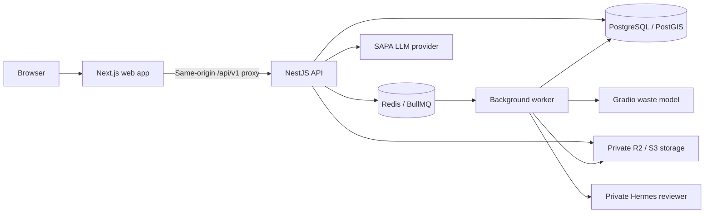

<p align="center">
  <a href="https://sap.venlab.tech/">
    
  </a>
</p>

<h1 align="center">SAP · Sustainable AI Platform</h1>

<p align="center">
  <strong>A small photo. A clearer picture. A cleaner community.</strong><br />
  AI waste recognition, verified local reports, and tools for community action.
</p>

<p align="center">
  <a href="https://sap.venlab.tech/"></a>
</p>

<p align="center">
  
  
  
  
  
  
</p>

<p align="center">
  <a href="#the-idea">The idea</a> ·
  <a href="#built-around-real-actions">Features</a> ·
  <a href="#architecture">Architecture</a> ·
  <a href="#getting-started">Quick start</a> ·
  <a href="#documentation">Documentation</a>
</p>

---

## The idea

**SAP turns everyday observations into environmental information people can act on.** A photo helps identify waste. A report adds the location and context. Human review determines what becomes public evidence. Community and volunteer tools help organize the next step.

The platform brings these flows together with a personal dashboard, geographic insights, and **SAPA**, a friendly AI companion for waste-related guidance.

**Visit the website: [sap.venlab.tech](https://sap.venlab.tech/).** The interface defaults to English; users can choose Indonesian in Settings, and saved language preferences are preserved.

### Community and operations modules

| Module | Purpose |
| --- | --- |
| **Community updates** | Record follow-up evidence and support review of changing conditions. |
| **Volunteer activities** | Organize cleanup activities, manage participants, and record attendance and results. |
| **Impact summaries** | Present recorded activity outcomes and participation. |
| **Hermes-assisted review** | Prepare structured evidence recommendations for human moderators. |
| **Instagram workflows** | Prepare and publish approved content through consent and publication controls. |

These modules are controlled by feature flags and require their associated migrations and services. The example environment disables the extensions by default. Consult the [implementation status](docs/BACKEND_IMPLEMENTATION_STATUS.md) and [production checklist](docs/PRODUCTION_BACKEND_TODO.md) for recorded verification and remaining work.

### The product loop

**Notice → Scan → Add context → Submit → Review → Explore → Take action**

Public reports pass through moderation. Geographic summaries describe recorded conditions and historical patterns. SAPA provides guidance without changing account data or report status, and Hermes recommendations remain subject to human review.

## Architecture



| Layer | Technology |
| --- | --- |
| Frontend | Next.js 16 App Router, React 19, TypeScript |
| Styling and motion | Tailwind CSS 4, Motion, Lucide icons |
| Maps and spatial indexing | Leaflet, PostGIS, H3 |
| HTTP API | NestJS 12, versioned REST at `/api/v1` |
| Persistence and retrieval | PostgreSQL, SQL migrations, pgvector, full-text search |
| Background processing | Redis and BullMQ |
| Media | Cloudflare R2 / S3-compatible private object storage |
| Waste inference | Self-hosted Gradio service using the EcoLens model |
| Assistant | LangGraph and an OpenAI-compatible LLM provider |
| Contracts | OpenAPI schemas, generated TypeScript types, and shared fixtures |

### Repository map

```text
.
├── apps/
│   ├── web/               Next.js frontend and same-origin API proxy
│   ├── api/               NestJS API, migrations, and backend tests
│   └── worker/            Scan processing and background jobs
├── packages/config/       Shared environment validation
├── contracts/             Published OpenAPI contract and fixtures
│   └── r1/                Extension contract draft
├── services/hermes-review/ Private assisted-review service
├── deploy/                Docker, database backups, and service configuration
├── scripts/               Contract and route checks
├── bench/                 Benchmark tooling
└── docs/                  Product, design, integration, and operations guides
```

SAP is a fresh implementation informed by EcoLens. Legacy `ecoLens` and `ecoLens_ML` source remains reference material and must not be copied into this repository or added as a submodule or subtree. The existing model supplies waste inference through the Gradio integration.

## Getting started

### 1. Prepare your environment

Use **Node.js 22 or later** and npm. Before starting the API and worker, prepare:

- PostgreSQL with **PostGIS**, **pgvector**, and **pg_trgm** available.
- Redis and a private S3-compatible bucket, such as Cloudflare R2.
- A configured Gradio inference service and its credentials.
- Transactional email through Resend, or SMTP for local development.

The included [PostgreSQL Dockerfile](deploy/postgres.Dockerfile) packages PostGIS and pgvector. The [deployment compose file](deploy/compose.yml) uses operator-managed configuration under `/etc/sap/` and a private ML network; follow the [deployment guide](docs/DEPLOYMENT.md) when preparing that environment.

### 2. Configure the application

For a fresh checkout, run from the repository root. Keep existing configured environment files if you already have them.

```sh
cp .env.example .env
cp apps/web/.env.example apps/web/.env.local
npm ci
```

`cp` is also available as an alias in PowerShell. Replace the placeholders in `.env` with your private service configuration. The validator rejects example credentials.

| Configuration | Purpose |
| --- | --- |
| `APP_ORIGIN` | Browser-facing origin; `http://localhost:3000` for local development. |
| `API_INTERNAL_URL` | Backend origin; `http://localhost:3001` locally. Also set this in `apps/web/.env.local`. |
| `DATABASE_URL`, `DATABASE_DIRECT_URL` | Runtime database connection and optional direct migration connection. |
| `REDIS_URL` | Native Redis connection URL used by background processing. |
| `SESSION_SECRET`, `CSRF_SECRET` | Independent random secrets of at least 32 characters each. |
| `MAIL_TRANSPORT`, mail settings | Email delivery; Resend by default, SMTP available locally. |
| `S3_*` | Private storage endpoint, bucket, and access credentials. |
| `ML_*` | Gradio endpoint, prediction route, credentials, and timeout. |

The proxy uses `API_INTERNAL_URL` and accepts the legacy `SAPA_API_BASE_URL` alias. Keep provider credentials on the server and out of `NEXT_PUBLIC_*` settings. Environment files must remain uncommitted. The complete configuration reference starts in [`.env.example`](.env.example).

### 3. Build shared packages and apply migrations

```sh
npm run build
npm run migrate -w @sap/api
```

Migrations prefer `DATABASE_DIRECT_URL` when provided. Ensure the database account can install the required extensions and apply the schema changes.

### 4. Start the three processes

Run each command in a separate terminal from the repository root:

| Process | Command | Default address |
| --- | --- | --- |
| API | `npm run dev:api` | `http://localhost:3001` |
| Worker | `npm run dev:worker` | Background process |
| Web | `npm run dev:web` | `http://localhost:3000` |

Open **[localhost:3000](http://localhost:3000)**. Check **[the proxied health endpoint](http://localhost:3000/api/v1/health)** and confirm `data.status` is `ok`. Create an account and verify the emailed code before using the dashboard. Complete scanning requires healthy storage, Redis, the worker, and Gradio.

<details>
<summary><strong>Enable optional capabilities</strong></summary>

Enable SAPA with `SAPA_FEATURE_ENABLED=true` and configure `SAPA_LLM_BASE_URL`, `SAPA_LLM_API_KEY`, and `SAPA_LLM_MODEL`. Read the [SAPA guide](docs/SAPA_ASSISTANT.md) before enabling hybrid retrieval.

Community and activities use `SAP_EXTENSION_ENABLED` together with `SAP_COMMUNITY_ENABLED` and `SAP_ACTIVITIES_ENABLED`. Hermes uses `SAP_HERMES_ENABLED` and its [private service configuration](services/hermes-review/README.md). Instagram rendering and publishing have separate flags and require the Meta integration, consent, and approval workflow.

Apply the relevant migrations and configure the supporting services before enabling a module. Restart the affected processes after environment changes. See [the integration agreement](docs/CONTRACT_ZAKA_ZAMANI.md) and [backend execution plan](docs/BACKEND_EXECUTION_PLAN.md) for the full requirements.

</details>

<details>
<summary><strong>Open the development app from another device</strong></summary>

Set backend `APP_ORIGIN` to the exact frontend URL, such as `http://192.168.1.20:3000`. In `apps/web/.env.local`, set `SAP_ALLOWED_DEV_ORIGINS=192.168.1.20` using only the hostname or IP address. Restart the backend, then start the web app with:

```sh
npm run dev:web -- --hostname 0.0.0.0
```

Open `http://192.168.1.20:3000` from the other device using your actual host IP.

</details>

## Development and validation

Run these commands from the repository root:

| Command | Purpose |
| --- | --- |
| `npm run build` | Build config, API, and worker packages. |
| `npm run build -w @sap/web` | Build the web app for production. |
| `npm run typecheck` | Check TypeScript across all workspaces. |
| `npm run contracts:check` | Validate contracts and fixtures. |
| `npm run contracts:routes` | Check API routes against the extension contract draft. |
| `npm run contracts:types -w @sap/web` | Regenerate types from the published API contract. |
| `npm run contracts:r1:types -w @sap/web` | Regenerate types from the R1 extension draft. |
| `npm run test` | Run workspace tests and the Hermes Python tests. |
| `npm run test:r1 -w @sap/web` | Run the web Playwright suite. |
| `npm run check` | Run contract validation, typechecks, tests, backend builds, and route checks. |

Run `npm run check` before committing. The Hermes test script uses POSIX shell syntax and `python3`; on Windows, run the full check from WSL or Git Bash with Python available. Playwright requires its browser dependencies and the environment expected by its configuration. Database integration tests require a dedicated test database; see the [test plan](docs/TEST_PLAN.md).

The published API contract is `1.1.0`; the R1 extension schema is a `1.2.0` draft. Keep handlers, schemas, fixtures, and generated frontend types aligned when changing API behavior. Local checks verify the repository; external-service and deployment acceptance is tracked separately in the [production checklist](docs/PRODUCTION_BACKEND_TODO.md).

## Documentation

| Guide | Start here for |
| --- | --- |
| [Documentation index](docs/README.md) | The full specification and handoff collection. |
| [Product requirements](docs/PRD.md) | Goals, users, and product scope. |
| [Frontend handoff](docs/FRONTEND_HANDOFF.md) | Pages, states, and integration behavior. |
| [Published API contract](contracts/openapi.json) | Machine-readable baseline schemas. |
| [R1 extension draft](contracts/r1/openapi.json) | Community, activity, moderation, and publication schemas. |
| [Integration agreement](docs/CONTRACT_ZAKA_ZAMANI.md) | Shared frontend/backend responsibilities and workflows. |
| [Backend execution plan](docs/BACKEND_EXECUTION_PLAN.md) | Dependencies, migrations, and acceptance criteria. |
| [Community and volunteer research](docs/research/2026-10-03-community-volunteers-hermes-ux.md) | Participation flows and impact measurement. |
| [Hermes and Instagram research](docs/research/2026-10-03-hermes-instagram.md) | Assisted review and publication design. |
| [Implementation status](docs/BACKEND_IMPLEMENTATION_STATUS.md) | Recorded evidence and outstanding integration work. |
| [Deployment guide](docs/DEPLOYMENT.md) | Runtime configuration and operations. |

---

<p align="center">
  <strong>Every cleaner place starts with someone who notices.</strong><br />
  <a href="https://sap.venlab.tech/">Explore SAP →</a>
</p>
