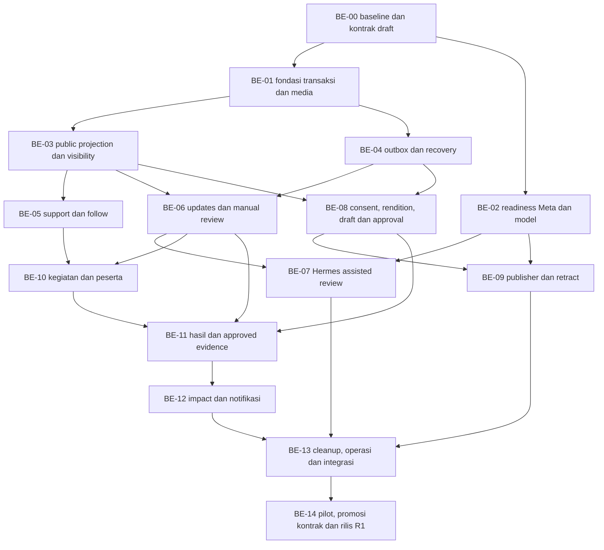

# Rencana eksekusi backend SAP — Zamani

Tanggal **3 Oktober 2026**. Versi **1.0.0**. Pemilik **Zamani**. Frontend/UI/UX **Zaka**. Kontrak bersama: [CONTRACT_ZAKA_ZAMANI.md](CONTRACT_ZAKA_ZAMANI.md).

**Status: rencana implementasi, bukan pekerjaan backend yang sudah selesai.** Endpoint, migration, service Hermes, integrasi Meta, dan skenario pemeriksaan tambahan di bawah belum dibuat/dijalankan oleh pekerjaan dokumentasi ini. Baseline diperiksa pada commit `977abeb`; OpenAPI published 1.1.0, target extension 1.2.0.

**Pembaruan implementasi:** kode backend kini dikerjakan mengikuti rencana ini; lihat [status implementasi](BACKEND_IMPLEMENTATION_STATUS.md). Pernyataan di atas menjelaskan baseline saat dokumen dibuat. Checklist berikut tetap gate acceptance/rilis, belum dinyatakan lolos hanya karena kode tersedia atau kompilasi berhasil.

## 1. Hasil akhir yang harus tercapai

1. Laporan ditinjau dengan bantuan Hermes, diputuskan manusia pada R1, dan muncul melalui proyeksi publik yang aman.
2. Warga dapat mendukung, mengikuti, dan memperbarui kondisi tanpa menunggu AI.
3. Koordinator dapat menjalankan siklus kegiatan relawan hingga hasil sebagian/selesai dengan bukti.
4. Moderator dapat memakai bukti relawan yang disetujui untuk resolusi tanpa membuka akses semua media.
5. Poster/caption dibuat sebagai draf dari data/izin yang disetujui; admin menyetujui konten final sebelum publish.
6. Penarikan SAP dan Instagram mempunyai status terpisah, retry/rekonsiliasi, serta bukti hasil.
7. Dashboard mendapatkan metrik deterministik yang tidak menghitung kejadian atau material dua kali.
8. Semua operasi mempunyai izin, transaksi, revisi, audit, observability, dan pemulihan yang jelas serta cocok kontrak frontend.

## 2. Batas rilis

**R1:** manual moderation + assisted review, komunitas, satu kegiatan aktif per kejadian, koordinator per kegiatan, in-app notification, satu akun IG professional + Page, single-image Feed, draft otomatis ketika eligible, approval admin, publish/retract, dampak lokal dari bukti.

**Tahap lanjut:** auto-approve/auto-publish, schedule post, upload hasil langsung oleh banyak peserta, chat/WhatsApp/email notifications, rekomendasi peserta, leaderboard atau hadiah komunitas, dan role global baru. R1 mengembalikan canAutomate=false. Draft otomatis tetap berjalan jika draftGeneration=automatic; ini berbeda dari publish otomatis.

## 3. Temuan kode yang menjadi pekerjaan awal

| Temuan | Konsekuensi dan tindakan |
| --- | --- |
| Detail laporan owner berisi exact GPS dan media privat | Buat public DTO/service tersendiri; jangan membuka guard endpoint owner |
| Query H3 belum memakai visibility baru | Tambahkan predicate pada semua query/list/snapshot dan invalidasi setelah perubahan |
| Media public key dapat dipasang ke object asli | Buat rendition + approval/consent per channel; legacy photos tidak otomatis menjadi bahan IG |
| Create/update report belum lengkap producer event review | Tambahkan outbox transactionally di operasi yang memengaruhi review/sumber |
| Relay maintenance sekarang hanya account deletion | Tambahkan relay/job handler untuk topic baru; hindari dua consumer memproses deletion yang sama |
| Outbox processing belum mempunyai lease umum untuk crash recovery | Tambahkan lease owner/expiry dan reclaim/reconciliation yang aman |
| Resolusi memeriksa media milik admin | Tambahkan approved evidence claim yang terikat subjek/revisi/report, tanpa menghapus owner guard |
| verified tidak langsung boleh resolved di domain existing | Tambahkan edge khusus approved resolution evidence sesuai kontrak; legacy flow tetap kompatibel |
| Moderation repository dapat mengembalikan kegagalan setelah UPDATE ketika publishMediaIds invalid | Pindahkan validasi sebelum write atau pastikan transaksi melempar error dan rollback; hasil gagal tidak boleh meng-commit status |
| Sweep orphan hanya mengenali scan/report_media | Tambahkan seluruh referensi update/result/measurement/rendition; jangan purge bukti yang aktif |
| Frontend IG telah ada, backend belum ada | Implementasikan kontrak baru; handoff perubahan validator/adapter Zaka sebelum aktivasi |

Source utama: [report](../apps/api/src/reports/report.repository.ts), [moderasi](../apps/api/src/admin/moderation.repository.ts), [guard resolusi](../apps/api/src/admin/admin.service.ts), [area](../apps/api/src/areas/areas.repository.ts), [media](../apps/api/src/media/media.service.ts), [outbox](../apps/api/src/auth/outbox.repository.ts), [maintenance](../apps/worker/src/maintenance-repository.ts), [worker](../apps/worker/src/main.ts).

Temuan rollback berasal pembacaan urutan kode, belum reproduksi runtime. Audit/negative test implementasi perlu membuktikan perilakunya sebelum menyatakan bug telah diperbaiki.

## 4. Requirement backend dan acceptance

| ID | Requirement | Kriteria penerimaan |
| --- | --- | --- |
| BR-01 | Public projection/privacy | Public DTO tidak memuat owner, GPS tepat, private description, raw photo, atau pending kontribusi pihak lain |
| BR-02 | Lifecycle terpisah | Status laporan, visibility, review, consent, aktivitas, membership, dan post memakai enum kontrak; tidak saling menyamar |
| BR-03 | Server authorization | Session/email/admin/coordinator/media relation divalidasi backend, termasuk saat status berubah |
| BR-04 | Atomicity/revision | Semua precondition dicek dalam transaksi; conflict/error tidak meninggalkan sebagian write/domain side effect |
| BR-05 | Support/follow | Desired state idempotent, unique per canonical, revoke/unfollow, canonical merge, tidak menambah poin/risiko |
| BR-06 | Community update | Input/bukti/revisi tersimpan segera; user melihat pending miliknya; approved projection mengikuti izin |
| BR-07 | Hermes isolation | Private service, snapshot minimum, pinned versions, no cross-user memory, bounded tools/usage, validated result |
| BR-08 | Human fallback | Laporan/update/result tetap dapat ditinjau saat AI offline/invalid/timeout; no auto-decision R1 |
| BR-09 | Activity lifecycle | Draft, penerimaan koordinator, publish, register/close/start/hold/cancel, hasil, dan perubahan jadwal |
| BR-10 | Slot/attendance | Atomic accepted capacity, waitlist eksplisit, cancellation, acknowledgement, actual presence terpisah |
| BR-11 | Approved evidence | Claim immutable terikat report dan revisi, revoke/supersede, digunakan domain moderasi tanpa ownership palsu |
| BR-12 | Consent/rendition | Consent owner AND approval reviewer per channel; public derivative nyata; asal/raw tetap privat |
| BR-13 | Draft/approval | Sumber manual/scan eligible, dedup series, preview final, contentRevision, approval invalidation |
| BR-14 | Meta publishing | Official auth, encrypted token, permissions health, durable intent, confirmed publishedAt, safe retry |
| BR-15 | Withdrawal/reconciliation | SAP cepat mencabut akses, job priority, publication race, confirmed delete/manual evidence, per-channel state |
| BR-16 | Impact | Canonical count, valid revisions, source public, kg per physical batch/stage, null/0, coverage dan metode |
| BR-17 | Notifications | Event/penerima dedup, hanya berhak/following, no per-vote spam, link target allowlist |
| BR-18 | Recovery/retention | Orphan/account deletion/backup restore menyertakan relasi baru dan external cleanup intents |
| BR-19 | Observability/readiness | Queue age/errors/usage/provider uncertainty/health terukur; feature flags tidak menyatakan ready palsu |
| BR-20 | Frontend compatibility | Draft/published schema/type/mock/headers konsisten, handoff tiap modul, frontend existing tidak diberi enum baru tanpa migrasi |

Semua BR berlaku untuk rilis lengkap R1. Penundaan modul menggunakan feature flag dan kontrak availability; jangan mengaku seluruh R1 selesai karena satu endpoint berhasil.

## 5. Struktur modul dan batas tanggung jawab

| Modul backend usulan | Tanggung jawab | Batas |
| --- | --- | --- |
| PublicIncidents | Proyeksi publik, canonical redirect, timeline, viewer | Tidak memakai serializer Report owner untuk public response |
| Community | Support, follow, updates, review keputusan | Tidak memanggil model dalam request vote/submit |
| Evidence | Lampiran, rendition, consent, approved resolution claims | Akses per hubungan/izin; original URL bukan public derivative |
| Reviews | Snapshot/run/policy, result validation, antrean admin | Rekomendasi, tanpa update status langsung dari Hermes |
| Activities | Kegiatan, coordinator binding, slot, attendance, result | Coordinator scoped; no role escalation |
| Publications | Draft, approval, account, intent, retraction, operation status | Provider call hanya worker/publisher terotorisasi |
| Impact | Query/aggregate dari revisi yang berlaku | Tidak meminta model menghitung kg/jumlah |
| Notifications | Delivery in-app/event recipient | Tidak mengirim pesan eksternal tanpa kanal yang disetujui |
| Outbox/Jobs | Producer transaction, relay, lease, handler, reconcile | Durable DB intent menjadi acuan saat Redis/provider tidak pasti |

Nama folder final boleh disesuaikan gaya repo. Perubahan existing report/moderation/media/area/deletion tetap memakai domain bersama agar status/poin/audit tidak terpecah menjadi dua implementasi.

Service Hermes dibungkus Python dengan kontrak internal sempit. Node worker memakai adapter HTTP internal; browser tidak mengenal URL service/model key. Renderer poster dan publisher Meta mempunyai akses yang berbeda dari Hermes.

## 6. Rencana database dan migration

Migration existing berada di `apps/api/migrations`, bukan folder db. Jangan mengubah migration 0001–0010 yang telah dipakai; buat migration setelah nomor terakhir aktual saat mulai kerja.

| Paket migration | Isi | Constraint/index penting |
| --- | --- | --- |
| M1 visibility/media | reports.public_visibility/instagram_allowed, consent, rendition, approval | Source revision, channel relation, grant/revoke audit; index eligibility |
| M2 infra/reviews | review_runs, snapshot metadata, actor service, lease outbox, operations | Unique review intent, snapshot hash, status CHECK, runnable index |
| M3 community | supports, follows, update/revision/media, decisions | Unique user/canonical support/follow; satu pending sejenis; lookup queue |
| M4 activities | activity/coordinator acceptance, membership, schedule acknowledgement | Partial unique satu active activity/report; unique user/activity; capacity locking |
| M5 evidence/impact | result/revision/media, approved evidence claims, physical batches, measurements | Approved claim immutable, batch/stage active version, correction lineage |
| M6 publications | account credential ref, publication series/post/approval/intent/attempt/retraction | Unique series key, satu active generation, provider ID uniqueness, operation dedup |
| M7 notifications/cleanup | recipient notifications, delivery receipts, graph references | Unique event/recipient/type, owner/read index, deletion/retention coverage |

Backfill:

- Submitted/rejected/duplicate dimulai hidden. Canonical verified/in_progress/resolved dengan publicSummary yang sah bisa public; photo/rendition ditahan sampai pemeriksaan channel/derivative selesai. Jangan otomatis memberi izin IG pada asset legacy.
- Poin/status lama tidak ditulis ulang sebagai akibat migration visibility. Predicate peta/list diubah bersama backfill; snapshot lama diinvalidasi supaya tidak membocorkan data yang ditarik.
- Pertahankan row historis; soft withdrawal berbeda dari purge permanen. User deletion membuat actor/identitas publik aman dan membersihkan data personal baru sesuai policy.
- Unique/index untuk canonical merge perlu menggabungkan state pendukung/follower terlebih dahulu; jangan menghapus kontribusi acak agar migration lolos.
- Database CHECK/DTO/OpenAPI enum berubah dalam paket yang sama. Media purpose community/activity_evidence perlu diperluas pada constraint existing, bukan hanya TypeScript.

Postgres locking memakai urutan deterministik untuk dua canonical report agar merge tidak deadlock. Antrean operasional memakai index state/nextAttemptAt/lease. Pagination memakai keyset sort stabil. Snapshot/hash dibuat dari data dan revisions yang dibaca konsisten dalam transaksi.

## 7. Dependensi dan urutan eksekusi

Readiness eksternal dapat dikerjakan bersama fondasi; credential yang belum ada tidak menahan penyusunan schema/public/community. Publish nyata baru diaktifkan setelah readiness akun dan penarikan terbukti. Dukungan sederhana dapat selesai lebih dahulu, sedangkan integrasi IG merupakan jalur tersendiri. Ini satu urutan rencana bersama yang dipakai kedua dokumen riset.

## 8. Paket pekerjaan Zamani

### BE-00 — Baseline dan kontrak draft

**Dependensi:** tidak ada. **Requirement:** BR-20.

- [ ] Catat commit backend/frontend dan kontrak published yang dipakai kedua pengembang.
- [ ] Terjemahkan DTO/endpoints/enum/error pada kontrak Markdown menjadi schema draft dan fixture sintetis terpisah, termasuk nullable/conditional fields.
- [ ] Buat manifest modul/operasi siap untuk handoff; target 1.2.0 baru promoted setelah handlers tersedia.
- [ ] Petakan frontend IG existing: source validator, status, stats, publishedAt, operation response, settings, preview/approval.
- [ ] Sepakati helper request IM/IK/CSRF/version dengan Zaka; fixture vote/update/activity/IG siap dipakai mock.

**Output/gate:** Zaka dapat membuat mock sesuai request/response tanpa menebak. Tidak ada perubahan header runtime atau publikasi schema draft sebagai API tersedia.

### BE-01 — Atomicity, authorization, dan dasar media

**Dependensi:** BE-00. **Requirement:** BR-03/04/11/12.

- [ ] Audit guard sesi/email/admin/scoped coordinator; guard emailVerified digunakan kontribusi baru.
- [ ] Audit precondition pada moderation transaction, termasuk invalid publishMediaIds sebelum status write; error setelah write harus rollback.
- [ ] Tambahkan model actor service yang dapat diaudit tanpa menyamar admin; aksi domain R1 tetap human actor.
- [ ] Tambahkan purpose media baru, batas upload existing, relation attachment, serta API consent owner.
- [ ] Buat akses private evidence per report/update/result dengan relasi; owner URL tidak menjadi fallback admin universal.
- [ ] Bentuk approved evidence claim dan pemeriksaan revocation sebagai desain sebelum endpoint resolusi diperluas.

**Output/gate:** unauthorized media ditolak; field/sumber invalid tidak mengubah status/poin/audit/outbox; negative case ditetapkan untuk verifikasi mendatang.

### BE-02 — Readiness akun Meta dan service model

**Dependensi:** BE-00; sebagian independen BE-01. **Requirement:** BR-07/14/15/19.

- [ ] Catat akun professional + Page dan pemilik izin, login path Facebook Login for Business, app access level, scope publish/delete, token type/expiry.
- [ ] Pada akun uji dan dengan otorisasi pemilik, rencanakan publish/read/delete satu media percobaan; simpan hasil tanpa credential. Jangan memakai postingan produksi sebagai bahan percobaan tanpa izin.
- [ ] Tentukan model/provider vision, versi Hermes, biaya/token budget dan environment privat. Pastikan model yang dipakai benar-benar mendukung gambar pada jalur tersebut.
- [ ] Buat account health/capabilities dari status nyata, bukan hanya env key terisi.
- [ ] Tetapkan jalur needs_action/manual jika scope/token/delete belum dapat dipakai; feature flag publish dinonaktifkan sampai kriterianya terpenuhi.

**Output/gate:** readiness record dan konfigurasi aman. Dokumentasi Meta bukan bukti akses akun SAP; hasil uji aktual tetap pekerjaan implementasi.

### BE-03 — Public incidents, visibility, dan canonical

**Dependensi:** BE-01. **Requirement:** BR-01/02/05.

- [ ] Terapkan migration/backfill visibility dan query public eligible.
- [ ] Buat public detail/timeline/canonical redirect; tidak serialize Report owner.
- [ ] Tambahkan metadata waktu/area yang aman; publicId=canonical report UUID.
- [ ] Bedakan 404 never-public/private dengan 410 previously-public withdrawn.
- [ ] Perbarui semua area query, pagination per cell, cache/snapshot invalidation, dan public evidence serving.
- [ ] Buat lifecycle admin untuk visibility/review/evidence/capability, tanpa memecahkan DTO Report legacy sembarangan.
- [ ] Lifecycle menyertakan publicationAssets/milestones eligible dan alasan createInstagramDraft agar frontend tidak menebak asal aset atau ID milestone.

**Output/gate:** permalinks/public data sesuai kontrak; revoked report/media tidak terbaca dari detail, map/list, atau cache yang dikontrol SAP.

### BE-04 — Outbox, job, dan crash recovery

**Dependensi:** BE-01. **Requirement:** BR-04/07/14/15/17/18/19.

- [ ] Generalisasikan producer sehingga memakai transaction handle yang sama dengan perubahan domain; jangan enqueue setelah commit tanpa outbox.
- [ ] Tambahkan lease owner/expiry, claim SKIP LOCKED, renew/reclaim, attempts/backoff, safe dead-letter/needs-action.
- [ ] Relay topic review/render/publish/retract/notification; maintenance deletion tidak diproses dua consumer.
- [ ] Unique job intent + deterministic jobId. Outbox delivered berarti broker menerima, bukan bisnis/provider sudah selesai.
- [ ] Reconciliation menemukan intent DB yang belum selesai dan tidak punya job runnable; restart/Redis loss dapat memulihkan pekerjaan.
- [ ] Pisahkan concurrency review/render/publish/retract; retract berprioritas tinggi tidak menunggu inferensi atau draft batch.

**Output/gate:** event tidak hilang pada crash antara DB commit/relay/worker. At-least-once delivery didedup; tidak mengklaim exactly once terhadap Meta.

### BE-05 — Support dan follow

**Dependensi:** BE-03; notification delivery menyusul BE-12. **Requirement:** BR-05.

- [ ] GET viewer dan PUT desired-state dengan permission server.
- [ ] Unique user/canonical, transaction check eligibility, jumlah count yang benar tanpa race.
- [ ] Canonical merge menggabungkan distinct active supporters dan followers; alias tidak mengarah resource privat.
- [ ] Resolved menutup aksi support; account deletion melepas kontribusi aktif; unfollow tetap dapat dilakukan setelah withdrawal.
- [ ] Rate limit request dan telemetry lonjakan tanpa menganggap satu IP=orang yang sama.
- [ ] Tidak menulis ledger poin atau perubahan riskLevel akibat dukungan.

**Output/gate:** retries tidak membuat double vote atau flip state; handoff Zaka mencakup timeout recovery, login/email prerequisites, dan closed state.

### BE-06 — Pembaruan kondisi dan review manusia

**Dependensi:** BE-03/04. **Requirement:** BR-06/08.

- [ ] Schema input/revisi/kind/correctionField, satu pending sejenis, upload relation, observedAt validation.
- [ ] Create/PATCH tersimpan segera; response 201/200 tidak menunggu Hermes.
- [ ] Author view berbeda dari admin full review; pending warga lain tidak publik.
- [ ] Unified queue report/community_update/activity_result; report submitted tetap masuk ketika AI disabled.
- [ ] Decision approve/request_evidence/reject dengan IM/IK, reason dan kebutuhan spesifik.
- [ ] Public timeline dari approved summary/media yang eligible; pengamatan lama tidak menimpa kondisi terbaru.
- [ ] Approved resolution claim hanya untuk bukti yang memenuhi syarat; approve update tidak otomatis resolved.

**Output/gate:** moderator bisa menjalankan seluruh alur secara manual sebelum AI diaktifkan. Pengguna melihat status kontribusi dan dapat melengkapi tanpa kehilangan data.

### BE-07 — Hermes assisted review

**Dependensi:** BE-02/04/06. **Requirement:** BR-07/08.

- [ ] Python wrapper private, instance per task, pinned model/policy/prompt, skip memory/context-file discovery, minimal toolset.
- [ ] Snapshot data/evidence IDs yang berhak untuk subjek/revisi; scan result existing digunakan kembali.
- [ ] Implementasikan sap-evidence-review-v1 dan enum bersama; parse/validate sebelum menerima result.
- [ ] Bind subject/report revisions dan snapshotHash; foreign evidence ID/invalid output/stale snapshot tidak boleh diterapkan.
- [ ] Maksimum awal 6 iterasi/tool rounds, timeout default 90 detik, maximum 1 retry transport otomatis; semuanya configurable dan dikalibrasi. Jangan retry inferensi setelah result valid sudah tersimpan.
- [ ] Token/media/cost budget per run dan per hari; job budget-exhausted masuk human fallback.
- [ ] MCP belum wajib. Jika dipakai, explicit allowlist tool baca dan server authorization, tanpa shell/browser host/cron/delegation/skill install.
- [ ] Failed/superseded tercatat terpisah dari status kontribusi; rerun admin mendapat intent baru, retry memakai intent sama.

**Output/gate:** saran terlihat bersama bukti dan dapat dikoreksi; model tidak mempunyai credential DB admin/Meta atau akses memory pengguna lain. Tidak ada keputusan otomatis R1.

### BE-08 — Consent, rendition, draf dan approval

**Dependensi:** BE-03/04; media dasar BE-01. **Requirement:** BR-12/13.

- [ ] Grant owner dan approval reviewer per channel/revision; withdrawing channel menghasilkan cleanup intents.
- [ ] Rendition publik/preview benar-benar hasil pemrosesan yang disetujui; original key tidak otomatis dipublikasikan.
- [ ] Renderer template versioned mengikuti [spesifikasi poster](INSTAGRAM_POST_DESIGN.md): semirip mungkin dengan referensi, foto bukti nyata, peta geografis nyata; seluruh data dari sumber approved. Implementasi dilanjutkan atas instruksi Zamani; pemeriksaan visual/provider tetap merupakan gate sebelum rilis.
- [ ] Draf eligible dari manual maupun scan report; missing consent/asset menghasilkan alasan belum ada draf, bukan mengambil foto privat.
- [ ] Caption/altText dari approved context; fallback template deterministik bila caption AI unavailable.
- [ ] Publication series/active generation dedup dan lineage replacement; edit menaikkan contentRevision, menginvalidasi approval.
- [ ] initial milestone=null; resolution mengacu approved result/resolved decision, outcome partial menggunakan teks sebagian. Replacement hanya setelah cancelled/retracted; restore tidak menerbitkan ulang.
- [ ] Preview rendition ready; approve mengikat content/source/rendition; settings hanya memengaruhi draf baru.

**Output/gate:** satu initial draft aktif per series, preview dapat ditinjau Zaka/admin, dan approval tidak bertahan setelah bahan berubah.

### BE-09 — Publisher, retraction, dan account lifecycle

**Dependensi:** BE-02/04/08. **Requirement:** BR-14/15.

- [ ] OAuth authorization/state/callback, token encryption/ref, scope/expiry health, credential redaction, reconnect/disconnect.
- [ ] Publish endpoint membuat durable operation dan job atomik; provider dipanggil worker setelah approval/source/account check.
- [ ] Catat request stage/container/media ID/attempt fingerprint di server sebelum/selama provider call; confirmed publishedAt memakai waktu konfirmasi yang diketahui, bukan submitAt.
- [ ] Respons timeout masuk reconciliation, bukan membuat container/post kedua. Jika identitas media tidak pasti, needs_action; tidak menebak hanya dari caption.
- [ ] Scope all withdrawal menyembunyikan SAP dan membuat semua retract intent; scope instagram hanya menarik IG dan menjaga peta sah.
- [ ] Tangani withdraw saat publish sedang berjalan: simpan intent, rekonsiliasi hasil, delete jika terbit.
- [ ] Delete success/manual-confirmation tervalidasi mengisi retractedAt; permission error/404 tidak dianggap sukses sendiri.
- [ ] Retry bounded/backoff, operation status persisten lintas reload, manual actions dengan audit.
- [ ] Disconnect dengan pending cleanup mengikuti acknowledgement dan tidak membuang provider ID/operasi aktif.
- [ ] Restore membuka SAP setelah review ulang; replacement draft mempunyai lineage dan approval baru, tidak menghidupkan post yang terhapus.
- [ ] Restore scope all memulihkan SAP/kelayakan IG yang sah; scope instagram hanya membuka eligibility IG bila SAP masih publik. Kedua scope tidak membuat replacement otomatis.

**Output/gate:** create/publish/read/delete pada akun uji yang diotorisasi, source revoke dan race tertangani, dashboard Zaka bisa membedakan SAP hidden versus IG pending/deleted/needs_action. Aktifkan canPublish/canRetract hanya sesuai kesehatan akun yang terbukti.

### BE-10 — Kegiatan, koordinator, peserta dan jadwal

**Dependensi:** BE-03/05/06; infra BE-04. **Requirement:** BR-09/10.

- [ ] Schema/CRUD draft kegiatan, admin list, coordinator assignments/acceptance, publish validation, satu active/report.
- [ ] Public detail/list tidak mengekspos titik kumpul tepat atau daftar peserta. Viewer/managed routes mempunyai izin berbeda.
- [ ] Commands close/start/hold/resume/cancel/request_result dengan IM/IK, state precondition, alasan dan timestamp server.
- [ ] Membership desired-state, requested bukan accepted, unique user/activity, deadline guard server.
- [ ] Pencarian calon koordinator admin terbatas pada displayName akun aktif verified; tugas membutuhkan penerimaan calon, dengan notifikasi assignment dan tanpa mengekspos email.
- [ ] Accept mengunci activity sebelum menghitung capacity; order lock konsisten; waitlist tidak dipromosikan diam-diam.
- [ ] Actual attendance terpisah; koordinator hanya mengelola kegiatan miliknya.
- [ ] Schedule revision/acknowledgement, notification events, cancellation slot release, source withdrawal menghentikan join baru.
- Backlog setelah R1: bantuan AI untuk draf kegiatan. Fitur ini memerlukan amendment endpoint/input/output sebelum dikerjakan; model tidak mengisi jadwal/mitra/kuota fiktif.

**Output/gate:** seluruh siklus kegiatan manual berfungsi; pending/full/waitlist/cancel/hold terbaca sama oleh frontend dan backend. Semua perubahan slot/jadwal konsisten saat request bersamaan.

### BE-11 — Hasil kegiatan dan approved resolution evidence

**Dependensi:** BE-06/10; bukti/izin BE-01/08. Bantuan Hermes memakai BE-07 ketika siap, tetapi alur manual tidak menunggu provider. **Requirement:** BR-11/16.

- [ ] Paket before/after/time/note/result revision sesuai kontrak; reuse public evidence tidak memberi akses original tanpa relasi.
- [ ] Koordinator mengirim/lengkapi, reviewer menerima/reject/request evidence; partial dan complete terpisah.
- [ ] Saran Hermes menggunakan schema subjek activity_result yang sama; fallback manual tetap tersedia.
- [ ] Membuat ApprovedResolutionEvidence hanya dari looks_clean approved atau result verifiedOutcome=complete, dengan after/time/cakupan yang sah; partial tidak membuat claim resolusi. Claim terikat report/subject revision/media.
- [ ] Domain moderation menerima resolutionEvidenceIds atau legacy owned resolutionMediaIds sesuai jalur; claim asing/usang/revoked ditolak.
- [ ] Implementasi edge verified→resolved khusus approved evidence; points/timeline/audit/outbox tetap memakai domain yang sama.
- [ ] Result approved partial dapat activity completed sementara report masih terbuka; complete proposal belum report resolved sebelum keputusan eksplisit.
- [ ] Grant/claim revocation menginvalidasi penggunaan baru dan memicu review koreksi keputusan yang terpengaruh; tidak mengubah histori diam-diam.

**Output/gate:** admin dapat menyelesaikan report dengan bukti relawan yang sah tanpa mengganti owner. Paket hasil dan report mempunyai state masing-masing; kegagalan salah satu operasi tidak ditampilkan sebagai keduanya sukses.

### BE-12 — Pengukuran, dampak, dan notification delivery

**Dependensi:** BE-05/06/10/11; outbox BE-04. **Requirement:** BR-16/17.

- [ ] Physical batch/measurement identity, stage, unit/method/evidence/provenance, reviewer decision dan correction lineage.
- [ ] Tambahan pengukuran handover/recycling dapat merujuk batch yang sama setelah result disetujui; tidak perlu mengedit ulang paket approved.
- [ ] Unique aktif batch/stage, duplicate reference/hash flags, human check terhadap bukti yang sama/berat yang disalin.
- [ ] Query ImpactSummary dengan canonical eligible, periode dan asOf/method version; null versus0 dan coverage sesuai kontrak.
- [ ] Collected/handed_over/recycled ditampilkan sendiri; update status resolved tidak menambah pengukuran lagi.
- [ ] Notification row unik event/recipient/type; hanya follower, pengirim kontribusi, peserta, coordinator/admin yang berhak.
- [ ] Read/unread state idempotent, safe target links; withdrawal tidak meninggalkan konten privat dalam message tersimpan.
- [ ] Narasi standar dari angka ImpactSummary dan sumber bukti; narasi AI menjadi backlog setelah R1 dengan amendment kontrak dan evaluasi tersendiri.

**Output/gate:** contoh sintetis 35kg terkumpul dan 35kg diserahkan tetap bukan 70kg terkumpul. Belum ditimbang bukan0. Notifikasi tidak bertambah pada retry vote/job.

### BE-13 — Retention, operasi, dan integrasi frontend

**Dependensi:** BE-07/09/12. **Requirement:** BR-18/19/20.

- [ ] Account deletion melakukan graph traversal contributions/follow/membership/media/rendition/publication sebelum purge; retract intents dan provider ID disimpan minimum sesuai policy.
- [ ] Local deletion completion dan external cleanup pending dibedakan; jangan mengaku seluruh IG sudah terhapus karena object storage sudah dihapus.
- [ ] Orphan sweep memeriksa relasi community/result/measurement/rendition yang baru; expiry attachment di-clear ketika attached.
- [ ] Restore replay tombstone dan withdrawal intent sebelum data restored dibuka; report/media revoked tidak muncul kembali dari cache/backup.
- [ ] Feature flags, queue/operation health, metrics, alerts untuk old pending retract/needs_action, cost budget, and coordinator/reviewer backlog.
- [ ] Handoff dan integrate Zaka per modul dengan schema commit/types/fixtures yang sama; runtime response validator FE diperbarui.
- [ ] Migrasi staged, seed sintetis admin/user/coordinator, credential aman dan smoke environment terpisah dari data operasional.

**Output/gate:** operasional dan pemulihan seluruh lifecycle terdokumentasi; frontend dapat menggunakan API nyata tanpa fixture produksi. Semua state yang direncanakan mempunyai penanganan UI.

### BE-14 — Pilot, promosi kontrak, dan rilis R1

**Dependensi:** seluruh paket wajib R1. **Requirement:** BR-01 sampai BR-20.

- [ ] Jalankan rencana verifikasi di bawah pada environment terisolasi ketika implementasi tersedia dan pengujian diotorisasi.
- [ ] Pilot satu area, reviewer/koordinator tersedia, task observation warga/admin, koreksi masalah pemahaman vote/approval/kuota.
- [ ] Evaluasi manfaat Hermes dibanding manual/baseline model: kesalahan bukti/status, waktu moderator, latency, biaya.
- [ ] Promosi published OpenAPI/fixtures/generated types/header/version checker dalam rilis terkoordinasi; target 1.2.0 tidak dipasang prematur.
- [ ] Catat module readiness dan keputusan go/no-go, migration/rollback/runbook, kebutuhan operator serta known limitations.
- [ ] Review perubahan sebelum push main; fetch perubahan teman, integrasi konflik secara biasa, tanpa force push.

**Output/gate:** semua requirement wajib terbukti dan bukti pemeriksaan tersimpan. R1 tidak menyertakan auto-approve/publish hanya karena pilot assisted review berjalan.

## 9. Event dan pekerjaan background

Envelope event minimal: `eventId`, `topic`, `aggregateId`, `aggregateRevision`, `occurredAt`, `dedupKey`, `payload` ID/ref minimum. Jangan memasukkan token, URL bertanda tangan, bytes gambar, description panjang, atau GPS rinci ke queue/log.

| Topic | Producer dalam transaksi | Consumer/effect |
| --- | --- | --- |
| report.created / report.updated | Create/edit report relevan | Review snapshot job; supersede hasil lama bila sumber berubah |
| report.decided | Domain moderation existing diperluas | Public cache invalidation, eligible draft, follow notification |
| community_update.submitted / revised / decided | Community service | Review, public projection setelah approve, notification |
| activity.published / changed / cancelled | Activity commands | Notification peserta, join guard, safe public projection |
| activity_result.submitted / revised / decided | Result service | Review, evidence claims, eligible result draft |
| measurement.decided / corrected | Impact/evidence service | Rebuild impacted summary; tidak menulis pengukuran ganda |
| media.consent_changed | Owner consent / reviewer approval | Invalidate rendition eligibility; retract penggunaan channel yang dicabut |
| publication.draft_requested | Eligible source event/manual admin | Dedup series dan renderer/caption job |
| publication.publish_requested | Approve + publish intent | Provider job dengan source/approval checks |
| publication.retraction_requested | Withdraw/source/asset/account deletion | Reconcile then delete; priority tinggi |
| notification.requested | Domain recipient event | In-app notification dedup |
| account.deletion.requested | Existing deletion request diperluas | Cleanup graph dan durable external cleanup, tetap memakai pola receipt existing |

Review result accepted ditulis oleh Reviews service dengan CAS terhadap revisions/hash; domain decisions tetap melalui moderator. Consumer boleh menerima event ulang dan harus memakai durable unique intent yang sama.

### Retry dan status tidak pasti

- Validation/permission/source invalid: tidak retry otomatis; reason aman dan status needs_action/manual bila relevan.
- Temporary network/provider unavailable: exponential backoff dengan jitter dan maxAttempts configurable.
- Publish timeout: reconcile container/media identifier yang diketahui; jangan publish ulang dengan ID baru sampai hasil pasti.
- Delete timeout: reconcile atau retry delete yang sama sesuai API; error permission/404 tidak menyelesaikan operation sendiri.
- Job crash setelah provider sukses tetapi sebelum DB update: attempt ledger/provider identity memungkinkan recovery tanpa post ganda.
- Lease expired: reclaim/requeue setelah memastikan worker lama tidak mempunyai write lease yang valid; CAS/fencing menghindari hasil lama menimpa state baru.
- Daily AI budget habis: manual queue tetap berjalan; vote/follow/registration tidak melewati model.

## 10. Konfigurasi dan observability

Nama flag/env berikut adalah usulan pekerjaan konfigurasi, bukan variabel yang sudah ada:

| Kelompok | Konfigurasi yang diperlukan |
| --- | --- |
| Feature | Community/activities/IG draft/IG publish enabled; AI assisted review enabled; auto-decision/auto-publish selalu false R1 |
| Hermes | Private URL/auth, pinned version/model/provider, timeout90s awal, iterations6, token/media/maxretry1, daily budget |
| Media | Public/rendition bucket/prefix, read URL TTL, delivery expiry, pixel/size, approved derivative pipeline |
| Meta | App ID/secret, redirect URI, account/Page refs, encrypted credential store/key reference, scope/expiry refresh policy |
| Jobs | Concurrency tiap queue, lease, backoff/max attempts, retention intent/attempt, reconcile frequency |
| Operation | Reviewer/coordinator ownership, retention raw/rendition/audit/batch, pilot area, alert thresholds |

Semua env baru masuk validator packages/config dan .env.example **dengan placeholder**. Jangan memasang credential di NEXT_PUBLIC, fixture, Markdown, screenshot, query log, atau provider payload yang dipantulkan ke frontend. Integrasi credential/key rotation mempunyai runbook tersendiri.

Metrics minimum:

- Umur/ukuran antrean review, render, publish dan retract; stale leases; jumlah failed/needs_action.
- Review latency p50/p95, usage/biaya per run, invalid/stale result, human correction rate.
- Draft eligibility blocked reasons, rendition failures, approval invalidation count.
- Publish/retract latency dan retry, unknown provider outcome, token expiry/scope health.
- Slot conflict/full, pending coordinator acceptance, result tanpa bukti, reviewer queue age.
- Measurement duplicate/correction, coverage missing, public projection lag dan notification dedup.

**Catatan implementasi:** worker R1 menulis log terstruktur `sap_extension_metrics` per 60 detik dari antrean durable SQL, termasuk umur backlog moderator, status Hermes/rendition/Instagram/cleanup, latency dan usage Hermes tervalidasi, serta hasil publish yang tidak pasti. Log ini tidak memuat identitas atau isi laporan. Operator tetap perlu mengirimkannya ke log store, menentukan ambang dan membuat alert; konfigurasi flag/provider bukan bukti provider sehat. Estimasi biaya dari Hermes bukan tagihan aktual.

Readiness publik tidak boleh mengekspos secret atau detail credential provider. Feature availability berasal kondisi server; credential terisi saja bukan canPublish/canRetract. Operator dapat pause review/render/publish tanpa menghentikan retract/cleanup.

## 11. Rencana verifikasi implementasi

Daftar berikut untuk pekerjaan implementasi mendatang. Tidak ada suite/build/provider call yang dijalankan saat menyusun dokumen ini.

| Kelompok | Skenario minimum |
| --- | --- |
| Public/privacy | Guest versus owner/admin, hidden/withdrawn, pending foreign update, exact GPS/photo privat tidak bocor, signed URL expiry/cache invalidation |
| Transactions | Bad publishMediaIds setelah keputusan, stale revision, dua moderator, crash setelah commit; error tidak meninggalkan poin/status berubah |
| Support | Retry/multiple tabs, same payload, closed/withdrawn race, canonical merge distinct users, deletion, same-IP warga sah |
| Updates | Semua kind, correctionField invalid, 0foto looks_clean, old observation, pending duplicate, author edit supersedes AI, evidence foreign owner |
| Hermes | Invalid JSON/enum/foreign evidence, source changes while running, prompt injection in data, provider offline/budget, rerun versus retry, cross-task memory isolation |
| Activities | Draft completeness/acceptance, coordinator scopes, public meeting point privacy, slot concurrent accepts, waitlist/cancel, deadline, changed schedule acknowledgements, result missing |
| Evidence/resolution | Claims foreign report/revision/revoked, immutable ownership, verified→resolved special path, legacy in_progress path, partial activity completed/report open |
| Impact | Unknown versus0, batch reused across stages, duplicate receipt/hash, correction/supersede, withdrawn source, correct from/to/count/timestamp method |
| Instagram | Source manual/scan, consent per channel, content/source/render change invalidates approval, double publish, restart after provider success, withdraw in-flight, needs_action retained |
| Token/OAuth | State replay/expiry/session mismatch, permission missing, token expiry, disconnect with pending retract, logs no credential |
| Notifications/deletion | Event replay dedup, only eligible recipients, safe withdrawn messages, orphan relation, external cleanup pending, backup restore tombstone |
| Frontend | Generated/response schema, nullability, 202operation, publishedAt historical, 8status/filters/byStatus, error fields/retry/version drift |

Layer pemeriksaan: domain unit/transaction, HTTP/schema contract, worker fault/replay, integration staging, lalu UX pilot bersama Zaka. Backend, frontend, dan provider harus diperiksa dengan data uji berizin; jangan melakukan test worker memakai database/queue operasional karena dapat memproses job nyata.

Script existing yang dapat dipakai **nanti**: npm run contracts:check, npm run contracts:routes, npm run typecheck, npm run test, npm run build. Saat promosi schema target, checker yang sekarang pin1.1.0 perlu diperbarui. Generate frontend memakai npm run contracts:types -w @sap/web. Penambahan skenario baru diperlukan; script existing saja belum membuktikan fitur baru benar.

## 12. Handoff per tahap kepada Zaka

| Paket backend | Handoff frontend |
| --- | --- |
| BE-00 | Draft schema/fixture, contoh enum/nullable/error, manifest endpoint availability |
| BE-03/05 | Public detail, canonical redirect/tombstone, viewer/support/follow, tujuan login dan recovery |
| BE-06/07 | Form input/batas/upload, own status, evidence requests, admin queue/saran/manual fallback |
| BE-08/09 | Settings baru, source manual, rendition preview, approval, operation publish/retract, capabilities/reasons |
| BE-10/11 | Activity/member/viewer/managed DTO, slot/deadline/status, schedule change, evidence claims/resolve |
| BE-12/13 | Impact definition/coverage, notifications, deletion/cleanup status, readiness/error flags |
| BE-14 | Published schema commit/version, staging acceptance evidence, migration dan release notes |

Untuk tiap paket, berikan contoh sukses dan error sintetik plus request replay/revision example. Zaka memilih layout; Zamani memastikan data yang dibutuhkan untuk menjalankan fungsi tersedia. Perubahan field/enum tidak dikirim tanpa catatan adapter/UI yang terdampak.

## 13. Rilis, rollback, dan keputusan go/no-go

### Urutan rollout

1. Migration kompatibel dan backfill/review legacy media pada staging; simpan snapshot pemulihan sesuai kebutuhan deployment.
2. Backend/worker routes terpasang dengan flags disabled; contract draft tetap dibedakan dari published.
3. Generated types dan adapter frontend siap untuk target package; run rencana verifikasi ketika implementasi tersedia.
4. Aktifkan public/community/manual review dahulu, kemudian assisted AI dan activity sesuai readiness.
5. Aktifkan draft/preview, lalu publish **bersamaan dengan retract/operation UI yang siap**; canRetract akun aktual menjadi gate penting.
6. Promosi schema published/header/checker/client yang kompatibel dan pilot terbatas; catat readiness modul, jangan mengaktifkan seluruh flag sekaligus tanpa bukti.

### Rollback

- Pause feature writes/publish/render/review yang bermasalah; retract dan cleanup tetap tersedia.
- Pertahankan operation/attempt/provider IDs; reconcile sebelum mengganti worker version atau replay.
- Rollback code yang kompatibel dengan migration additive; jangan DROP tabel/field yang berisi operation belum selesai.
- Public visibility dan withdrawal intents tetap dihormati walau backend lama dipulihkan; jika versi lama belum memahami visibility, jangan buka layanan publik lama sampai projection-safe tersedia.
- Restore DB mengikuti deletion tombstones/withdrawal replay sebelum traffic; perubahan metrik dapat dibangun ulang dari ledger yang berlaku.

### Gate R1

- [ ] BR-01 sampai BR-20 terpenuhi dengan bukti pemeriksaan, bukan hanya UI/migration tersedia.
- [ ] Zaka memakai enum/type/adapter baru dan semua state penting dapat dipahami.
- [ ] Public projection, unauthorized media, transaction rollback, quota/retry/dedup lulus pemeriksaan.
- [ ] Actual Meta publish/delete access dan recovery ditunjukkan; manual fallback tidak diberi label sukses otomatis.
- [ ] Reviewer/koordinator tersedia; alert queue/cost/provider uncertainty dan runbook pemulihan aktif.
- [ ] Credential/key/retention/pilot environment ditetapkan tanpa secret dalam repository.

Jika sebagian belum siap, rilis subset yang memenuhi gate dengan flags jelas dan catat sisa pekerjaan. Jangan menyatakan seluruh R1 selesai atau mempromosikan kemampuan otomatis yang belum terbukti.

## 14. Keputusan yang tidak boleh ditebak

Pemilik akun/Page dan perizinannya, model/provider aktual, biaya harian, kapasitas reviewer, retensi final, operator koordinasi, serta kota pilot diisi dari informasi tim/environment. Nilai awal budget review adalah konfigurasi yang bisa diubah setelah pengukuran. Tidak ada estimasi tanggal selesai yang dibuat tanpa kapasitas dua pengembang dan readiness tersebut.

**Langkah pertama Zamani:** BE-00 → BE-01, jalankan kesiapan BE-02 secara independen; selanjutnya public projection dan outbox sebelum AI/publikasi. **Langkah pertama Zaka:** fixture/tipe kontrak baru, lalu kemampuan FE-01 sampai FE-14 sesuai paket handoff, dengan desain bebas.
