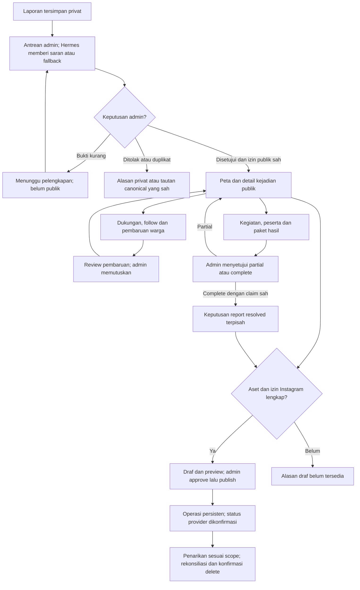

# Kontrak pengembangan SAP — Zaka dan Zamani

Tanggal: **3 Oktober 2026**. Versi dokumen: **1.0.0**. Cakupan: review Hermes, kejadian publik, komunitas, relawan, dampak, serta draf/publikasi/penarikan Instagram.

**Status: kontrak rancangan untuk implementasi.** Endpoint tambahan dalam dokumen ini belum tersedia. Baseline aplikasi yang diperiksa adalah commit `977abeb`; hasil fetch menunjukkan push Zaka `78c2dfb` pada 2 Oktober sudah masuk checkout ini. Kontrak mesin yang sedang dipakai aplikasi tetap OpenAPI **1.1.0**. Target paket tambahan adalah **1.2.0**, setelah schema, handler, fixture, dan frontend siap; nomor target bukan klaim API sudah dirilis.

Dokumen ini menggantikan catatan kontrak lama `contract.md` dan `docs/instagram-publication-contract.md` dari commit `78c2dfb`. Riwayat patch autentikasi/animasi tetap dapat dibaca di Git. [Riset Hermes/Instagram](research/2026-10-03-hermes-instagram.md) dan [rencana komunitas](research/2026-10-03-community-volunteers-hermes-ux.md) menjelaskan alasan rancangan. [Rencana backend](BACKEND_EXECUTION_PLAN.md) mengatur pekerjaan Zamani.

## 1. Pembagian kerja dan sumber acuan

| Pemilik | Tanggung jawab | Hasil yang diserahkan |
| --- | --- | --- |
| **Zaka — frontend dan UI/UX** | Antarmuka warga, relawan, koordinator, admin; konsumsi API; state; aksesibilitas; mock pengembangan | Komponen/halaman, adapter dan tipe hasil generate, penanganan error/status, integrasi API nyata |
| **Zamani — backend** | Aturan domain, API, database, media, worker, Hermes, Meta, audit, metrik, operasi | Schema/migration, DTO/handler, job/relay, otorisasi, fixture, readiness, monitoring, dokumentasi rilis |
| **Bersama** | Enum, nama field, nullability, status HTTP, batas input, perilaku konflik, versi kontrak | Satu baseline kontrak yang digunakan kedua sisi |

**Kebebasan desain Zaka:** susunan halaman, posisi navigasi, layout, bentuk komponen, warna, animasi, dan gaya visual ditentukan Zaka. Kontrak mengikat fungsi, data, status, izin, dan perilaku. Pembagian layar/menu dalam riset merupakan rekomendasi, bukan syarat bahwa sebuah fungsi harus ditempatkan pada layout tertentu. Tautan publik yang stabil tetap diperlukan agar peta, notifikasi, dan Instagram menuju kejadian yang sama.

Urutan acuan:

1. Untuk **fitur tambahan yang belum diimplementasikan**, dokumen ini menentukan kontrak rencana.
2. Saat implementasi, Zamani menerjemahkan DTO/operasi ini ke draft OpenAPI dan fixture; Zaka membangun dari tipe/mock yang sama. Drift diperbaiki di dokumen ini dan schema secara bersamaan.
3. Untuk **API yang sudah tersedia**, `contracts/openapi.json` 1.1.0 tetap acuan executable. Jangan menyatakan endpoint rencana tersedia hanya karena ada di Markdown.
4. Saat paket baru dirilis, OpenAPI, fixture, generated types, header versi, dan dokumen ini harus selaras. Schema draft tidak menggantikan kontrak published sebelum handler siap.
5. Riset tidak boleh mendefinisikan enum/endpoint tandingan. Jika ada perbedaan, koreksi semua dokumen terkait dalam perubahan yang sama.

## 2. Keputusan rilis pertama — R1

- Reviewer MVP memakai role `admin` existing; belum menambah role global moderator/publisher.
- Hermes memberi rekomendasi. Semua keputusan verifikasi/pembaruan/resolusi R1 oleh manusia.
- Laporan canonical menjadi identitas kejadian; `scanId` boleh null. Laporan manual yang memenuhi syarat diterima sebagai sumber Instagram.
- Status laporan existing dipertahankan. Visibility publik, review AI, consent media, kegiatan, dan publikasi adalah lifecycle tersendiri.
- Vote login + email terverifikasi, satu dukungan aktif per akun per kejadian terbuka. Vote tidak menambah poin, memverifikasi laporan, atau mengubah risiko H3.
- Pembaruan warga disimpan segera. Review AI asynchronous; gagal/timeout dapat ditinjau manual.
- Satu kegiatan aktif per kejadian pada R1; koordinator mempunyai izin per kegiatan, bukan menjadi admin global.
- Notifikasi di aplikasi pada R1. Email/WhatsApp, chat grup, hadiah vote, dan leaderboard komunitas ditunda.
- Draf Instagram otomatis saat sumber publik dan bahan/izin Instagram lengkap; publikasi membutuhkan persetujuan admin atas versi konten final.
- Satu akun professional SAP, Facebook Login for Business, single-image Feed. Kredensial dan provider ID operasional berada di server.
- Penarikan postingan dan rekonsiliasi termasuk R1. Kemampuan hapus harus dibuktikan pada akun aktual; jika belum tersedia, tampilkan `needs_action` dan jalur manual yang diaudit.
- Publikasi otomatis tanpa approval, penjadwalan post, serta auto-approve laporan adalah tahap lanjut. `canAutomate=false` pada R1; tidak ada endpoint schedule R1.
- Backend menghitung metrik dari bukti disetujui. Narasi angka R1 memakai template deterministik; narasi dampak AI dan bantuan draf kegiatan adalah backlog sesudah R1. Hermes tidak memperkirakan kg/CO₂ dari foto.

### Alur lintas frontend dan backend



## 3. Konvensi API bersama

Semua path tabel di bawah relatif terhadap **`/api/v1`**. Browser memakai origin yang sama, cookie `sap_session`, dan client/proxy SAP. Response normal memakai:

```json
{
  "data": {},
  "meta": { "requestId": "request-reference" }
}
```

```json
{
  "error": {
    "code": "REVISION_CONFLICT",
    "message": "Data sudah berubah. Muat versi terbaru.",
    "fields": { "description": ["Penjelasan terlalu panjang."] }
  },
  "meta": { "requestId": "request-reference" }
}
```

Contoh hanya menunjukkan bentuk; isi error dan `fields` mengikuti penyebab sebenarnya. `fields` opsional, nilainya `Record<string, string[]>`.

| Hal | Kesepakatan |
| --- | --- |
| Identitas | UUID string untuk entity; H3 cell string; `publicId` R1 adalah ID laporan canonical, bukan ID terpisah |
| Field | camelCase pada API, snake_case pada DB; tidak mengirim object key/internal provider payload |
| Waktu | ISO 8601 UTC; tampilan kegiatan/post mencantumkan zona waktu, default `Asia/Jakarta` |
| Angka | Count integer >=0; kg number >=0; data belum diketahui `null`, bukan angka nol palsu |
| Nullability | Semua field DTO response yang dicantumkan wajib, kecuali disebut optional; `null` tetap dikirim pada field nullable |
| Request | Field di tabel/input wajib kecuali diberi `?`; field asing ditolak oleh validator |
| Panjang teks | Batas karakter memakai Unicode code points setelah normalisasi NFC/trim; validasi server menjadi acuan, bukan jumlah byte atau unit UTF-16 |
| Auth | Tidak memakai token sesi di localStorage. Public DTO tidak berisi viewer-specific data |
| Mutasi | `X-CSRF-Token` dari `GET /auth/csrf`; pengecualian hanya callback OAuth provider yang memakai state sekali pakai |
| `If-Match` | String integer positif, mengikuti pola SAP sekarang, contoh `If-Match: 4`; revisi basi → 409 |
| Idempotency | `Idempotency-Key` UUID pada create/decision/command yang ditandai `IK`; key sama + payload/revision sama mereplay hasil; payload berbeda → 409 |
| Penetapan state | PUT support/follow/read-state memakai desired state, bukan toggle; request ulang tidak menggandakan tindakan |
| Pagination baru | `limit` default 20, maksimal 50; cursor opaque; `nextCursor=null` di akhir; sort server stabil |
| Pagination existing | Endpoint legacy mempertahankan batas existing. Endpoint Instagram baru mengikuti default 20/max50; adapter lama `limit=12` tetap valid |
| Cache | Data personal/admin `Cache-Control: no-store`. Proyeksi publik R1 juga no-store sampai invalidation/revocation dapat dipastikan |
| Async | HTTP 202 berarti diterima untuk diproses; bukan bukti AI sukses, post terbit, atau post terhapus |
| Header versi | Header runtime mengikuti kontrak published; jangan mengirim 1.2.0 sementara aplikasi masih memakai schema 1.1.0 |

`Page<T> = { items: T[], nextCursor: string|null }`. `PublicationPage` menambah `total` untuk seluruh hasil filter. Query cursor tidak boleh digunakan bersama filter berbeda; cursor invalid → 400 `INVALID_CURSOR`.

Notasi: **P** publik; **U** sesi aktif; **V** sesi + email terverifikasi; **A** admin; **C** admin atau koordinator kegiatan tersebut. Semua izin diperiksa backend. `IM` berarti If-Match wajib; `IK` berarti Idempotency-Key wajib. Semua operasi tulis juga CSRF kecuali callback yang dinyatakan khusus.

## 4. Enum dan lifecycle resmi R1

| Domain/field | Nilai |
| --- | --- |
| `Report.status` existing | `submitted`, `verified`, `in_progress`, `resolved`, `rejected`, `duplicate` |
| `publicVisibility` | `hidden`, `public`, `withdrawn` |
| `ReviewRun.status` | `queued`, `running`, `completed`, `failed`, `superseded` |
| Rekomendasi review | `recommend_accept`, `human_review`, `recommend_reject`, `recommend_duplicate` |
| Pembaruan: `kind` | `still_present`, `reduced`, `looks_clean`, `information_wrong` |
| Pembaruan: `status` | `submitted`, `needs_evidence`, `approved`, `rejected` |
| `correctionField` | `location`, `category`, `time`, `photo`, `other`, atau null |
| Kegiatan: `status` | `draft`, `registration_open`, `registration_closed`, `in_progress`, `awaiting_result`, `completed`, `on_hold`, `cancelled` |
| Permintaan ikut: `status` | `requested`, `accepted`, `waitlisted`, `rejected`, `cancelled` |
| Kehadiran: `attendance` | `unknown`, `present`, `absent` |
| Hasil kegiatan: `status` | `submitted`, `needs_evidence`, `approved`, `rejected` |
| Hasil kegiatan: outcome | `partial`, `complete`; `verifiedOutcome=null` sebelum disetujui |
| Pengukuran: `stage` | `collected`, `handed_over`, `recycled` |
| Pengukuran: `status` | `pending_review`, `verified`, `rejected`, `superseded` |
| Consent channel | `web`, `instagram` |
| Post: `status` | `draft`, `publishing`, `published`, `failed`, `cancelled`, `retracting`, `retracted`, `needs_action` |
| Approval post: `status` | `unapproved`, `approved`, `invalidated` |
| Operasi async: `status` | `queued`, `running`, `succeeded`, `failed`, `needs_action`, `cancelled` |
| Operasi publikasi: `kind` | `publish`, `retract`, `disconnect` |

Untuk tipe tertutup di bawah, gunakan alias `PublicReportStatus = 'verified'|'in_progress'|'resolved'` dan `ActivityStatus` delapan state kegiatan pada tabel ini. ReasonCode tidak menentukan status secara otomatis.

`requiresHumanReview=true` untuk review R1, termasuk saat `status=completed`. `needs_human` bukan status eksekusi. `completed` pada review hanya berarti hasil AI valid telah tersimpan; tidak berarti laporan disetujui.

### Aturan transisi

- Laporan memakai domain moderasi existing. Pencabutan visibility tidak dipaksakan menjadi `rejected`; koreksi status adalah keputusan terpisah.
- Pembaruan/hasil: `submitted → needs_evidence → submitted` saat pengirim melengkapi; `submitted → approved|rejected`. Hasil Hermes lama pada revisi sebelumnya menjadi `superseded`.
- Kegiatan: `draft → registration_open → registration_closed → in_progress → awaiting_result → completed`. `completed` berarti hasil kegiatan disetujui, outcome bisa partial. Kejadian partial tetap terbuka.
- `on_hold` menyimpan state sebelumnya dan alasan; resume memvalidasi koordinator, sumber, serta jadwal lagi. `cancelled` terminal untuk kegiatan tersebut.
- Permintaan: `requested → accepted|waitlisted|rejected`; accepted/waitlisted/requested dapat cancelled oleh pemilik sebelum kegiatan dimulai. Perubahan setelah mulai dikelola koordinator dengan alasan.
- Post: `draft|failed → publishing → published|failed|needs_action`; `published → retracting → retracted|needs_action`. PublishedAt historis tetap ada setelah retract.
- Cancel post hanya bila belum terbit dan tidak ada request publish yang masih berjalan. Untuk publish berjalan/hasil belum pasti, gunakan retract intent dan rekonsiliasi.
- `retracted` membutuhkan konfirmasi provider atau bukti penghapusan manual yang ditinjau admin. 404/permission error saja bukan konfirmasi.

## 5. Persyaratan fungsi frontend — milik Zaka

Tidak ada ketentuan tabel versus kartu, drawer versus halaman, ukuran sidebar, atau posisi tombol pada kontrak ini.

| ID | Kemampuan yang wajib tersedia | Data/API dan state yang dipakai |
| --- | --- | --- |
| FE-01 | Jelajah area dan kejadian tanpa login; tautan kejadian stabil | Endpoint area existing + detail publik; kosong/gagal/dicabut/redirect canonical |
| FE-02 | Lihat ringkasan, status, waktu pengamatan, bukti publik, timeline | `PublicIncident`; tidak meminta detail pemilik sebagai fallback |
| FE-03 | Dukung dan batalkan, kembali ke tujuan setelah login/verifikasi | `IncidentViewer`, PUT support; syarat dari server; timeout baca ulang state |
| FE-04 | Ikuti/berhenti mengikuti dan lihat kabar penting | PUT follow, daftar notifikasi; tidak otomatis follow karena vote |
| FE-05 | Kirim/lengkapi pembaruan kondisi dengan bukti | Upload, consent, `CommunityUpdate`; draft form tidak hilang saat error |
| FE-06 | Lihat status kontribusi sendiri dan permintaan tambahan bukti | Daftar milik sendiri; alasan aman; revisi terbaru |
| FE-07 | Jelajah/detail kegiatan, minta ikut, batalkan, lihat kegiatan sendiri | Activity public + viewer + membership; kuota dan status pending jelas |
| FE-08 | Koordinator mengelola kegiatan yang ditugaskan dan peserta | Manage DTO; accepted/waitlisted/cancelled, kehadiran, jadwal, hasil |
| FE-09 | Admin meninjau laporan/pembaruan/bukti kegiatan | Review queue, saran AI, bukti berizin, keputusan, konflik revisi, manual fallback |
| FE-10 | Admin mengelola draf/preview/approval/publish/cancel/retract Instagram | Post, account/capabilities, operation status, riwayat; pending bukan sukses |
| FE-11 | Admin menghubungkan akun dan mengetahui masalah izin/token | Authorization redirect; callback result; capability reasons tanpa credential |
| FE-12 | Lihat dampak dengan periode dan cakupan bukti | `ImpactSummary`; kg unknown berbeda dari 0; collected/handed_over/recycled berbeda |
| FE-13 | Perubahan status/error dapat dipahami dan diakses | Loading/empty/error/forbidden/expired/conflict/paused; keyboard dan pesan status |
| FE-14 | Penyuntingan aman ketika resource berubah | IM, draft pengguna dipertahankan; tampilkan versi server dan pilih ulang tindakan |

SAPA tetap opsional. Penambahan bantuan kejadian/kegiatan dilakukan pada tahap lanjut dengan perluasan konteks yang terkoordinasi. Animasi tidak memanggil API per frame dan tidak menandai job sukses berdasarkan timer.

## 6. Baseline existing yang dipakai kembali

| Operasi existing | Peran dalam fitur tambahan |
| --- | --- |
| Auth/OTP/MFA, `GET /auth/me`, `GET /auth/csrf` | Sesi, emailVerified, role, CSRF; tidak membangun sistem login kedua |
| `POST /media`, `GET /media/{mediaId}/url` | Upload dan URL milik owner; akses cross-user tetap melalui endpoint berizin sesuai hubungan |
| `POST /reports`, `GET /reports/mine`, `GET/PATCH /reports/{reportId}` | Laporan privat pemilik/admin; tidak dibuka sebagai endpoint publik |
| `GET /areas`, `GET /areas/{cellId}`, `GET /areas/{cellId}/reports` | Peta/agregat dan daftar publik per area; predicate visibility perlu ditambahkan |
| `GET /admin/reports`, `/duplicates`, `POST /admin/reports/{id}/decisions` | Moderasi canonical, revisi, status, poin, timeline, audit |
| Assistant chat, scan hybrid, categories, account deletion | Tetap menggunakan domain existing; fitur baru memperluas dependensi yang relevan |

Taxonomy kategori tetap sepuluh ID existing; nama dari `/categories`. Nilai lokasi publik tidak mengambil exact coordinate `Report.location`. H3 risk tetap memakai kejadian canonical/hari sesuai `HOTSPOT_RULES`, bukan vote.

Temuan patch Zaka yang tetap relevan: `Challenge.message`, `expiresAt`, dan `retryAfterSeconds` perlu digunakan sesuai semantik; respons resend tidak membuktikan email terkirim. Pengosongan input tidak membatalkan challenge server. Temuan retry SMTP/kebijakan OTP lama dicatat sebagai audit baseline tersendiri, bukan syarat membuat auth baru untuk fitur komunitas.

## 7. API kejadian publik, dukungan, dan follow

| Method/path | Izin/header | Input | HTTP dan data sukses |
| --- | --- | --- | --- |
| GET `/public/incidents/{id}` | P | ID laporan/link publik | 200 `PublicIncident` atau `CanonicalRedirect` |
| GET `/public/incidents/{id}/timeline` | P | limit/cursor | 200 `Page<PublicTimelineEvent>` |
| GET `/public/incidents/{id}/viewer` | U, no-store | — | 200 `IncidentViewer` |
| PUT `/public/incidents/{id}/support` | V | `{ supported: boolean }` | 200 `SupportState` |
| PUT `/public/incidents/{id}/follow` | U | `{ following: boolean }` | 200 `FollowState` |
| GET `/users/me/followed-incidents` | U | limit/cursor | 200 `Page<FollowedIncident>` |

```ts
type ActionPermission = { allowed: boolean; reasonCode: string | null };
type PublicEvidence = {
  id: string; url: string; expiresAt: string;
  observedAt: string | null; caption: string;
};
type PublicIncident = {
  kind: 'incident'; id: string; sourceRevision: number;
  title: string; summary: string; status: 'verified'|'in_progress'|'resolved';
  categoryId: string | null; area: { cellId: string; label: string };
  occurredAt: string; lastObservedAt: string | null; updatedAt: string;
  evidence: PublicEvidence[]; supportCount: number; supportClosed: boolean;
  relatedActivityIds: string[]; canonicalPath: string;
};
type CanonicalRedirect = { kind: 'redirect'; canonicalId: string; canonicalPath: string };
type PublicTimelineEvent = {
  id: string; kind: 'verified'|'condition_updated'|'handling_started'|'resolved'|'correction'|'activity_result';
  occurredAt: string; observedAt: string | null; summary: string; evidence: PublicEvidence[];
};
type IncidentViewer = {
  incidentId: string; supported: boolean; following: boolean;
  actions: { support: ActionPermission; update: ActionPermission; follow: ActionPermission };
};
type SupportState = { incidentId: string; supported: boolean; supportCount: number; supportClosed: boolean };
type FollowState = { incidentId: string; following: boolean };
type FollowedIncident = {
  incidentId: string; title: string | null; status: PublicReportStatus | null;
  availability: 'public'|'withdrawn'; canonicalPath: string;
  lastEventAt: string | null;
};
```

PublicEvidence ID adalah referensi evidence publik, bukan izin mengambil original melalui endpoint owner. Tidak ada `reporterId`, email, exact location, description privat, alasan moderasi privat, atau pending update warga lain pada DTO publik.

Private/nonexistent incident → 404 `NOT_FOUND`. Link yang sebelumnya publik kemudian ditarik → 410 `INCIDENT_WITHDRAWN` dengan pesan generik tanpa konten lama. Alias duplikat hanya mengarah ke canonical yang masih publik. GET timeline mengikuti izin yang sama. Viewer tidak membuat incident privat menjadi terbuka.

PUT support memvalidasi status/visibility dalam transaksi dan unique `(userId, canonicalReportId)`. Support tetap dapat dicabut oleh penghapusan akun; resolved menutup tindakan biasa dan menyimpan riwayat. Follow boleh dihentikan meskipun kejadian kemudian dicabut. Endpoint private untuk berhenti follow tetap tidak mengembalikan konten yang telah ditarik.

Perubahan vote/follow tidak menaikkan `reports.revision`. Perubahan status, summary, bukti publik, visibility, atau kondisi terkini yang disetujui menaikkan revisi sumber; snapshot konten juga memiliki hash agar review/approval usang ditolak.

## 8. Media, consent, dan akses bukti

Upload existing tetap multipart `file` + `purpose`; JPEG/PNG/WebP, maksimum **10 MiB**, decoded maksimum **25 megapiksel**. Usulan purpose baru: `community` dan `activity_evidence`, di samping `scan`, `report`, `resolution`, `avatar`. Perlu schema, DTO, DB constraint, dan tipe frontend yang diperbarui bersama. Media upload belum otomatis terlampir atau disetujui.

| Method/path | Izin/header | Input | HTTP dan data |
| --- | --- | --- | --- |
| GET `/media/{mediaId}/consents` | U, owner | — | 200 `MediaConsents` |
| PUT `/media/{mediaId}/consents` | V, owner, IM | `{ channels: ('web'|'instagram')[] }` | 200 `MediaConsents` |
| PUT `/admin/reports/{reportId}/media/{mediaId}/approvals` | A, IM report, IK | `{ channel, approved, renditionId, reason }` | 200 `ReportLifecycle` |
| GET `/admin/reports/{reportId}/media/{mediaId}/url` | A, relasi report/media | — | 200 `{ url, expiresAt }` untuk review privat |
| GET `/admin/community-updates/{id}/media/{mediaId}/url` | A, relasi update/media | — | 200 `{ url, expiresAt }` |
| GET `/activities/{id}/results/{resultId}/media/{mediaId}/url` | C, relasi result/media | — | 200 `{ url, expiresAt }` |
| GET `/activities/{id}/measurements/{measurementId}/media/{mediaId}/url` | C, relasi measurement/media | — | 200 `{ url, expiresAt }` bukti timbang privat |
| POST `/admin/media/{mediaId}/renditions` | A, IM subjek, IK | `{ subjectType, subjectId, redactions }` | 202 `EvidenceRendition` queued |
| GET `/admin/media/{mediaId}/renditions` | A, relasi subjek/media | subjectType, subjectId, limit/cursor | 200 `Page<EvidenceRendition>` |

```ts
type MediaConsents = {
  mediaId: string; revision: number; channels: ('web'|'instagram')[]; updatedAt: string;
};
type EvidenceRendition = {
  id: string; mediaId: string; revision: number; status: 'queued'|'ready'|'failed';
  url: string | null; expiresAt: string | null;
  redactions: { x: number; y: number; width: number; height: number }[];
};
type EvidencePublicationInput = {
  mediaId: string; renditionId: string; channels: ('web'|'instagram')[];
};
type ReportLifecycle = {
  reportId: string; sourceRevision: number; publicVisibility: 'hidden'|'public'|'withdrawn';
  instagramAllowed: boolean; latestReview: ReviewRun | null;
  approvedResolutionEvidence: ApprovedResolutionEvidence[];
  publicationAssets: {
    mediaId: string; renditionId: string; channels: ('web'|'instagram')[];
    sourceType: 'report'|'community_update'|'activity_result'; sourceId: string;
  }[];
  publicationMilestones: {
    id: string; type: 'activity_result'|'report_resolution'; observedAt: string;
    outcome: 'partial'|'complete'; summary: string;
  }[];
  actions: {
    moderate: ActionPermission; withdraw: ActionPermission; restore: ActionPermission;
    createInstagramDraft: ActionPermission;
  };
};
type ApprovedResolutionEvidence = {
  id: string; reportId: string; sourceType: 'community_update'|'activity_result';
  sourceId: string; sourceRevision: number; mediaId: string;
  approvedAt: string; observedAt: string; status: 'valid'|'revoked';
};
```

Pada approval media, `channel='web'|'instagram'`, `approved` boolean, `renditionId` nullable hanya ketika approved=false, `reason` 5–1000 karakter. IM mengikuti revisi laporan. Jika approved=true: consent owner untuk channel harus aktif, media terhubung ke laporan/bukti yang sah, rendition hasil proses publik harus siap, dan reviewer memilih rendition tersebut. Metadata EXIF dihapus saat normalisasi, tetapi itu tidak otomatis menyamarkan wajah/plat.

Consent owner dan keputusan reviewer merupakan dua syarat berbeda. Legacy `publishedMediaIds` tidak dipakai sebagai consent Instagram. Legacy public key yang menunjuk object asli tidak dianggap bukti sudah disamarkan. Foto dapat tetap dipakai untuk review privat sesuai hak akses sementara pemakaian publik ditahan.

Lifecycle menyediakan pilihan aset/milestone yang sudah sah untuk admin membuat draf; alasan createInstagramDraft menjelaskan sumber/bahan/izin yang kurang. PublicationAssets mencakup lampiran report dan bukti update/result approved yang terkait. Endpoint report/media harus memeriksa hubungan tersebut, bukan memberi akses global ke media hanya karena pemohon admin.

Rendition request memakai subjectType report/community_update/activity_result, subjectId yang mempunyai relasi dengan media, dan IM revisi subjek. Redactions 0–20 persegi panjang normalized 0..1, width/height positif dan seluruh rectangle berada dalam gambar; server melakukan penyamaran deterministik lalu membuat kandidat privat. Ready mempunyai url/expiresAt valid; queued/failed keduanya null. Daftar kandidat bukan izin tampil publik. Admin memilih rendition pada approval/decision. Bila belum ada foto yang aman, minta bukti pengganti atau tahan publikasi; jangan membuat gambar bukti generatif.

Mengurangi channel consent menulis outbox penarikan aset dalam transaksi. Menarik Instagram saja tidak menghapus ringkasan publik SAP yang masih sah. Menarik web mencabut URL bukti web; bila post memakai aset yang izin Instagram-nya ikut ditarik, post itu juga ditarik. Semua penggunaan aset perlu dapat ditemukan melalui hubungan source/rendition/post.

Foto privat tidak dapat ditarik kembali dari pihak yang sudah menyimpannya; server mencabut akses baru, menghapus cache yang dikontrol SAP, dan menggunakan URL berumur pendek. Frontend tidak menyimpan signed URL ke localStorage. Pekerjaan media purge/orphan/account deletion wajib mengenali hubungan baru agar bukti yang terlampir tidak terhapus sebagai orphan.

## 9. API pembaruan kondisi

| Method/path | Izin/header | Input | HTTP dan data |
| --- | --- | --- | --- |
| POST `/public/incidents/{id}/updates` | V, IK | `CommunityUpdateInput` | 201 `CommunityUpdate` |
| GET `/users/me/community-updates` | U | limit/cursor/status? | 200 `Page<CommunityUpdate>` |
| GET `/community-updates/{id}` | U, pengirim atau A | — | 200 `CommunityUpdate` |
| GET `/admin/community-updates/{id}` | A | — | 200 `AdminCommunityUpdate` |
| PATCH `/community-updates/{id}` | V, pengirim, IM | `CommunityUpdateInput` lengkap | 200 `CommunityUpdate` revisi baru |
| POST `/admin/community-updates/{id}/decisions` | A, IM, IK | `CommunityUpdateDecision` | 200 `CommunityUpdate` |

```ts
type CommunityUpdateInput = {
  kind: 'still_present'|'reduced'|'looks_clean'|'information_wrong';
  observedAt: string; description: string; mediaIds: string[];
  correctionField: 'location'|'category'|'time'|'photo'|'other'|null;
};
type CommunityUpdate = {
  id: string; reportId: string; revision: number;
  kind: CommunityUpdateInput['kind']; observedAt: string; description: string;
  mediaIds: string[]; correctionField: CommunityUpdateInput['correctionField'];
  status: 'submitted'|'needs_evidence'|'approved'|'rejected';
  publicSummary: string | null; requestedEvidence: string[];
  decisionReason: string | null;
  approvedResolutionEvidence: ApprovedResolutionEvidence[];
  createdAt: string; updatedAt: string;
};
type CommunityUpdateDecision = {
  action: 'approve'|'request_evidence'|'reject'; reason: string;
  publicSummary: string | null; publicEvidenceApprovals: EvidencePublicationInput[];
  requestedEvidence: string[];
};
type AdminCommunityUpdate = CommunityUpdate & { latestReview: ReviewRun | null };
```

Input: description 10–1000 karakter, waktu pengamatan tidak di masa depan, foto 0–3 ID unik purpose community milik pengirim. CorrectionField wajib non-null hanya untuk information_wrong, selain itu null. Pembaruan pada kejadian resolved masih boleh mengusulkan koreksi/pengamatan baru; bukan otomatis vote baru atau membuka kembali kejadian.

PATCH hanya untuk submitted/needs_evidence; melengkapi needs_evidence mengembalikan status submitted. Satu pembaruan pending sejenis per akun/kejadian; salinan baru → 409 `PENDING_UPDATE_EXISTS` dengan referensi milik pengirim untuk dilengkapi. Hasil sudah diputuskan diperbaiki melalui pembaruan lanjutan.

Decision: reason 5–1000; approve membutuhkan publicSummary 1–500 bila membuat pembaruan publik; publicEvidenceApprovals 0–3 hanya media terlampir, rendition ready yang dipilih, serta consent untuk setiap channel. Request_evidence membutuhkan requestedEvidence 1–3 butir, masing-masing 1–300 karakter. Reject/request_evidence tidak menerbitkan summary/foto baru; publicSummary=null dan publicEvidenceApprovals kosong. RequestedEvidence kosong untuk approve/reject.

Looks_clean tanpa foto bisa disimpan tetapi tidak menghasilkan approved resolution evidence hingga foto sesudah dengan waktu/relasi yang sesuai disetujui. R1 tidak mempunyai jalur claim tanpa media. Approve update tidak otomatis resolved. Observation lama dapat masuk riwayat tanpa menimpa lastObservedAt/kondisi terbaru.

## 10. Review Hermes dan antrean admin

| Method/path | Izin/header | Input | HTTP dan data |
| --- | --- | --- | --- |
| GET `/admin/review-queue` | A | type=`all|report|community_update|activity_result`, limit/cursor | 200 `Page<ReviewQueueItem>` |
| GET `/admin/reports/{id}/reviews` | A | limit/cursor | 200 `Page<ReviewRun>` |
| GET `/admin/reviews` | A | subjectType, subjectId, limit/cursor | 200 `Page<ReviewRun>` |
| GET `/admin/reports/{id}/lifecycle` | A | — | 200 `ReportLifecycle` |
| POST `/admin/reviews` | A, IK | `{ subjectType, subjectId, subjectRevision }` | 202 `ReviewRun` |
| GET `/admin/reviews/{id}` | A | — | 200 `ReviewRun` |

```ts
type ReviewSubjectType = 'report'|'community_update'|'activity_result';
type ReviewRun = {
  id: string; subjectType: ReviewSubjectType; subjectId: string; subjectRevision: number;
  reportId: string; sourceReportRevision: number; snapshotHash: string;
  status: 'queued'|'running'|'completed'|'failed'|'superseded';
  requiresHumanReview: boolean; result: EvidenceReviewResult | null;
  errorCode: string | null; modelVersion: string; policyVersion: string;
  createdAt: string; finishedAt: string | null;
};
type EvidenceReviewResult = {
  schemaVersion: 'sap-evidence-review-v1';
  subjectType: ReviewSubjectType; subjectId: string; subjectRevision: number;
  sourceReportId: string; sourceReportRevision: number; snapshotHash: string;
  recommendation: 'recommend_accept'|'human_review'|'recommend_reject'|'recommend_duplicate';
  reasonCodes: ReviewReasonCode[];
  evidence: { mediaId: string; observation: string }[];
  duplicateCandidates: string[]; missingEvidence: string[];
  publicSummaryProposal: string | null; publicationWarnings: string[];
};
type ReviewReasonCode =
  'LOCATION_UNCONFIRMED'|'TIME_UNCONFIRMED'|'POSSIBLE_DUPLICATE'|
  'MORE_EVIDENCE_REQUIRED'|'EVIDENCE_CONFLICT'|'IMAGE_UNCLEAR'|
  'PUBLIC_PRIVACY_RISK'|'NO_NEW_EVIDENCE'|'PARTIAL_CLEANUP'|'MEASUREMENT_UNCONFIRMED';
type ReviewQueueItem = {
  subjectType: ReviewSubjectType; subjectId: string; subjectRevision: number;
  reportId: string; title: string; submittedAt: string;
  reviewState: 'pending'|'needs_evidence'; latestReview: ReviewRun | null;
};
```

Body POST reviews subjectType adalah enum di atas. Revision yang tidak sesuai → 409. Rerun eksplisit mendapat intent baru; retry transport memakai key yang sama. Subject tanpa kewenangan/relasi valid ditolak. Contract browser tidak mengekspos endpoint service Hermes, tool credential, model message history, atau penalaran internal.

`recommend_accept` berarti usulan menerima sesuai jenis subjek: memverifikasi laporan baru, menyetujui pembaruan, atau menerima paket hasil. **Tidak berarti otomatis menyelesaikan kejadian.** recommend_duplicate hanya sah untuk report. Missing/conflicting evidence dilaporkan melalui reasonCodes/missingEvidence, bukan enum rekomendasi baru.

Completed membutuhkan result valid, ID/revisi/hash yang cocok dan errorCode=null. Failed memiliki errorCode aman, result=null, finishedAt terisi; tetap bisa ditinjau manual. Superseded berarti tidak boleh menjadi dasar approval. Nilai modelVersion untuk job queued berasal konfigurasi yang dipin, bukan dipilih browser.

Antrean berdasarkan kontribusi yang perlu keputusan manusia, bukan hanya ReviewRun gagal. Laporan submitted masuk antrean meskipun AI belum dipanggil. Hal ini menjaga fallback saat feature AI mati atau budget habis.

## 11. API kegiatan dan peserta

| Method/path | Izin/header | Input | HTTP dan data |
| --- | --- | --- | --- |
| GET `/activities` | P | limit/cursor, cellId?, from?, to?, availableOnly? | 200 `Page<PublicActivity>` |
| GET `/activities/{id}` | P | — | 200 `PublicActivity` atau `ActivityNotice` |
| GET `/activities/{id}/viewer` | U | — | 200 `ActivityViewer` |
| GET `/users/me/activities` | U | limit/cursor | 200 `Page<MyActivity>` |
| GET `/users/me/coordinator-assignments` | U, assignment milik sendiri | limit/cursor | 200 `Page<ManagedActivity>` |
| GET `/admin/activities` | A | limit/cursor/status?, reportId? | 200 `Page<ManagedActivity>` |
| GET `/admin/activity-coordinator-candidates` | A | search, limit/cursor | 200 `Page<{ id: string, displayName: string }>` |
| POST `/admin/activities` | A, IK | `ActivityInput` | 201 `ManagedActivity` draft |
| GET `/activities/{id}/manage` | C | — | 200 `ManagedActivity` |
| PATCH `/activities/{id}` | C, IM | `ActivityInput` lengkap | 200 `ManagedActivity` |
| POST `/activities/{id}/commands` | C, IM, IK | `{ action, reason }` | 200 `ManagedActivity` |
| PUT `/activities/{id}/membership` | V | `{ participating: boolean }` | 200 `Membership` |
| GET `/activities/{id}/memberships` | C | limit/cursor/status? | 200 `Page<ManagedMembership>` |
| PATCH `/activities/{id}/memberships/{membershipId}` | C, IM membership | `{ status: 'accepted'|'waitlisted'|'rejected'|'cancelled', reason }` | 200 `ManagedMembership` |
| PUT `/activities/{id}/memberships/{membershipId}/attendance` | C, IM membership | `{ attendance: 'unknown'|'present'|'absent' }` | 200 `ManagedMembership` |

```ts
type ActivityInput = {
  reportId: string; title: string; description: string; coordinatorId: string | null;
  startsAt: string | null; endsAt: string | null; registrationClosesAt: string | null;
  timezone: 'Asia/Jakarta'; capacity: number | null;
  meetingPoint: { instructions: string; latitude: number | null; longitude: number | null } | null;
  equipment: string[]; accessibilityNotes: string; wasteHandoverPlan: string;
};
type PublicActivity = {
  kind: 'activity'; id: string; reportId: string; revision: number; title: string; description: string;
  status: 'registration_open'|'registration_closed'|'in_progress'|'awaiting_result'|'completed'|'on_hold'|'cancelled';
  cancellationReason: string|null;
  area: { cellId: string; label: string }; coordinatorDisplayName: string;
  startsAt: string; endsAt: string; registrationClosesAt: string; timezone: 'Asia/Jakarta'; capacity: number;
  acceptedCount: number; availableSeats: number; registrationOpen: boolean;
  equipment: string[]; accessibilityNotes: string; wasteHandoverPlan: string;
  resultOutcome: 'partial'|'complete'|null; canonicalPath: string;
};
type ActivityViewer = {
  activityId: string; membership: Membership | null;
  meetingPoint: ActivityInput['meetingPoint']; scheduleRevision: number;
  scheduleAcknowledgementRequired: boolean;
  actions: { join: ActionPermission; cancelMembership: ActionPermission; manage: ActionPermission };
};
type ManagedActivity = ActivityInput & {
  id: string; revision: number; status: ActivityStatus; coordinatorAcceptedAt: string | null;
  acceptedCount: number; availableSeats: number; holdReason: string | null;
  priorState: ActivityStatus | null; createdAt: string; updatedAt: string;
  actions: {
    publish: ActionPermission; edit: ActionPermission; cancel: ActionPermission;
    start: ActionPermission; closeRegistration: ActionPermission;
    hold: ActionPermission; resume: ActionPermission; requestResult: ActionPermission;
  };
};
type Membership = {
  id: string; activityId: string; revision: number;
  status: 'requested'|'accepted'|'waitlisted'|'rejected'|'cancelled';
  attendance: 'unknown'|'present'|'absent'; reason: string | null;
  createdAt: string; updatedAt: string;
};
type ManagedMembership = Membership & { displayName: string };
type ActivityNotice = {
  kind: 'activity_notice'; id: string; status: 'on_hold'|'cancelled'; message: string;
  cancellationReason: string|null; canonicalPath: string;
};
type MyActivity = { activity: PublicActivity | ActivityNotice; membership: Membership | null; isCoordinator: boolean };
```

ActivityInput wajib memuat semua field; nullable boleh pada draft. Sebelum publish: sumber canonical publik terbuka, koordinator diterima, waktu/kapasitas/titik kumpul/rencana penanganan lengkap, startsAt dan registrationClosesAt belum lewat. Title 5–150, description 20–2000, capacity 1–200, equipment <=15 butir masing-masing 1–200, accessibilityNotes 0–1000, wasteHandoverPlan 0–1000 saat draft dan 1–1000 saat publish. MeetingPoint.instructions 1–1000 bila titik kumpul terisi. startsAt<endsAt, registrationClosesAt<=startsAt; latitude/longitude berpasangan dan batas geografi valid. ReportId immutable setelah create; koordinator hanya bisa diubah admin dan calon baru harus menerima.

Tambahan penerimaan tugas: `PUT /activities/{id}/coordinator-acceptance` V, calon koordinator yang ditunjuk, IM activity; body `{ accepted: boolean, publishDisplayName: boolean }`, 200 ManagedActivity. Calon yang belum menerima dapat membaca penugasannya sendiri. Publish hanya A. Command action=`publish|close_registration|start|hold|resume|cancel|request_result`; reason wajib 5–1000 untuk hold/resume/cancel dan nullable untuk lainnya. Pada `cancel`, reason adalah teks publik yang boleh dibaca siapa pun; pada `hold`, reason adalah catatan internal privat. Alasan resume hanya untuk audit. Status transisi tidak dikendalikan timer browser.

Coordinator candidates hanya akun aktif dengan email terverifikasi, search displayName 3–100 karakter; hasil tidak berisi email/telepon atau role privat. Endpoint khusus admin ini membantu memilih calon, bukan menetapkan tugas tanpa persetujuannya. Assignment baru diberitahukan melalui notifikasi in-app coordinator_assigned; penolakan penerimaan membuat coordinatorAcceptedAt=null dan kegiatan belum boleh publish.

PublicActivity tidak membuka meetingPoint rinci atau daftar peserta. MeetingPoint viewer hanya untuk accepted member atau C selama aksesnya sah; setelah source dicabut peserta mendapat null dan C mengakses detail melalui manage untuk penanganan. Nama koordinator publik memakai displayName jika disetujui saat menerima tugas, selain itu label Koordinator SAP; bukan email. Daftar kegiatan mengecualikan draft dan kejadian nonpublik; detail kegiatan yang pernah publik dengan source dicabut mengembalikan ActivityNotice tanpa konten sumber. GET activities/{id} karena itu mengembalikan union PublicActivity|ActivityNotice; MyActivity memakai union yang sama.

`cancellationReason` hanya berisi alasan publik dari kolom terpisah yang ditetapkan saat command `cancel`; nilainya null kecuali status kegiatan `cancelled`. Alasan untuk `hold`, peninjauan sumber, atau assignment koordinator disimpan sebagai `holdReason` privat bagi route terkelola dan tidak pernah disalin ke proyeksi publik/ActivityNotice. Operator yang membatalkan wajib menulis alasan yang aman untuk ditampilkan publik; teks ini boleh tampil pada ActivityNotice cancelled yang diterima peserta terdahulu melalui `/users/me/activities`, tanpa membuka konten kejadian yang ditinjau/ditarik. Baris pembatalan sebelum migrasi tidak di-backfill dari `hold_reason`, sehingga cancellationReason-nya null.

PUT membership participating=true membuat requested, bukan langsung accepted. Request ulang tidak mengubah accepted kembali requested. participating=false membatalkan permintaan sendiri sesuai aturan waktu. Rejoin setelah cancelled sebelum penutupan mengembalikan requested. Join menolak setelah deadline/ketika sumber nonpublik walaupun UI masih menampilkan tombol.

Persetujuan accepted mengunci row kegiatan dan menghitung slot dalam transaksi. Penuh → 409 `ACTIVITY_FULL`, koordinator dapat menetapkan waitlisted. Membership decision membutuhkan reason 5–1000; requested/waitlisted boleh accepted/rejected, accepted dapat cancelled dengan alasan. Rejected/cancelled tidak dapat dihidupkan koordinator tanpa permintaan baru dari pemilik. Pembatalan mengembalikan slot sebelum kegiatan dimulai. Tidak otomatis mempromosikan waitlist tanpa keputusan koordinator. Attendance hanya accepted participant saat kegiatan berlangsung/menunggu hasil; unknown tidak dihitung sebagai hadir. Setelah hasil approved, koreksi kehadiran oleh C tetap memakai IM dan audit agar agregat dapat diperbaiki.

Perubahan startsAt/endsAt atau meetingPoint setelah publish membutuhkan acknowledgement peserta: `PUT /activities/{id}/schedule-acknowledgement` U, accepted member; body `{ scheduleRevision: number, confirmed: boolean }`, 200 Membership. ScheduleRevision berasal ActivityViewer; tidak berubah karena edit judul/approval lain. Confirmed=false membatalkan keikutsertaan; revision basi →409. Backend tetap menahan tempat selama belum dijawab dan koordinator menindaklanjuti, sehingga UI tidak menjanjikan slot yang sudah dipakai orang lain. Jangan mengubah jadwal kegiatan completed; koreksi historis memakai audit admin dan tidak meminta peserta melakukan pendaftaran ulang.

## 12. Bukti hasil, resolusi, dan pengukuran

| Method/path | Izin/header | Input | HTTP dan data |
| --- | --- | --- | --- |
| POST `/activities/{id}/results` | C, IK | `ActivityResultInput` | 201 `ActivityResult` |
| GET `/activities/{id}/results/{resultId}` | C | — | 200 `ActivityResult` privat |
| GET `/admin/activity-results/{id}` | A | — | 200 `AdminActivityResult` |
| PATCH `/activities/{id}/results/{resultId}` | C, IM result | `ActivityResultInput` lengkap | 200 `ActivityResult` |
| GET `/activities/{id}/public-results` | P | limit/cursor | 200 `Page<PublicActivityResult>` |
| POST `/admin/activity-results/{id}/decisions` | A, IM result, IK | `ActivityResultDecision` | 200 `ActivityResult` |
| POST `/admin/measurements/{id}/decisions` | A, IM measurement, IK | `{ action: 'verify'|'reject', reason }` | 200 `ImpactMeasurement` |
| PATCH `/admin/measurements/{id}` | A, IM measurement, IK | `{ valueKg, reason, evidenceMediaIds }` | 200 `ImpactMeasurement` revisi pengganti |
| POST `/activities/{id}/measurements` | C, IK | `NonNullable<ActivityResultInput['measurement']>` | 201 `ImpactMeasurement` pending_review |
| GET `/activities/{id}/measurements` | C | limit/cursor | 200 `Page<ImpactMeasurement>` |

```ts
type ActivityResultInput = {
  observedAt: string; description: string; claimedOutcome: 'partial'|'complete';
  beforeMediaIds: string[]; beforePublicEvidenceIds: string[]; afterMediaIds: string[];
  measurement: {
    physicalBatchId: string | null; stage: 'collected'|'handed_over'|'recycled';
    valueKg: number; measuredAt: string; method: 'scale';
    sourceReference: string; evidenceMediaIds: string[];
  } | null;
};
type ActivityResult = {
  id: string; activityId: string; reportId: string; revision: number;
  status: 'submitted'|'needs_evidence'|'approved'|'rejected';
  observedAt: string; description: string; claimedOutcome: 'partial'|'complete';
  verifiedOutcome: 'partial'|'complete'|null;
  beforeMediaIds: string[]; beforePublicEvidenceIds: string[]; afterMediaIds: string[];
  measurement: ImpactMeasurement | null; requestedEvidence: string[];
  decisionReason: string | null; publicSummary: string | null;
  approvedResolutionEvidence: ApprovedResolutionEvidence[];
  createdAt: string; updatedAt: string;
};
type ActivityResultDecision = {
  action: 'approve'|'request_evidence'|'reject'; reason: string;
  verifiedOutcome: 'partial'|'complete'|null; publicSummary: string | null;
  publicEvidenceApprovals: EvidencePublicationInput[]; requestedEvidence: string[];
};
type AdminActivityResult = ActivityResult & { latestReview: ReviewRun | null };
type ImpactMeasurement = {
  id: string; revision: number; activityId: string; physicalBatchId: string;
  stage: 'collected'|'handed_over'|'recycled'; valueKg: number; unit: 'kg';
  method: 'scale'; sourceReference: string; evidenceMediaIds: string[];
  status: 'pending_review'|'verified'|'rejected'|'superseded';
  measuredAt: string; verifiedAt: string | null; supersedesId: string | null;
};
type PublicActivityResult = {
  id: string; activityId: string; reportId: string; summary: string;
  outcome: 'partial'|'complete'; observedAt: string; evidence: PublicEvidence[];
  verifiedMeasurement: { valueKg: number; unit: 'kg'; stage: ImpactMeasurement['stage'] } | null;
};
```

R1 menerima satu paket hasil aktif per kegiatan; revisi melengkapi submitted/needs_evidence. Upload paket oleh koordinator/admin; upload langsung peserta lain adalah tahap lanjut. beforeMediaIds+beforePublicEvidenceIds total 1–3, afterMediaIds 1–3; reuse evidence publik harus dari kejadian terkait dan izinnya masih berlaku. Media baru purpose activity_evidence, milik aktor pengirim. Description 20–2000, observedAt tidak future. Foto timbang <=3; sourceReference 1–150 karakter. Measurement boleh null; valueKg 0–100000, maksimum 3 desimal, angka ini batas input operasional dan bukan asumsi berat kejadian.

PhysicalBatchId=null untuk batch baru; server membuat ID. Pengukuran penyerahan/daur ulang batch yang sama merujuk ID tersebut dan memakai bukti tahap yang sesuai. SourceReference + provenance dan hash bukti menjadi sinyal dedup; reviewer memastikan batch fisik tidak dihitung ulang. Unique batch/stage/version yang berlaku menjaga total terverifikasi. Perubahan pengukuran menghasilkan revisi/koreksi berjejak audit, tidak menghapus sejarah.

Approve result membutuhkan verifiedOutcome dan publicSummary yang aman. Request_evidence membutuhkan 1–3 kebutuhan spesifik. Approve partial dapat menutup lifecycle kegiatan sebagai completed tetapi tidak menutup kejadian. Hanya verifiedOutcome=complete dengan bukti sesudah yang disetujui dapat menghasilkan approved resolution evidence; partial menghasilkan daftar claim kosong. Persetujuan hasil tidak otomatis memverifikasi berat; measurement mempunyai keputusan sendiri.

Result decision reason 5–1000, publicSummary 1–500 pada approve, publicEvidenceApprovals maksimum6 dari before/after terlampir dengan rendition ready/consent aktif. Reject/request_evidence memakai verifiedOutcome=null, publicSummary=null, dan publicEvidenceApprovals kosong. RequestedEvidence kosong pada approve/reject; request_evidence 1–3 butir masing-masing 1–300. Additional measurement dapat dibuat setelah kegiatan completed untuk batch yang sama; keputusannya independen dan tidak memerlukan edit paket approved. Measurement decision reason 5–1000; correction memakai bukti terlampir/baru milik aktor yang sah dan menghasilkan row pending_review baru dengan supersedesId, baru menggantikan versi verified setelah approval atomik.

Pada PATCH paket oleh C, media yang telah terlampir sah boleh dipertahankan meskipun aktor pengedit berbeda dari pengunggah. Media baru harus dimiliki pengunggah yang melakukan request dan cocok purpose/relasinya. Izin C tidak membuat seluruh media pengguna lain dapat dipilih.

### Penggunaan bukti relawan oleh domain moderasi

Keputusan existing `POST /admin/reports/{id}/decisions` diperluas dengan input optional `resolutionEvidenceIds?: string[]` (1–3 ID ApprovedResolutionEvidence), selain resolutionMediaIds admin existing. Jika nextStatus=resolved, pilih satu jalur bukti; jangan mengirim kedua jalur sekaligus. Semua claim harus valid, milik kejadian itu, mengacu revisi paket yang disetujui, dan mempunyai waktu/foto yang sesuai.

Untuk media original report, decision juga boleh memuat optional publicEvidenceApprovals yang memilih rendition/channel sesuai §8. Legacy publishMediaIds hanya dapat menggunakan approval web/rendition valid yang sudah ada; backend tidak lagi menyalin object_key original menjadi public_derivative_key sebagai pengganti approval.

Claim hanya berasal dari looks_clean approved atau activity_result approved dengan verifiedOutcome=complete, foto sesudah dan observedAt yang sesuai kejadian serta tidak lebih lama dari kondisi terbaru yang diterima. Claim tidak dibuat untuk still_present/reduced/information_wrong atau hasil partial. Peninjau memeriksa cakupan lokasi; jumlah vote tidak memenuhi syarat bukti penyelesaian.

Backend mengubah claim menjadi media yang sah di transaksi keputusan; tidak mengalihkan owner relawan atau menghapus owner check global. R1 menambahkan transisi **verified → resolved hanya melalui approved resolution evidence**; jalur resolutionMediaIds lama tetap mengikuti transisi existing dari in_progress. In_progress → resolved dapat menggunakan salah satu jalur. Reopen resolved → verified tetap melalui admin dengan alasan; laporan kejadian baru setelah pembersihan memakai ID baru.

Approve update/result yang memenuhi syarat menghasilkan klaim bukti yang dapat dipilih, bukan mengubah report.status. Frontend menampilkan hasil paket dan status kejadian secara terpisah; keputusan resolved memerlukan intent admin yang eksplisit serta IM report. Jika persetujuan paket berhasil tetapi keputusan laporan konflik, tampilkan paket sudah disetujui dan laporan belum diselesaikan.

## 13. Notifikasi dan dampak

| Method/path | Izin/header | Input | HTTP dan data |
| --- | --- | --- | --- |
| GET `/users/me/notifications` | U | limit/cursor, unreadOnly? | 200 `Page<Notification>` |
| PUT `/users/me/notifications/{id}/read` | U, owner | `{ read: boolean }` | 200 `Notification` |
| GET `/impact/summary` | P | from, to, cellId? | 200 `ImpactSummary` |

```ts
type Notification = {
  id: string; type: 'incident_updated'|'incident_resolved'|'incident_withdrawn'|
    'evidence_requested'|'membership_decided'|'coordinator_assigned'|'activity_changed'|'activity_cancelled'|'result_approved';
  title: string; message: string; targetPath: string; read: boolean; createdAt: string;
};
type ImpactSummary = {
  from: string; to: string; cellId: string | null; asOf: string;
  resolvedIncidents: number; approvedActivities: number;
  volunteerAttendances: number; uniqueVolunteers: number;
  medianResolutionHours: number | null;
  verifiedKg: { collected: number | null; handedOver: number | null; recycled: number | null };
  measurementCoverage: { approvedResults: number; resultsWithVerifiedWeight: number };
  scope: 'approved_public_sources'; methodologyVersion: 'sap-local-impact-v1';
};
```

Range from<to, maksimal 366 hari. Count keputusan selesai menggunakan resolvedAt dalam periode dan canonical yang publik; waktu penyelesaian dari createdAt laporan sampai keputusan resolved yang berlaku. Kegiatan dihitung saat hasil approved dalam periode; kehadiran hanya present pada kegiatan yang dihitung. UniqueVolunteers adalah pengguna unik, volunteerAttendances adalah jumlah kehadiran lintas kegiatan. Deletion akun memerlukan identitas statistik yang tidak dapat dipakai untuk menghubungi/mengidentifikasi pengguna; kebijakan retensi dikonfigurasi sebelum produksi.

Kg per stage hanya pengukuran verified pada measuredAt dalam periode dengan source publik yang masih eligible. Tidak ada pengukuran verified untuk suatu stage → null; pengukuran sah bernilai 0 →0. Coverage memakai jumlah approved result dengan sekurangnya satu pengukuran collected terverifikasi; kg penyerahan tidak dihitung sebagai kg terkumpul lagi. Koreksi/withdrawal sumber menyebabkan query/aggregate diperbarui, dengan histori tetap pada audit privat. Snapshot ringkasan selalu mencantumkan asOf/metode.

Notifikasi hanya untuk pengguna yang berhak atau mengikuti kejadian. Payload tidak menyimpan salinan konten publik yang telah ditarik; link lama menuju pemberitahuan aman. TargetPath berasal allowlist route internal. Event+penerima unik, sehingga retry tidak menggandakan notifikasi.

## 14. Instagram: DTO dan API pengendalian

### 14.1 Sumber, approval, dan status

Acuan renderer: [INSTAGRAM_POST_DESIGN.md](INSTAGRAM_POST_DESIGN.md). Poster semirip mungkin dengan referensi, memakai foto bukti nyata dan peta geografis nyata sesuai lokasi publik yang diizinkan; tidak mengatur layout dashboard Zaka.

Sumber wajib canonical, status verified/in_progress/resolved, visibility public, publicSummary terisi, dan media terlampir dengan consent serta approval channel Instagram. scanId nullable. Jika bahan/izin belum lengkap, tampilkan alasan **draf belum tersedia** pada lifecycle; jangan membuat post yang mengaku siap atau mengambil media privat sebagai fallback.

Publication series unik `(canonicalReportId, accountId, kind, milestoneId)`; initial memakai milestoneId=null, resolution memakai ID milestone approved. Satu series mempunyai paling banyak satu generation aktif, yakni draft/publishing/published/failed/retracting/needs_action. Retry dan edit memakai generation yang sama; edit konten tidak menciptakan initial kedua. Penggantian hanya boleh setelah generation sebelumnya cancelled atau retracted, dengan replacesPostId yang menunjuk generation terakhir pada series yang sama. Backend menaikkan generation secara atomik dan meminta approval baru. Restore laporan tidak membuat generation baru otomatis. Report.resolved tidak otomatis menghapus initial yang masih benar.

```ts
type PublicationStatus = 'draft'|'publishing'|'published'|'failed'|'cancelled'|
  'retracting'|'retracted'|'needs_action';
type PublicationSettings = {
  revision: number; source: 'reports'; onlyVerified: true; format: 'feed';
  timezone: 'Asia/Jakarta'; draftGeneration: 'automatic'|'manual';
  publishMode: 'approval_required'; captionTemplate: string; hashtags: string;
};
type PublicationRendition = {
  id: string; revision: number; templateVersion: string;
  status: 'queued'|'ready'|'failed'; url: string | null; expiresAt: string | null;
};
type PublicationApproval = {
  status: 'unapproved'|'approved'|'invalidated'; contentRevision: number | null;
  sourceRevision: number | null; renditionId: string | null; approvedAt: string | null;
};
type InstagramPost = {
  id: string; revision: number; contentRevision: number;
  publicationSeriesId: string; generation: number; replacesPostId: string | null;
  kind: 'initial'|'resolution'; milestoneId: string | null;
  source: {
    reportId: string; sourceRevision: number; scanId: string | null;
    status: PublicReportStatus; occurredAt: string; area: { cellId: string; label: string };
    title: string; categoryName: string; mediaId: string; publicSummary: string;
  };
  status: PublicationStatus; caption: string; altText: string;
  rendition: PublicationRendition; approval: PublicationApproval;
  createdAt: string; updatedAt: string; publishedAt: string | null; retractedAt: string | null;
  permalink: string | null; publishError: string | null; lastOperationId: string | null;
  actions: {
    edit: ActionPermission; approve: ActionPermission; publish: ActionPermission;
    cancel: ActionPermission; retract: ActionPermission;
  };
};
type InstagramOverview = {
  account: { username: string | null; status: 'connected'|'disconnected'|'expired'|'needs_action' };
  capabilities: {
    canCreateDraft: boolean; canPublish: boolean; canRetract: boolean;
    canConnect: boolean; canAutomate: boolean;
  };
  capabilityReasons: Record<string, string | null>;
  settings: PublicationSettings;
  stats: { total: number; byStatus: Record<PublicationStatus, number> };
};
type PublicationPage = Page<InstagramPost> & { total: number };
type PublicationOperation = {
  id: string; postId: string | null; kind: 'publish'|'retract'|'disconnect';
  status: 'queued'|'running'|'succeeded'|'failed'|'needs_action'|'cancelled';
  channels: { sap: 'unaffected'|'hidden'|'cancelled'; instagram: 'not_created'|'pending'|'published'|'deleted'|'needs_action' };
  errorCode: string | null; message: string; attemptCount: number;
  nextRetryAt: string | null; createdAt: string; updatedAt: string;
};
type PublicationPreview = {
  postId: string; revision: number; contentRevision: number; sourceRevision: number;
  caption: string; altText: string; rendition: PublicationRendition; approval: PublicationApproval;
};
```

Row revision berubah pada perubahan resource. ContentRevision hanya berubah pada teks, media, template, atau rendition konten; approval mengikat contentRevision/sourceRevision/rendition yang disetujui. Update state publishing tidak membatalkan approval konten itu sendiri. Perubahan konten/sumber relevan menginvalidasi approval; job harus memvalidasi ulang snapshot sebelum panggilan provider.

PublishedAt terisi hanya setelah publish dikonfirmasi; **tetap disimpan** saat retracting/retracted atau needs_action akibat penarikan. RetractedAt hanya saat delete dikonfirmasi. Needs_action saat publish belum pasti dapat mempunyai publishedAt=null. Permalink historis bukan bukti post masih tersedia. Post.status dan operation.channels menjelaskan keadaan sekarang.

Stats.byStatus memuat semua delapan key, termasuk nilai nol; total=sum seluruh state. Jangan mempertahankan rumus lama total=draft+published. Filter status adalah all atau satu enum PublicationStatus. Search <=150 karakter; period all/7d/30d berdasarkan createdAt, sort createdAt DESC,id DESC. Respons total mengikuti seluruh filter, bukan panjang page.

### 14.2 Endpoint

| Method/path | Izin/header | Input | HTTP dan data |
| --- | --- | --- | --- |
| GET `/admin/instagram` | A | — | 200 InstagramOverview |
| GET `/admin/instagram/posts` | A | limit/cursor/status/search/period | 200 PublicationPage |
| GET `/admin/instagram/posts/{id}` | A | — | 200 InstagramPost |
| POST `/admin/instagram/posts` | A, IK | `{ reportId, mediaId, caption, altText, kind, milestoneId, replacesPostId }` | 201 InstagramPost draft |
| PATCH `/admin/instagram/posts/{id}` | A, IM | `{ caption, altText }` | 200 InstagramPost |
| GET `/admin/instagram/posts/{id}/preview` | A | — | 200 PublicationPreview |
| POST `/admin/instagram/posts/{id}/approve` | A, IM, IK | `{ contentRevision, sourceRevision, renditionId }` | 200 InstagramPost |
| POST `/admin/instagram/posts/{id}/publish` | A, IM, IK | Body kosong | 202 PublicationOperation |
| POST `/admin/instagram/posts/{id}/cancel` | A, IM, IK | `{ reason }` | 200 InstagramPost |
| POST `/admin/instagram/posts/{id}/retract` | A, IM, IK | `{ reason }` | 202 PublicationOperation |
| GET `/admin/instagram/operations/{id}` | A | — | 200 PublicationOperation |
| POST `/admin/instagram/operations/{id}/retry` | A, IK | Body kosong | 202 PublicationOperation intent yang sama |
| POST `/admin/instagram/operations/{id}/manual-confirmation` | A, IK | `{ evidenceMediaIds, explanation }` | 200 PublicationOperation |
| PUT `/admin/instagram/settings` | A, IM | Settings tanpa revision | 200 PublicationSettings |
| GET `/admin/instagram/reports/{reportId}/media/{mediaId}/url` | A, source eligible IG | — | 200 `{ url, expiresAt }` rendition publik approved |
| GET `/admin/instagram/account/authorization` | A | — | 200 `{ authorizationUrl, expiresAt }` |
| GET `/admin/instagram/account/callback` | State OAuth + sesi yang terikat | code/state provider | 302 route hasil yang diizinkan; bukan envelope JSON |
| POST `/admin/instagram/account/disconnect` | A, IK | `{ acknowledgePendingRetractions: boolean }` | 202 PublicationOperation |
| POST `/admin/reports/{id}/withdraw` | A, IM report, IK | `{ scope: 'all'|'instagram', reason }` | 202 WithdrawalResult |
| POST `/admin/reports/{id}/restore-publication` | A, IM report, IK | `{ scope: 'all'|'instagram', reason }` | 200 ReportLifecycle |
| GET `/admin/reports/{id}/publications` | A | limit/cursor | 200 PublicationPage |

```ts
type WithdrawalResult = {
  reportId: string; sourceRevision: number;
  publicVisibility: 'hidden'|'public'|'withdrawn'; scope: 'all'|'instagram';
  operations: PublicationOperation[];
};
```

Publish/retract HTTP 202 **mengembalikan operasi**, bukan InstagramPost seperti adapter lama. Frontend membaca operasi dan resource post untuk state terkini. Polling awal 5 detik, berhenti otomatis setelah 2 menit dan menyediakan refresh; angka ini kebijakan UX polling, bukan timeout worker/provider. Membuka ulang halaman membaca operasi persisten yang sama.

Create initial memakai milestoneId=null; resolution membutuhkan milestone hasil/keputusan selesai approved yang sesuai report. Caption 1–2200 karakter; altText 1–1000 sebagai batas SAP, disesuaikan renderer/provider ketika implementasi. Template <=1800, hashtags <=400. Batas akhir caption tetap diperiksa sesudah interpolasi; jangan memotong diam-diam menjadi klaim lain. Settings tidak mengubah draf lama otomatis. Default draftGeneration=automatic, publishMode=approval_required. PublishMode lain ditolak pada R1.

MilestoneId resolution dipilih dari ReportLifecycle.publicationMilestones: ID paket activity_result approved atau ID keputusan report resolved yang berlaku. Istilah kind=resolution mencakup kabar hasil sebagian; outcome partial harus berlabel sebagian dan tidak boleh memakai klaim kejadian selesai. Otomasi draf hanya satu per milestone ketika eligible; notifikasi/approval tidak membuat milestone baru. Caption AI gagal memakai template faktual agar alur draf tetap tersedia.

PATCH hanya draft/failed yang belum terbit; setelah edit naik contentRevision dan approval invalidated. Admin harus melihat rendition ready sebelum approve. Approval bukan publish: dua intent jelas, walaupun UI dapat menjalankannya dalam alur konfirmasi yang sama. Idempotency backend dan dedup intent lintas tab/reload mencegah pekerjaan ganda.

Manual-confirmation hanya untuk retract needs_action: explanation 20–1000 dan evidenceMediaIds 1–3 milik admin purpose resolution. Server mencatat actor/bukti bahwa penghapusan dilakukan manual; tidak dipakai untuk mengarang publish sukses atau menyatakan hapus dari error 404.

### 14.3 Withdrawal, restore, dan koneksi akun

Scope all: sembunyikan kejadian publik, tutup tindakan baru, invalidasi media/cache yang terkait, naikkan sourceRevision, batalkan draf/intent belum berjalan, tahan/batalkan kegiatan, dan tulis semua retract intent dalam transaksi. Post yang hasil publish-nya belum pasti direkonsiliasi dahulu; bila ternyata terbit, delete menyusul. Scope instagram: blokir bahan/publikasi IG dan tarik post terkait, **peta SAP tetap publik** jika datanya masih sah.

Withdraw/restore/cancel/retract reason 5–1000. Restore scope all membuka kembali SAP dan kelayakan IG setelah review sumber/status/consent yang berlaku; scope instagram hanya membuka kelayakan IG dan memerlukan SAP masih publik. Tidak menghidupkan kembali post yang sudah terhapus atau approval lama. Restore tidak membuat draf replacement otomatis; admin membuat generation baru setelah post lama cancelled/retracted dengan replacesPostId dan approval baru.

Callback memvalidasi state sekali pakai, sesi/admin, masa berlaku, dan redirect allowlist. Token exchange, refresh, penyimpanan terenkripsi, scopes, account/Page binding, serta capability health milik backend. Frontend hanya melakukan redirect ke authorizationUrl resmi; tidak menerima code/token sebagai data aplikasi. URL callback/query rahasia diredaksi dari log.

Disconnect menutup publish baru. Jika ada retract belum selesai, acknowledgePendingRetractions=false →409 `PENDING_RETRACTIONS`; true mempertahankan metadata operasi dan menandai kebutuhan tindakan/koneksi ulang sesuai kemampuan token. Jangan membuang identitas post sebelum cleanup diketahui hasilnya. Frontend menjelaskan konsekuensi operasi yang sedang pending.

## 15. Error dan perilaku frontend

| HTTP / code | Makna | Respons frontend |
| --- | --- | --- |
| 400 VALIDATION_ERROR / INVALID_CURSOR | Input/header/query invalid | Pesan field; pertahankan isian |
| 401 AUTH_REQUIRED / SESSION_EXPIRED | Sesi tidak aktif | Login; kembali ke tujuan yang tervalidasi |
| 403 EMAIL_NOT_VERIFIED | Kontribusi membutuhkan verifikasi | Verifikasi/kirim ulang, tidak mencatat tindakan otomatis |
| 403 FORBIDDEN / CSRF_INVALID | Role/relasi atau token tidak sesuai | Tampilkan error; tidak memakai endpoint owner sebagai bypass |
| 404 NOT_FOUND | Tidak ada atau tidak berhak mengetahui resource | Pesan generik tanpa metadata privat |
| 410 INCIDENT_WITHDRAWN | Link yang pernah publik sudah ditarik | Pemberitahuan tanpa ringkasan/foto lama |
| 409 REVISION_CONFLICT | Revisi basi | Muat versi baru, pertahankan draft, konfirmasi intent lagi |
| 409 IDEMPOTENCY_CONFLICT | Key digunakan untuk payload berbeda | Jangan retry payload baru dengan key lama |
| 409 INCIDENT_CLOSED / SOURCE_NOT_APPROVED / SOURCE_REVISION_CHANGED | Eligibility berubah | Ikuti state server, hentikan tindakan usang |
| 409 PENDING_UPDATE_EXISTS / ACTIVE_ACTIVITY_EXISTS | Kontribusi/kegiatan aktif sudah ada | Arahkan ke resource yang berhak dilihat |
| 409 ACTIVITY_FULL / REGISTRATION_CLOSED / INVALID_TRANSITION | Kapasitas/waktu/status melarang tindakan | Tampilkan opsi yang masih diizinkan |
| 409 PUBLICATION_NOT_APPROVED / ALREADY_PUBLISHED / PENDING_RETRACTIONS | Precondition publikasi/koneksi | Tampilkan post/operasi dan tindakan yang tersedia |
| 413 IMAGE_TOO_LARGE / 415 UNSUPPORTED_IMAGE / 422 MEDIA_INVALID | Upload tidak memenuhi batas | Error per file dan kesempatan mengganti file |
| 422 EVIDENCE_INVALID / MEASUREMENT_INVALID | Bukti tidak cocok dengan subjek/metode | Tunjukkan kebutuhan yang perlu diperbaiki |
| 429 RATE_LIMITED | Pembatasan sementara | Hormati Retry-After; state belum tentu berubah |
| 503 FEATURE_UNAVAILABLE / PUBLISHER_UNAVAILABLE / DEPENDENCY_UNAVAILABLE | Modul/dependensi belum siap | State tidak tersedia + retry/manual sesuai fitur |

Permission.reasonCode memakai kode di atas bila sesuai, plus `ACCOUNT_DISCONNECTED`, `TOKEN_EXPIRED`, `PERMISSION_MISSING`, `RENDITION_NOT_READY`, `AUTOMATION_DISABLED`, `COORDINATOR_REQUIRED`. allowed=true →reasonCode=null. Pesan aman di UI; backend tidak mengirim token, signed URL dalam log error, prompt, atau raw provider response.

404 overview ketika backend lama belum memiliki modul Instagram boleh dianggap module belum tersedia. Setelah modul R1 terpasang, modul disabled memakai 503 FEATURE_UNAVAILABLE; 404 resource lain bukan alasan menampilkan data demo. Fixture hanya untuk development/mock yang ditandai sintetis.

## 16. Migrasi frontend dari proposal Zaka 2 Oktober

| Proposal lama | Kontrak baru | Pekerjaan Zaka |
| --- | --- | --- |
| Source scan_reports dan scanId wajib untuk eligibility | Source reports, scanId nullable | Terima manual report yang lolos izin; ubah settings validator |
| Empat status post | Delapan status dan operasi persisten | Perbarui enum, switch, badge/filter, error/refresh; jangan fallback unknown ke published |
| PublishedAt hanya boleh saat published | Timestamp historis dapat ada setelah retracting/retracted | Perbarui validator dan label status kini versus waktu historis |
| Publish mengembalikan InstagramPost | Publish/retract mengembalikan PublicationOperation | Adapter async membaca operasi lalu post |
| total=draft+published | total=sum byStatus | Ringkasan tidak menghitung retracted/cancelled sebagai draft aktif |
| mode draft/automatic mencampur automasi | draftGeneration terpisah publishMode | Jelaskan draf otomatis dengan approval admin |
| Edit caption saja | Caption/altText dan contentRevision/preview/approval | Approval ulang setelah konten berubah |
| Foto dipilih dari owner fallback | Endpoint source/rendition dengan relasi dan izin | Jangan mencoba endpoint lain setelah forbidden |
| Belum ada cancel/retract/operation UI | Kontrol per capability dan alasan | Tampilkan proses yang belum pasti, gagal, perlu tindakan, serta penghapusan terkonfirmasi |

Kontrak tidak mengharuskan membongkar desain yang sudah dibuat Zaka. Tipe, validator, adapter, dan state perlu diperbarui sebelum frontend lama dihubungkan ke backend baru. Tidak ada implementasi perubahan runtime frontend dalam pekerjaan dokumentasi ini.

## 17. Integrasi, handoff, dan definisi selesai

1. Zamani menyiapkan draft schema/fixture sesuai kontrak ini, termasuk negative cases; simpan terpisah dari OpenAPI published sampai route siap.
2. Zaka memakai generated types dan mock yang sama; tidak mendefinisikan enum tandingan dalam komponen.
3. Setiap paket handoff menyebut versi/commit schema, endpoint siap, feature flag, contoh sintetis, serta error yang harus ditangani.
4. Backend menyediakan API staging per modul dengan data uji terpisah. Frontend tidak memanggil Hermes/Meta/DB secara langsung.
5. Saat promosi paket, ubah schema/fixtures/checker versi/frontend expected version secara terkoordinasi. Jangan menganggap perubahan enum aman hanya karena additive.
6. Review diperlukan sebelum push ke **main** sesuai instruksi pengguna; hindari force push dan periksa perubahan terbaru kedua pengembang. Branch/PR boleh menjadi sarana review bila tim memilihnya; target publikasi hasil tetap main.
7. Definisi selesai modul: fungsi tersedia dengan API nyata, precondition/permissions benar, field/enum sesuai, negative cases dan recovery diperiksa, readiness diketahui, serta frontend tidak mengandalkan fixture produksi.

Skenario integrasi minimum: guest read, login kembali ke tujuan, email belum verified, retry support, canonical merge, source withdrawal, hasil review usang/gagal, kuota bersamaan, pembatalan/perubahan jadwal, partial versus complete, approved evidence lintas owner, berat unknown/0/ganda/koreksi, publish timeout, retract saat publish berjalan, token/scope hilang, serta reload operasi.

Daftar skenario adalah requirement verifikasi implementasi mendatang; tidak ada suite runtime yang dijalankan saat menyusun kontrak ini.

## 18. Matriks sinkronisasi dokumen

| Keputusan tunggal | Hermes/Instagram | Komunitas/UX | Kontrak ini |
| --- | --- | --- | --- |
| Persetujuan manusia R1 | Assisted moderation; auto fase lanjut | Review update dan hasil oleh moderator | §2, §10 |
| Rekomendasi AI | sap-evidence-review-v1 | Schema yang sama; alasan kasus pada reasonCodes | §10 |
| Status review | Eksekusi terpisah requiresHumanReview | Tidak mengganti status kontribusi | §4 |
| Report canonical dan manual source | Laporan eligible tanpa syarat scan | Satu pusat kejadian | §7, §14 |
| Consent per channel | Web tidak otomatis Instagram | Bukti mentah privat | §8 |
| Draft otomatis versus publish | Draft jika bahan/izin lengkap; approval manusia | Draf awal dan draf hasil | §14 |
| Vote | Prioritas; tanpa poin/verification | Login/email; unique per canonical | §2, §7 |
| Kegiatan partial versus resolved | Hasil berbukti | Lifecycle kegiatan terpisah | §11–12 |
| Penarikan IG-only versus semua kanal | Scope eksplisit dan status per kanal | Peta tetap untuk IG-only | §14.3 |
| Urutan eksekusi | Mengacu plan backend | Mengacu plan backend | BACKEND_EXECUTION_PLAN.md |
| Layout | Referensi desain poster | Susunan layar hanya rekomendasi | Kebebasan Zaka, §1 dan §5 |

## 19. Prasyarat operasi yang diisi saat implementasi

Zamani mencatat akun/Page pemilik izin, bukti publish/delete akun uji, versi Hermes/model/provider, batas biaya, kapasitas reviewer, alamat callback, host service, kebijakan retensi, dan kota pilot. Secret berada di konfigurasi aman, bukan kontrak/fixture. Nilai-nilai eksternal ini tidak ditebak agar dokumen tampak selesai; pekerjaan backend dan mock frontend yang tidak bergantung pada credential dapat berjalan terlebih dahulu.
