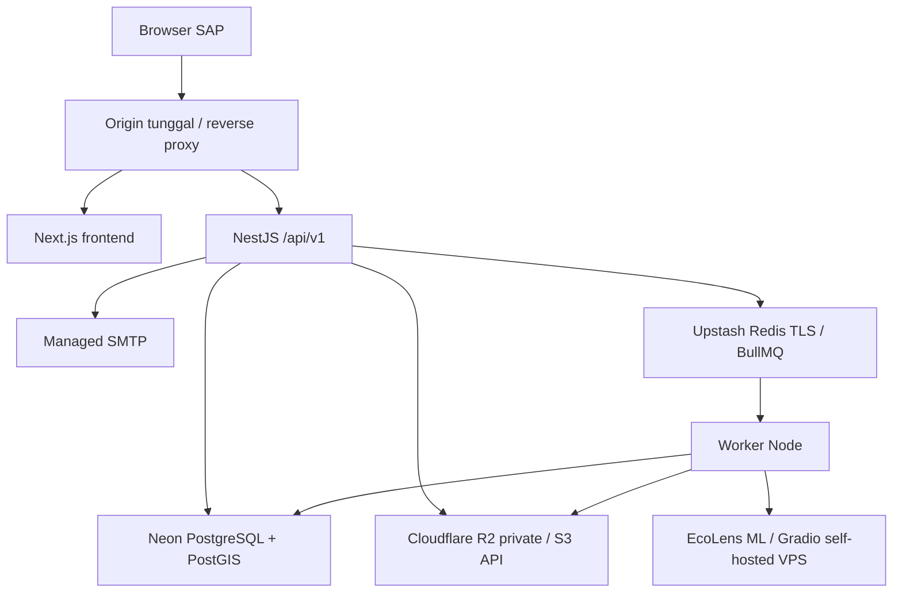

# TECH_SPEC — Arsitektur SAP

v1.0 · Keputusan stack untuk tim frontend/backend terpisah.

## 1. Pilihan dan alasan

| Layer | Pilihan | Alasan |
| --- | --- | --- |
| Web | Next.js App Router + React + TypeScript strict | Mendukung SSR; logika bisnis tetap di API |
| UI/data | Tailwind CSS, TanStack Query, React Hook Form | Komponen, cache, form dan error konsisten |
| Peta | MapLibre GL JS + tiles berlisensi | Renderer terpisah dari penyedia tiles |
| API | NestJS + TypeScript, Express adapter | Modul, guard, validation dan kontrak jelas |
| Data | Neon PostgreSQL + PostGIS; Drizzle ORM + SQL migrations | Transaksi ledger dan query/index geospasial |
| Jobs | Upstash Redis native TLS (`rediss://`) + BullMQ, worker Node | ML, cleanup dan agregasi tidak menahan request; Redis bukan source of truth |
| Media | Cloudflare R2 private melalui S3-compatible API | Foto tidak menjadi base64 di database atau objek publik |
| Email | SMTP managed | OTP/recovery server-to-server |
| ML | `@gradio/client` ke layanan Gradio self-hosted configurable | Mengisolasi protokol provider tanpa mengganti model EcoLens |
| Kontrak/uji | OpenAPI 3.1; openapi-typescript + openapi-fetch; Vitest/Jest, Playwright, MSW | Shared schema, generated client dan mock |

Source EcoLens/Hugging Face tetap provenance dan referensi model, bukan provider runtime produksi. Versi Node, pnpm dan dependency dikunci saat bootstrap setelah set kompatibel berhasil diuji.

## 2. Topologi



Neon, Upstash, R2 dan SMTP berada di luar private network VPS. Semua koneksi wajib TLS, timeout, retry terbatas, credential terpisah per environment dan observability. Frontend tidak menyimpan secret atau memanggil Gradio langsung.

API memvalidasi session/owner media dan membuat scan+outbox dalam transaksi. Dispatcher memasukkan job BullMQ dengan ID scan deterministik. Worker membaca media tervalidasi dari R2, memanggil Gradio, lalu menulis hasil+ledger atomik dan menandai outbox processed. Retry/crash tidak boleh menggandakan event.

## 3. Workspace dan repository

Target implementasi: [github.com/sitaurs/sap](https://github.com/sitaurs/sap).

```text
apps/web
apps/api
apps/worker
packages/api-client
contracts
db/migrations
docs
```

`contracts/openapi.json` adalah sumber kontrak dan `contracts/fixtures.json` contoh bersama. Web, API dan worker dapat dideploy independen tetapi `contractVersion` harus cocok.

Checkout `ecoLens` dan `ecoLens_ML` hanya referensi read-only: jangan disalin, dijadikan subtree/submodule, atau di-commit. Jangan `git init` di direktori induk ketiga folder; gunakan checkout bersih repo SAP. Web legacy boleh menjadi referensi alur/UX, bukan fondasi API, auth, MongoDB, model data atau aturan domain.

## 4. Identitas dan sesi

Registrasi email/password → OTP hash TTL 10 menit, maksimum 5 percobaan, resend cooldown 60 detik. Password memakai Argon2id. Verify/login membuat opaque random session token minimal 256 bit; database menyimpan hash dengan expiry 7 hari. Cookie `sap_session`: HttpOnly, Secure, SameSite=Lax, Path=/, host-only. API tidak mengembalikan access/refresh token.

GET `/auth/csrf` membuat signed double-submit token dan cookie `sap_csrf`; semua mutasi mengirim `X-CSRF-Token`. Server memeriksa signature, cookie/header equality, binding session/pre-auth nonce dan Origin allowlist; token dirotasi setelah login/logout. Role hanya `user`/`admin`; register tidak menerima role. Reauthentication maksimum 10 menit untuk delete account. Produksi memakai origin tunggal; CORS bukan otorisasi.

## 5. Media, waktu dan proses

Upload multipart satu file/request, maksimum 10 MiB dan decoded 25 megapiksel, hanya JPEG/PNG/WebP. Server sniff, decode, re-encode, strip EXIF, membuat checksum/preview privat, lalu menyimpan ke R2 melalui S3 API. Tolak SVG, GIF dan remote URL. `purpose=scan|report|resolution`; report memakai 1–3 media milik user.

Usulan retensi: foto scan dan upload orphan 24 jam; foto laporan selama aktif lalu 90 hari setelah resolved; log 30 hari; audit 180 hari. R2 tetap privat; signed read URL pendek, baseline sekitar 5 menit. Foto laporan tidak otomatis publik. Delete account menghapus identitas/session/media pribadi dan mempseudonimkan catatan publik sesuai kebijakan.

Timestamp UTC; calendar day Asia/Jakarta untuk streak/hotspot. Enum API snake_case, property API camelCase, DB snake_case. GeoJSON `[longitude, latitude]`; PostGIS `geography` memakai meter; H3 resolution 9.

## 6. ML dan keandalan

Worker memakai base URL configurable, bukan raw `/gradio_api/call/...`. Discovery aktual: Gradio 6.26, prefix `/gradio_api`, endpoint `/predict_gradio`, input `img` Image/Buffer melalui upload client, output `LabelData`. HTTP Basic berada di reverse proxy; `@gradio/client` mengirim `Authorization` melalui custom headers, bukan native auth option.

VPS baseline 4 GB/2 vCPU, satu process ML dan concurrency 1 sampai benchmark membuktikan lebih. HTTP 200 UI hanya liveness. Readiness model-aware memeriksa binary+multiclass loaded, checkpoint compatibility/hash, known-positive/negative, endpoint schema dan `providerRevision`. Risiko source: `timm` hilang dari requirements, dependency belum dipin, `strict=False`, path model relatif, dan bobot lokal masih pointer Git LFS.

Create scan membalas 202; polling 2/4/8 detik sampai terminal. Deadline 90 detik, maksimum 2 attempt untuk gangguan transient; baseline circuit breaker 5 gagal berturut-turut → jeda 60 detik. Provider 401/403 adalah configuration failure, bukan retry tanpa batas. Failed berbeda dari unknown/no_waste. API/worker/model health dipisahkan.

Cache peta maksimal 5 menit dengan `asOf` dan invalidasi moderasi. Error eksplisit, tanpa silent truncation. Baseline rate limit scan 10/jam/akun dan laporan 10/hari/akun, configurable dengan `Retry-After`.

Status layanan ada di [ENVIRONMENT_READINESS.md](ENVIRONMENT_READINESS.md).

## 7. Development dan rujukan

Development default memakai Neon, Upstash, R2, SMTP dan Gradio remote khusus development; emulator/container lokal opsional. Dev/staging/production wajib memakai resource dan credential berbeda.

[NestJS OpenAPI](https://docs.nestjs.com/openapi/introduction), [OpenAPI TypeScript](https://openapi-ts.dev/introduction), [Gradio JS client](https://www.gradio.app/main/docs/js-client), dan [MapLibre](https://maplibre.org/maplibre-gl-js/docs/) menjadi rujukan implementasi.
