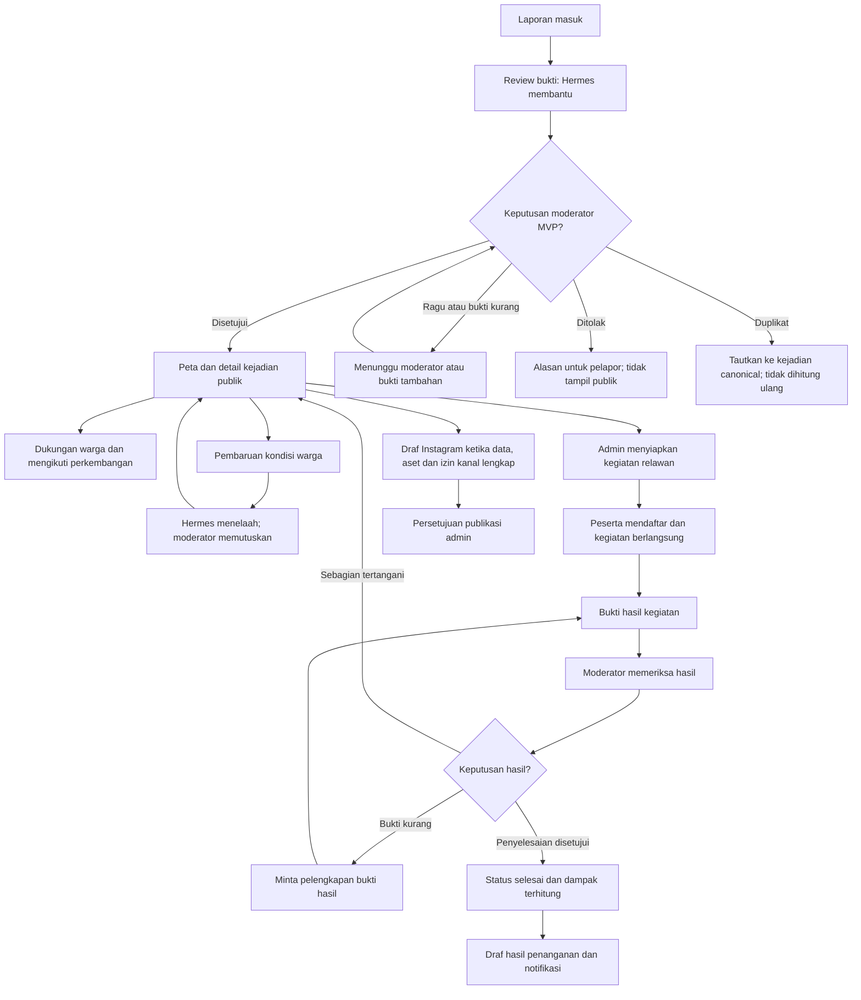
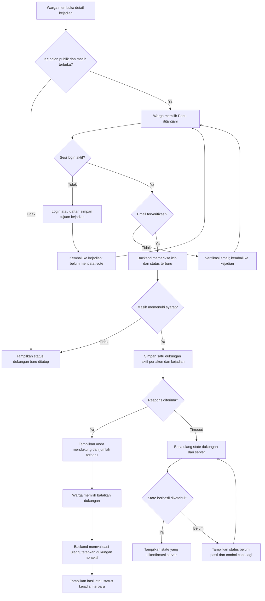
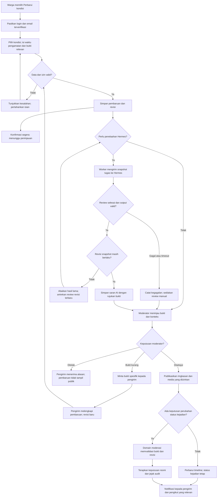
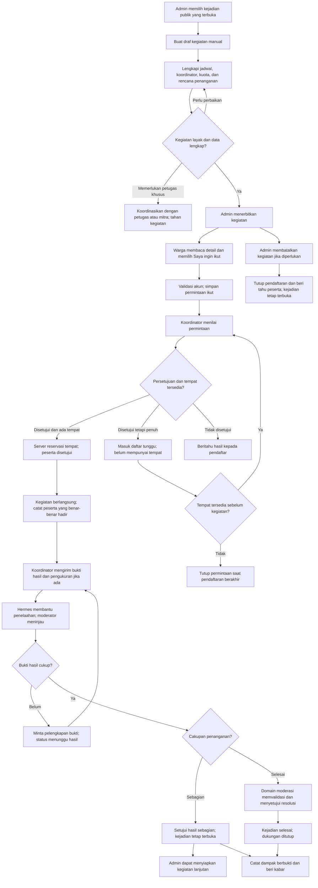
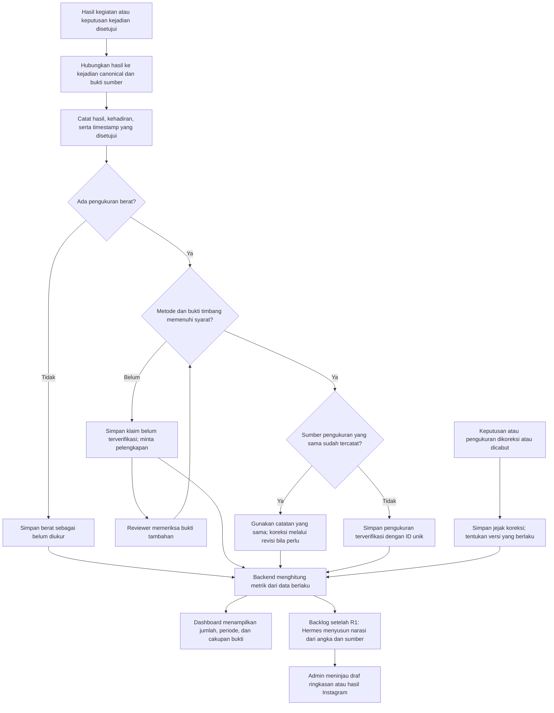
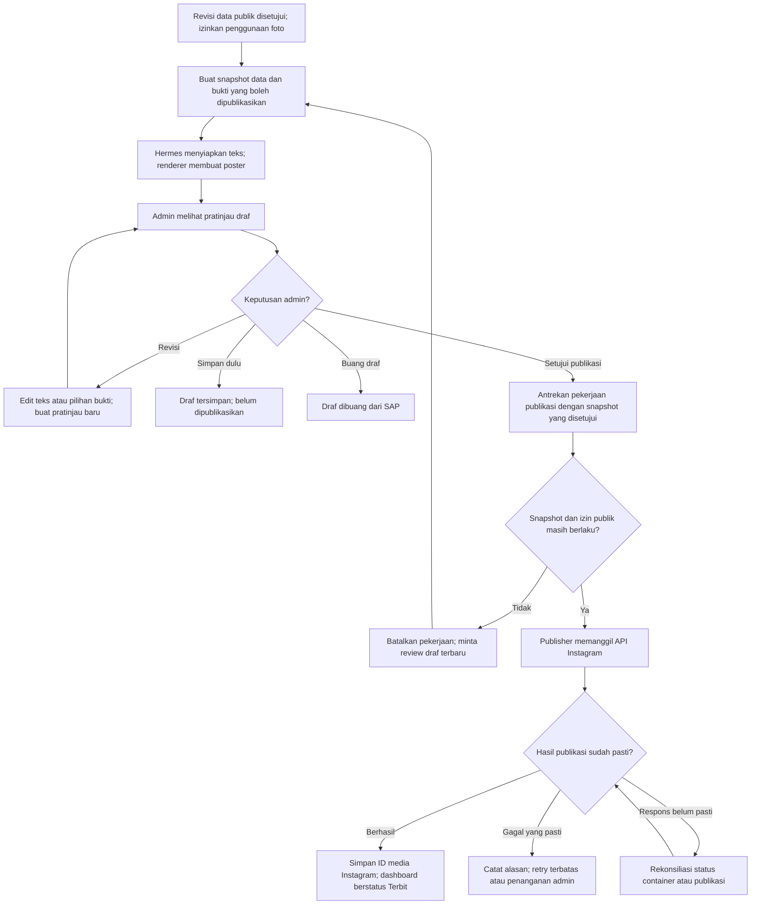
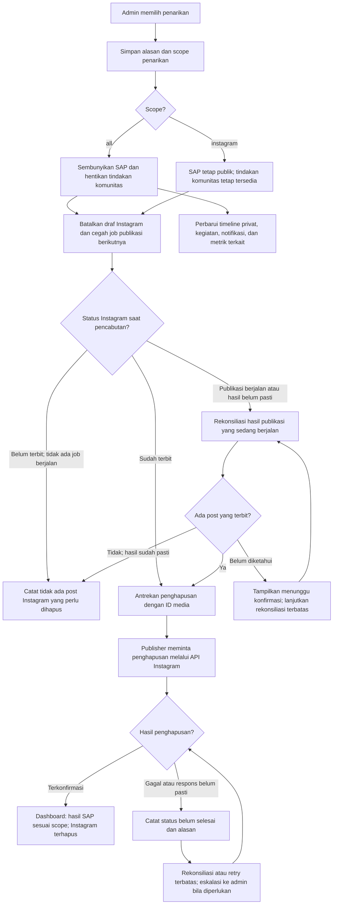

# Rencana SAP: komunitas, relawan, dan Hermes dengan alur yang jelas

Tanggal: **3 Oktober 2026, WIB**. Acuan kode: commit **`977abeb`**, workspace `/home/zamn/sap-run`.

**Status: hasil riset dan usulan produk, belum implementasi atau hasil uji pengguna.** Dokumen ini memperinci bagian komunitas/relawan dalam [riset Hermes dan Instagram](2026-10-03-hermes-instagram.md).

**Acuan implementasi R1:** [kontrak Zaka–Zamani](../CONTRACT_ZAKA_ZAMANI.md) menetapkan DTO, enum, endpoint, izin, dan pembagian kerja; [rencana backend](../BACKEND_EXECUTION_PLAN.md) menetapkan requirement dan tahapan yang dipakai kedua riset. Rekomendasi susunan halaman di sini merupakan pilihan UX; Zaka bebas menentukan layout, desain, dan navigasi selama fungsi kontrak terpenuhi. OpenAPI 1.1.0 mencakup endpoint existing; extension belum diimplementasikan.

## 1. Ringkasan keputusan

Tujuan SAP adalah mengubah laporan menjadi penanganan yang bisa dibuktikan. Untuk itu, rekomendasi saya:

1. **Satu detail kejadian publik sebagai pusat interaksi:** lihat kondisi, dukung penanganan, kirim pembaruan, ikuti perkembangan, dan temukan kegiatan terkait.
2. **Usulan satu tambahan menu utama: Relawan.** Fungsi yang dibutuhkan adalah daftar/detail kegiatan dan kegiatan yang diikuti. Zaka boleh mengelompokkan navigasinya berbeda; vote dan konfirmasi dapat tersedia pada detail kejadian.
3. **Dukungan warga hanya memengaruhi urutan perhatian.** Verifikasi, risiko peta, dan penyelesaian memiliki dasar serta proses tersendiri.
4. **Hermes membantu menelaah bukti dan menyiapkan usulan.** Pencatatan vote, kuota peserta, perubahan status resmi, dan perhitungan dampak dilakukan oleh backend SAP.
5. **Alur warga tidak menunggu AI.** Pembaruan segera tersimpan; penelaahan berjalan di belakang layar. Saat Hermes gagal, moderator tetap bisa memprosesnya.
6. **MVP memakai keputusan manusia untuk pembaruan kondisi dan penyelesaian.** Otomasi keputusan baru dipertimbangkan setelah ada data evaluasi, pembatalan keputusan, serta pemantauan kesalahan.
7. **Hasil kegiatan, kondisi kejadian, dan status Instagram ditampilkan terpisah.** Selesainya satu kegiatan belum tentu berarti seluruh masalah sudah tertangani.
8. **Dampak dihitung dari kejadian unik dan bukti yang disetujui.** Berat yang tidak diketahui ditampilkan sebagai belum diukur.

Yang ditunda: komentar bebas tanpa moderasi, leaderboard vote, hadiah untuk vote, chat grup, rekomendasi relawan berbasis profil otomatis, dan laporan dampak AI setiap kali halaman dibuka. Semua itu menambah beban sebelum siklus utama terbukti berguna.

## 2. Apa yang dipelajari dari riset

| Sumber primer | Temuan yang digunakan | Implikasi untuk SAP |
| --- | --- | --- |
| [FixMyStreet: alur warga](https://fixmystreet.org/training/citizens/) | Kejadian dapat mempunyai tautan tetap, pembaruan, dan langganan perkembangan | Warga kembali ke kejadian yang sama untuk memberi kabar; hindari membuat laporan baru untuk setiap pembaruan |
| [Ushahidi/Uchaguzi: verification](https://docs.ushahidi.com/uchaguzi-support/digital-response-teams/verification) | Peninjauan memeriksa duplikasi, bukti pendukung, serta sumber; ketidakpastian tetap dicatat | Konfirmasi warga masuk penelaahan. Banyak dukungan atau satu foto belum membuktikan seluruh klaim |
| [GOV.UK: create accounts](https://design-system.service.gov.uk/patterns/create-accounts/) | Akun menambah hambatan; layanan sebaiknya dapat dijelajahi sebelum harus membuat akun | Peta, detail kejadian, dan daftar kegiatan terbuka untuk dibaca; login muncul ketika melakukan tindakan personal |
| [GOV.UK: question pages](https://design-system.service.gov.uk/patterns/question-pages/) | Gunakan pertanyaan yang relevan, hindari meminta ulang data, pertahankan isian ketika kembali | Form pembaruan mengambil kejadian dan area dari halaman asal; pertanyaan tambahan mengikuti jenis pembaruan |
| [Microsoft Research: Human-AI Interaction](https://www.microsoft.com/en-us/research/blog/guidelines-for-human-ai-interaction-design/) | Peran dan keterbatasan AI perlu jelas; bantuan mudah dipanggil, dikoreksi, dan diabaikan | Bantuan Hermes tampil pada tugas yang membutuhkan penelaahan/draf; hasil bisa diedit atau dilewati |
| [Hermes: Python library](https://hermes-agent.nousresearch.com/docs/guides/python-library/) | Runtime dapat dipanggil dari aplikasi, dengan batas iterasi, kontrol toolset, dan pilihan tanpa memory persisten | Integrasi cocok sebagai pekerjaan backend terisolasi dengan kontrak hasil dan batas biaya |
| [Hermes: MCP](https://hermes-agent.nousresearch.com/docs/user-guide/features/mcp) | Mendukung koneksi tool eksternal dan pemilihan tool per server | Jika perlu mencari konteks, berikan akses baca terbatas pada kejadian terkait |
| [W3C: ukuran target](https://www.w3.org/WAI/WCAG22/Understanding/target-size-minimum.html), [pesan status](https://www.w3.org/WAI/WCAG22/Understanding/status-messages.html), [isian berulang](https://www.w3.org/WAI/WCAG22/Understanding/redundant-entry.html) | Tindakan perlu mudah disentuh, perubahan status dapat diketahui teknologi bantu, dan data dalam proses yang sama tidak diminta ulang tanpa alasan | Tombol jelas, umpan balik setelah tindakan, navigasi keyboard, dan konteks form otomatis |

**Batas interpretasi:** ini merupakan adaptasi pola dari sumber primer. Alur FixMyStreet tidak membuktikan SAP sudah terhubung pemerintah; panduan Uchaguzi berasal dari konteks pemantauan pemilu. Dokumentasi Hermes tidak menjamin akurasi model dalam memeriksa sampah. Efektivitas UX SAP masih perlu dibuktikan melalui pilot.

## 3. Kondisi kode SAP yang memengaruhi rancangan

| Kondisi yang ditemukan | Keputusan rancangan |
| --- | --- |
| Peta publik di landing dan peta dashboard menampilkan agregat area H3 | Pertahankan peta; tambahkan daftar kejadian pada area yang dipilih dan tautan detail |
| Backend sudah mempunyai daftar laporan publik per area, dengan ringkasan dan media publik | Gunakan kontrak publik tersebut sebagai awal; tambahkan detail publik tunggal dan timeline publik |
| `ReportDetail` menampilkan koordinat rinci dan mengambil media privat | Buat komponen/proyeksi publik tersendiri; detail pemilik tetap menggunakan izin yang sekarang |
| Moderasi sekarang dapat memasang `public_derivative_key` ke `object_key` asli | Nama field belum menjamin foto telah disamarkan; siapkan proses turunan publik dan review sebelum memperluas akses |
| Kejadian untuk statistik peta adalah laporan canonical: status `verified`, `in_progress`, atau `resolved`, tanpa `duplicate_of_id` | Gunakan laporan canonical sebagai identitas kejadian MVP; belum perlu membuat model kejadian baru yang menduplikasi laporan |
| Risiko H3 didasarkan pada jumlah kejadian dan hari kejadian | Dukungan warga tidak masuk rumus risiko H3 |
| Role saat ini `user` dan `admin` | Reviewer MVP adalah admin. Koordinator kegiatan menggunakan izin pada kegiatan tertentu |
| Session guard memasang `emailVerified`, tetapi tidak memaksakan nilainya menjadi true | Endpoint kontribusi perlu memeriksa kelayakan email di server |
| Resolusi admin memerlukan 1–3 media `resolution` yang dimiliki admin pelaku keputusan | Bukti milik relawan memerlukan hubungan dan persetujuan khusus sebelum dapat menjadi bukti resolusi |
| SAP sudah mempunyai SAPA dan konteks halaman untuk assistant | Gunakan SAPA atau bantuan inline bila berguna; peran Hermes di belakang layar tidak membutuhkan bot tambahan |
| Worker memakai BullMQ dan ada pola outbox, tetapi job komunitas/Hermes belum tersedia | Tambahkan producer, relay, consumer, deduplikasi, dan pemantauan job sebagai satu rangkaian |

Acuan source: [peta publik](../../apps/web/components/public-map-section.tsx), [peta dashboard](../../apps/web/components/area-view.tsx), [detail pemilik](../../apps/web/components/report-detail.tsx), [navigasi dashboard](../../apps/web/components/dashboard.tsx), [tipe area publik](../../apps/api/src/areas/areas.types.ts), [query area](../../apps/api/src/areas/areas.repository.ts), [session guard](../../apps/api/src/auth/session-auth.guard.ts), [resolusi admin](../../apps/api/src/admin/admin.service.ts), [publikasi media](../../apps/api/src/admin/moderation.repository.ts), [client SAPA](../../apps/web/components/sapa-client.ts).

## 4. Susunan halaman dan menu

Semua path di bawah adalah **usulan**, kecuali landing, dashboard, dan endpoint area yang sudah ada.

| Tempat | Isi dan tindakan utama | Bentuk perubahan |
| --- | --- | --- |
| Peta yang sekarang | Area → daftar kejadian → detail kejadian | Perluasan halaman yang ada |
| `/kejadian/{publicId}` | Kondisi, bukti publik, dukungan, pembaruan, timeline, kegiatan terkait | Halaman detail publik baru |
| Menu **Relawan**, dengan daftar `/kegiatan` | Kegiatan terbuka, filter area/jadwal, tab **Kegiatan saya** | Satu menu utama baru |
| `/kegiatan/{id}` | Jadwal, koordinator, kuota, pendaftaran, hasil kegiatan | Halaman detail kegiatan baru |
| Dashboard | Kartu **Yang saya ikuti**, **Kegiatan terdekat**, dan ringkasan dampak | Perluasan dashboard |
| Moderasi laporan | Tab **Laporan baru**, **Pembaruan warga**, **Bukti kegiatan** | Satu antrean review dengan filter |
| Relawan → Kelola | Membuat kegiatan, peserta, perubahan jadwal, bukti | Tampilan berdasarkan izin |
| Publikasi Instagram | Draf, publikasi, koreksi/penarikan dan status sinkronisasi | Memakai tujuan dashboard yang sudah direncanakan |

Fungsi baru dikelompokkan menjadi detail kejadian dan kegiatan, dengan tautan yang dapat dibuka ulang. Tambahan satu menu dashboard adalah rekomendasi, bukan kewajiban layout. Ringkasan dampak boleh ditempatkan bersama halaman yang sesuai.

### Hierarki detail kejadian

Contoh hierarki konten pada ponsel, yang boleh disusun ulang oleh Zaka:

1. Judul singkat, area publik, status, waktu kondisi terakhir yang disetujui.
2. Foto publik beserta waktu/keterangan, bila ada. Jangan mengisi foto bukti kosong dengan gambar ilustrasi tanpa label.
3. Tindakan utama **Perlu ditangani**, dengan jumlah akun pendukung.
4. Tindakan **Perbarui kondisi**; **Ikuti perkembangan** sebagai kontrol sekunder.
5. Kegiatan terkait, jika benar-benar tersedia: **Lihat kegiatan**.
6. Timeline ringkas dan bukti yang disetujui.
7. Menu tambahan **Bagikan** dan **Laporkan masalah pada informasi ini**.

Hindari menampilkan lima tombol besar dengan penekanan yang sama. Saat kejadian selesai, area tindakan utama berubah menjadi **Lihat hasil penanganan**; dukungan lama menjadi informasi riwayat.

## 5. Alur produk dari awal sampai hasil

Diagram utama menunjukkan hubungan antarfitur. Diagram rinci berikut memperlihatkan keputusan dan jalur pemulihannya:

- [Dukungan warga](#flowchart-dukungan): login, verifikasi email, dukungan, dan retry.
- [Pembaruan kondisi](#flowchart-pembaruan-kondisi): penyimpanan, review Hermes, keputusan moderator, dan bukti tambahan.
- [Kegiatan relawan](#flowchart-kegiatan-relawan): pembuatan kegiatan, peserta, hasil sebagian, dan penyelesaian.
- [Publikasi Instagram](#flowchart-publikasi-instagram): draf, persetujuan admin, serta hasil publikasi.
- [Penarikan konten](#flowchart-penarikan-konten): pencabutan di SAP dan konfirmasi penghapusan Instagram.
- [Pengukuran dampak](#flowchart-pengukuran-dampak): bukti ukur, persetujuan, dan pencegahan hitungan ganda.

**Cara membaca:** kotak adalah tindakan/status, belah ketupat adalah keputusan, dan panah berlabel adalah hasil keputusan. Diagram menggambarkan rancangan yang diusulkan; bukan fitur yang sudah berjalan.



Semua keputusan moderasi R1 memakai manusia. Otomasi keputusan/publish adalah backlog sesudah R1 dan memerlukan evaluasi serta amendment kontrak; canAutomate=false. Draf hasil kegiatan juga memerlukan sumber approved dan izin kanal lengkap.

### Empat tindakan warga dan hasilnya

| Tindakan | Yang dimaksud pengguna | Respons langsung | Efek setelah ditelaah |
| --- | --- | --- | --- |
| **Perlu ditangani** | Saya ingin masalah ini mendapat perhatian | Dukungan tersimpan; bisa dibatalkan | Menambah sinyal prioritas |
| **Perbarui kondisi** | Saya mempunyai pengamatan atau koreksi | Pembaruan tersimpan, menunggu peninjauan | Timeline/bukti/status dapat diperbarui moderator |
| **Saya ingin ikut** | Saya berminat mengikuti kegiatan tertentu | Permintaan ikut tersimpan; status jelas | Koordinator menyetujui atau memasukkan daftar tunggu |
| **Ikuti perkembangan** | Saya ingin mengetahui perubahan kejadian | Langganan aktif; bisa dihentikan | Notifikasi untuk perubahan yang relevan |

Mengirim salah satu tindakan tidak otomatis mengirim tindakan lain. Voting tidak diam-diam mendaftarkan pengguna sebagai relawan atau mengaktifkan notifikasi.

## 6. Dukungan “Perlu ditangani”: syarat dan aturan

### Syarat MVP

- Pengguna sudah login dengan sesi aktif.
- Email akun sudah diverifikasi; dicek pada backend saat menulis dukungan.
- Kejadian masih publik dan berstatus `verified` atau `in_progress`.
- Satu dukungan aktif per akun per kejadian canonical; akun pembuat laporan boleh mendukung.
- Tidak ada syarat KTP, foto tambahan, GPS, atau domisili untuk dukungan biasa. Ini pernyataan prioritas, bukan kesaksian bahwa pengguna berada di lokasi.
- Pengguna dapat membatalkan dukungan selama kejadian masih terbuka. Setelah selesai, jumlah menjadi riwayat dan tindakan baru ditutup.

Email terverifikasi membuktikan kontrol atas alamat email, **tidak menjamin satu akun berarti satu manusia**. Jelaskan jumlah sebagai “akun mendukung”. Jika kelak dibutuhkan pemungutan suara yang menentukan keputusan resmi, mekanisme ini harus dievaluasi ulang.

### Perjalanan pengguna

**Sudah login dan terverifikasi:** buka kejadian → tekan **Perlu ditangani** → label menjadi **Anda mendukung**. Satu tindakan setelah membaca informasi.

**Belum login:** tombol menjelaskan bahwa masuk diperlukan → login/daftar → kembali ke kejadian yang sama → tindakan dukungan tersedia untuk dikonfirmasi. Simpan tujuan navigasi melalui path internal yang tervalidasi. Jangan mencatat dukungan hanya karena pengguna selesai login.

**Email belum terverifikasi:** tampilkan penjelasan dan tombol kirim ulang verifikasi; setelah verifikasi kembali ke kejadian. Jangan meminta verifikasi ulang pada setiap vote.

### Flowchart dukungan



Seluruh alur ini menggunakan aturan backend. Respons jaringan yang tidak pasti tidak boleh dianggap sebagai vote gagal lalu ditulis ulang dengan operasi toggle.

### Kebenaran data dan kasus khusus

| Situasi | Aturan |
| --- | --- |
| Klik berulang atau retry jaringan | Endpoint menetapkan state `supported=true/false`, dengan unique `(user_id, canonical_report_id)`; hindari endpoint toggle yang bisa terbalik karena retry |
| Timeout setelah menekan | UI membaca ulang state milik pengguna; tampilkan **Memeriksa dukungan** sebelum menyatakan gagal |
| Laporan duplikat digabung | Gabungkan himpunan pendukung unik; akun yang mendukung kedua laporan tetap dihitung sekali |
| Link lama ke duplikat | Arahkan ke canonical publik, bila tersedia; jangan membuka laporan privat lewat redirect |
| Laporan dicabut dari publik | Tutup tindakan dan hilangkan data publik; link menjadi halaman pemberitahuan singkat tanpa foto/uraian lama |
| Status berubah di antara klik dan respons | Server memvalidasi status dalam transaksi yang sama; UI mengikuti state terbaru |
| Akun dihapus atau dibatasi | Terapkan kebijakan kontribusi akun dan perbarui jumlah aktif; kaitkan fitur dengan alur penghapusan akun yang ada |
| Satu Wi-Fi dipakai banyak warga | IP menjadi sinyal penyalahgunaan, bukan alasan otomatis menganggap semua akun satu orang |
| Kejadian muncul lagi setelah pembersihan | Kejadian baru menggunakan ID baru; koreksi keputusan selesai untuk kejadian lama membutuhkan peninjauan dan riwayat yang terlihat |

Gunakan rate limit berbasis request dan pemantauan lonjakan sebagai perlindungan server. Ambang operasional dikalibrasi dari pilot; tidak perlu kuota harian vote atau syarat umur akun yang menghambat warga baru tanpa bukti manfaat.

### Prioritas yang bisa dijelaskan

Default antrean operasional memakai urutan: kebutuhan penanganan khusus yang ditetapkan reviewer → lamanya kejadian belum ditangani → dukungan warga sebagai sinyal tambahan. Berikan pilihan urut **Paling lama**, **Paling didukung**, dan **Terbaru**.

Tampilkan alasan singkat seperti “Belum ditangani 5 hari · 12 akun mendukung”. Sisihkan perhatian admin untuk kejadian lama dengan sedikit dukungan agar wilayah dengan sedikit pengguna tetap dilayani. Bobot angka belum ditetapkan sebelum tersedia data pilot. Hermes tidak menentukan skor tersembunyi.

## 7. Konfirmasi komunitas menjadi “Perbarui kondisi”

Nama **Perbarui kondisi** lebih langsung menjelaskan tindakan dibanding istilah “konfirmasi komunitas”. Form kecil dibuka dari kejadian sehingga ID, area, dan konteks tidak diisi ulang.

### Satu pilihan awal, pertanyaan mengikuti kebutuhan

| Pilihan | Isian minimum | Bukti dan konsekuensi |
| --- | --- | --- |
| **Sampah masih ada** | Waktu melihat; keterangan singkat | Foto opsional; pengamatan tanpa foto dapat dicatat tetapi belum menjadi bukti kuat |
| **Sampah sudah berkurang** | Waktu melihat; bagian yang berkurang/tersisa | Foto disarankan; tidak otomatis selesai |
| **Lokasi terlihat bersih** | Waktu melihat; keterangan | Bukti foto atau pemeriksaan lapangan diperlukan sebelum klaim selesai dapat disetujui |
| **Ada informasi yang salah** | Bagian yang salah: lokasi/kategori/waktu/foto/lainnya; penjelasan | Lampiran pendukung opsional; moderator menentukan koreksi |

Klaim “terlihat bersih” tanpa foto masih boleh dikirim sebagai informasi, dengan pesan **“Moderator membutuhkan bukti tambahan sebelum menyatakan selesai.”** Jangan menampilkan sukses dengan label “Berhasil menyelesaikan laporan”. Bila pengguna mengalami unggahan gagal, isian tetap tersimpan pada form dan dapat dicoba lagi.

Identitas pelapor pembaruan tidak menjadi syarat tampil publik. Gunakan label umum “Pembaruan warga”; nama hanya bila ada pilihan persetujuan yang jelas. Media mentah privat. Foto publik merupakan turunan yang ditinjau, dengan wajah/plat/informasi pribadi ditangani sebelum publikasi. Pengiriman bukti tidak otomatis memberi izin mengunggahnya ke Instagram.

### Alur peninjauan

1. Server memeriksa akun/email, kejadian, bentuk data, waktu pengamatan, dan kepemilikan lampiran.
2. Pembaruan beserta revisi disimpan; pengguna menerima nomor pembaruan dan status **Menunggu peninjauan**.
3. Worker mengirim konteks relevan ke Hermes, bila penelaahan AI memang diperlukan.
4. Hermes mengusulkan ringkasan, bukti yang sesuai/bertentangan, dan hal yang masih kurang.
5. Moderator memilih **Setujui pembaruan**, **Minta bukti tambahan**, atau **Tolak dengan alasan**.
6. Perubahan status kejadian merupakan keputusan domain tersendiri dengan bukti dan revisi. Menyetujui teks pembaruan tidak otomatis menyelesaikan kejadian.
7. Timeline publik menampilkan hasil yang disetujui. Pengirim dapat melihat pembaruan pending miliknya; pending warga lain tidak dibuka ke publik.

Pembaruan dapat diedit selama belum diputuskan; revisi baru membuat hasil Hermes lama tidak berlaku. Koreksi setelah disetujui dibuat sebagai pembaruan lanjutan dengan jejak audit. Pencegahan spam dapat meminta pengguna melengkapi pembaruan pending sejenis sebelum membuat salinan baru.

Status pembaruan yang diusulkan: **Menunggu peninjauan → Perlu bukti tambahan / Disetujui / Ditolak**. Status job Hermes berjalan atau gagal adalah metadata penelaahan, tidak menggantikan status pembaruan. Pengamatan yang lebih lama dari kondisi terbaru tidak otomatis mengganti kondisi terkini; moderator dapat menerimanya sebagai riwayat.

### Flowchart pembaruan kondisi



Konfirmasi penyimpanan berada sebelum pemanggilan Hermes. Klaim warga “terlihat bersih” menjadi input review; keputusan resmi selesai hanya diterapkan melalui domain moderasi dengan bukti yang memenuhi syarat.

Pada MVP tidak ada kolom komentar bebas. Hal ini membuat setiap kontribusi mempunyai tujuan dan jalur tindak lanjut yang dapat ditinjau.

## 8. Kegiatan relawan: dari minat sampai hasil

### 8.1 Membuat kegiatan

Admin membuat kegiatan dari kejadian publik yang masih terbuka. Untuk MVP, satu kegiatan aktif per kejadian memudahkan koordinasi; kegiatan berikutnya bisa dibuat jika hasil sebelumnya baru sebagian.

Data sebelum kegiatan diterbitkan:

- Kejadian terkait dan tujuan konkret, misalnya membersihkan titik yang sudah ditinjau.
- Koordinator yang telah menerima penugasan.
- Tanggal, jam mulai/selesai, serta zona waktu yang terlihat.
- Kuota peserta dan aturan persetujuan peserta.
- Area publik; titik kumpul rinci tersedia bagi peserta yang disetujui sesuai kebutuhan.
- Peralatan yang disediakan/perlu dibawa, kebutuhan akses, dan rencana pengangkutan sampah.
- Keputusan kelayakan kegiatan oleh penanggung jawab. Temuan yang memerlukan penanganan khusus diarahkan ke petugas/mitra yang tepat.

R1 menyediakan draf kegiatan manual yang lengkap. Bantuan Hermes untuk deskripsi/daftar kebutuhan menjadi backlog sesudah R1, dengan amendment API terlebih dahulu. Jadwal, penanggung jawab, kuota, mitra, dan sarana yang belum diketahui dibiarkan kosong; admin melengkapi dan menerbitkan.

### 8.2 Mendaftar

Daftar kegiatan bisa dibaca tanpa login. Filter sederhana: area, tanggal, dan ketersediaan tempat; GPS opsional bila pengguna memilih **Dekat saya**.

Detail menampilkan **jadwal + area + tugas + kuota + koordinator** sebelum tombol **Saya ingin ikut**. Setelah login/email terverifikasi, pengguna mengirim permintaan ikut tanpa mengisi ulang nama/email. Pertanyaan tambahan hanya diminta jika benar-benar dipakai koordinator.

Status peserta: **Menunggu persetujuan → Disetujui / Daftar tunggu / Tidak disetujui**, atau **Dibatalkan oleh peserta**. Kehadiran dicatat terpisah setelah kegiatan; jumlah pendaftar bukan jumlah relawan yang benar-benar hadir.

Kuota peserta yang disetujui dijaga secara transaksional di server. Status permintaan tidak menjanjikan tempat sebelum disetujui. Peserta dapat membatalkan dengan tindakan singkat; koordinator melihat tempat tersedia kembali.

### 8.3 Melaksanakan dan mengirim hasil

Koordinator/admin mengunggah dan mengirim paket bukti kegiatan pada R1. Unggahan langsung peserta ke paket kegiatan menjadi backlog; warga tetap dapat mengirim community update berizin. Paket memuat:

- Foto sebelum dan sesudah, waktu pengambilan/pengamatan, serta bagian lokasi yang tertangani.
- Jumlah peserta hadir dan catatan kegiatan.
- Hasil **Sebagian tertangani** atau **Mengusulkan selesai**.
- Berat sampah, jika benar-benar ditimbang, berikut metode dan bukti timbang.
- Tujuan pengangkutan/penyerahan; bukti penerimaan bila ada.

Foto sesudah yang terlihat bersih belum membuktikan berat atau bahwa sampah didaur ulang. Paket bisa diterima sebagai hasil kegiatan tanpa membuat klaim tersebut.

Moderator membandingkan bukti dan memutuskan hasil kegiatan. Hasil partial dapat membuat kegiatan completed sementara kejadian tetap terbuka. Paket approved menghasilkan ApprovedResolutionEvidence yang dapat dipilih admin melalui keputusan report terpisah dengan resolutionEvidenceIds dan If-Match report. Transisi baru verified→resolved hanya untuk claim approved; jalur media resolution milik admin tetap mengikuti in_progress→resolved. Approve paket tidak otomatis membuat report resolved.

Lifecycle kegiatan yang diusulkan: **Draf → Pendaftaran dibuka → Pendaftaran ditutup → Berlangsung → Menunggu hasil → Hasil disetujui**, dengan **Ditahan** atau **Dibatalkan** jika diperlukan. Penutupan hasil kegiatan membawa nilai hasil sebagian/selesai; status kejadian tetap dikelola melalui keputusan moderasi.

### Flowchart kegiatan relawan



Diagram membedakan status peserta, hasil kegiatan, dan status kejadian. Perubahan jadwal, pembatalan oleh peserta, serta pengalihan koordinator mengikuti aturan pada bagian berikut.

### 8.4 Perubahan dan pembatalan

| Keadaan | Perilaku produk |
| --- | --- |
| Jadwal berubah | Peserta disetujui mendapat pemberitahuan; perubahan besar meminta mereka mengonfirmasi keikutsertaan lagi |
| Koordinator tidak tersedia | Admin mengganti koordinator dengan penerimaan penugasan; kegiatan tidak diam-diam berpindah tanggung jawab |
| Kegiatan dibatalkan | Pendaftaran ditutup, alasan terlihat, peserta diberi tahu, kejadian tetap terbuka |
| Kejadian dicabut | Kegiatan ditahan untuk peninjauan atau dibatalkan; informasi privat tidak diteruskan ke peserta baru |
| Kegiatan berakhir tanpa bukti | Status **Menunggu bukti hasil**, bukan otomatis selesai |
| Sampah masih tersisa | Hasil sebagian ditampilkan; admin dapat menyiapkan kegiatan lanjutan |

**Perubahan kode yang wajib diperhatikan:** pemeriksaan `assertOwnedResolutionMedia` sekarang mensyaratkan media milik admin pembuat keputusan. Tambahkan hubungan bukti relawan → kegiatan/pembaruan → kejadian dan persetujuan penggunaan sebagai resolusi. Jangan sekadar menghapus pemeriksaan kepemilikan. Persetujuan harus mengikat ID media, revisi, reviewer, dan snapshot yang benar sehingga keputusan tidak dapat merujuk file sembarang.

## 9. Peran Hermes: mana yang bernilai, mana yang cukup dengan kode

### Rekomendasi prioritas

| Pekerjaan | Bentuk bantuan Hermes | Waktu pemanggilan | Prioritas |
| --- | --- | --- | --- |
| Menelaah pembaruan kondisi | Bandingkan bukti lama/baru, rangkum perubahan, tunjukkan ketidaksesuaian dan bukti yang kurang | Setelah pembaruan atau revisi tersimpan | Utama |
| Membantu antrean moderator | Ringkasan kejadian dan pembaruan terkait; alasan saran dengan rujukan bukti | Per revisi kasus; gunakan hasil yang sudah ada | Utama |
| Membuat draf kegiatan | Deskripsi, daftar kebutuhan, isian yang belum lengkap | Admin meminta bantuan, setelah API disepakati | Backlog sesudah R1 |
| Merangkum hasil/dampak | Narasi singkat dari angka yang dihitung SAP dan bukti disetujui | Setelah API helper dan evaluasi disepakati | Backlog sesudah R1; draf IG R1 memakai konteks approved dan fallback template |
| Membantu warga melalui SAPA | Penjelasan cara memperbarui kondisi/ikut kegiatan; bantu susun teks pilihan pengguna | Dipanggil pengguna saat membutuhkan bantuan | Opsional setelah pilot |

Kode biasa menangani: keunikan vote, validasi sesi/email, kapasitas peserta, langganan, pengiriman notifikasi, penjumlahan kg, deduplikasi kejadian, serta validasi transisi status. Pekerjaan tersebut memerlukan hasil yang pasti dan tidak membutuhkan inferensi bahasa.

### Batas bantuan yang bisa dipahami pengguna

- Warga melihat **“Pembaruan tersimpan. Menunggu peninjauan.”** Mereka tidak harus mengikuti percakapan Hermes atau menunggu progress animasi model.
- Moderator melihat **“Saran AI”**, ringkasan pendek, rujukan foto/waktu, hal yang belum terbukti, dan tombol keputusan sendiri.
- Hindari label “100% benar” atau angka confidence yang dipresentasikan sebagai probabilitas fakta tanpa kalibrasi.
- Penelaahan foto menilai konsistensi bukti, bukan memastikan keaslian, tempat, dan waktu foto dari tampilan/EXIF saja. Temuan semacam itu tetap membutuhkan konteks pendukung atau peninjauan lapangan.
- Hasil draf kegiatan atau narasi bisa diedit. Tombol bantuan dapat dilewati; form manual tetap lengkap.
- Jika Hermes gagal, panel moderator menyatakan saran belum tersedia dan menyediakan review manual. Kegagalan AI tidak menandai kontribusi warga sebagai salah.
- Ringkasan AI tidak menerbitkan foto, memesan peserta, mengubah laporan, atau memposting Instagram dengan sendirinya.

SAPA yang sudah ada dapat menjadi tempat bantuan pengguna. Integrasi Hermes untuk review tidak mengharuskan mengganti seluruh backend SAPA. Jika konteks baru ditambahkan, kontrak `SapaPageContext` dan pemetaan frontend/backend harus diperluas bersama.

## 10. Integrasi Hermes yang efisien

### Arsitektur usulan

```text
Web SAP → API NestJS → Database + outbox
                           ↓ relay
                      BullMQ worker
                           ↓
                 Service Hermes privat
                           ↓ hasil yang divalidasi
                  Review tersimpan di SAP
                           ↓
                 Moderator / draf yang bisa diedit
```

Web hanya memanggil API SAP. Service Hermes menerima snapshot tugas yang dibatasi pada kejadian dan bukti terkait. Pengelolaan hak akses tetap di backend, termasuk akses tool; pembatasan prompt saja tidak cukup.

Dokumentasi library menjelaskan kontrol toolset, batas iterasi, memory persisten, dan instance terpisah untuk tugas paralel. Untuk SAP, rekomendasinya adalah instance per tugas, `skip_memory=True`, `skip_context_files=True`, dan toolset minimal yang dicocokkan dengan versi yang dipin. Ini merupakan rancangan deployment, bukan konfigurasi yang sudah diterapkan. [Hermes Python library](https://hermes-agent.nousresearch.com/docs/guides/python-library/).

Mulai dengan snapshot langsung. MCP baru ditambahkan bila lookup diperlukan; izinkan hanya tool baca seperti mengambil konteks/bukti tugas saat ini. `tools.include` dapat membatasi tool yang terlihat, sementara server tool tetap memeriksa izin untuk setiap ID. [Hermes MCP](https://hermes-agent.nousresearch.com/docs/user-guide/features/mcp).

### Kontrak hasil review

Hasil internal memakai schema `sap-evidence-review-v1`, sama dengan riset Instagram dan kontrak bersama:

- subjectType (`report`, `community_update`, `activity_result`), subjectId, subjectRevision, sourceReportId, sourceReportRevision, snapshotHash.
- recommendation: `recommend_accept`, `human_review`, `recommend_reject`, atau `recommend_duplicate`.
- reasonCodes dari enum kontrak; bukti kurang/konflik adalah alasan dan missingEvidence, bukan enum rekomendasi baru.
- evidence berupa `{mediaId, observation}` dari snapshot, duplicateCandidates dari lookup server, missingEvidence, publicSummaryProposal nullable, publicationWarnings.
- Versi Hermes/model/prompt/policy, intent, penggunaan, durasi, dan status eksekusi berada pada metadata ReviewRun. State eksekusi: queued/running/completed/failed/superseded; requiresHumanReview=true pada R1.

Completed tidak berarti approved. Rekomendasi accept juga tidak otomatis membuat report resolved. Hasil lengkap dan bukti privat hanya tersedia pada DTO admin; DTO pemilik kontribusi menampilkan feedback keputusan yang aman.

SAP memvalidasi schema, enum, ID bukti, dan revisi sebelum menyimpan. Jika output tidak valid atau revisi sudah berubah, hasil tidak menjadi dasar tindakan. Catat alasan yang ringkas dan bukti; tidak perlu menampilkan penalaran internal model.

### Kendali biaya dan waktu

- Satu review per kombinasi jenis tugas, revisi, snapshot, model, dan policy; membuka halaman tidak membuat review baru.
- Gunakan hasil klasifikasi scan yang sudah tersedia; vision tambahan hanya jika tugas memerlukan perbandingan baru.
- Hanya kirim foto terpilih dan ukuran yang cukup untuk tugas. Jangan mengirim seluruh arsip pengguna.
- Default pilot bersama BE-07: timeout 90 detik, maksimum 6 iterasi/tool rounds, maksimum 1 retry transport otomatis, dan batas token/media terkonfigurasi. Angka ini anggaran SAP yang perlu dievaluasi, bukan batas bawaan Hermes.
- Tugas tanpa bukti baru atau perubahan substansial dapat cukup diproses aturan/form dan review manual; ukur manfaat sebelum memanggil AI untuk semuanya.
- Pisahkan antrean review AI dari publikasi/penarikan Instagram agar lonjakan review tidak menahan penarikan konten.
- Saat anggaran habis atau provider bermasalah, kasus masuk antrean manusia dengan status yang jelas.
- Ukur biaya per pembaruan, waktu review admin, koreksi terhadap saran AI, serta jumlah kasus yang membutuhkan bukti tambahan.

Contoh perhitungan anggaran: `revisi yang perlu AI × biaya rata-rata review + permintaan draf × biaya rata-rata draf`. Jumlah vote tidak masuk jumlah pemanggilan Hermes.

## 11. Mengikuti perkembangan dan notifikasi

**Ikuti perkembangan** menggunakan akun SAP dengan pilihan aktif/nonaktif yang jelas, terpisah dari vote. Membaca halaman tidak membutuhkan akun. R1 hanya mengirim notifikasi di aplikasi; kanal email/WhatsApp menjadi tahap lanjut dengan persetujuan pengguna dan kontrak tersendiri.

Notifikasi yang bernilai:

- Pembaruan kondisi/bukti baru yang sudah disetujui.
- Perubahan status resmi kejadian.
- Kegiatan dibuka, jadwal berubah, atau dibatalkan.
- Permintaan ikut diterima/masuk daftar tunggu.
- Bukti tambahan diminta dari pengirim pembaruan.
- Hasil penanganan disetujui atau keputusan penting dikoreksi.

Jangan mengirim notifikasi untuk setiap vote atau tahap pemanggilan AI. Gabungkan pembaruan kecil; deduplikasi berdasarkan event dan penerima. Pengguna dapat menghentikan mengikuti satu kejadian; pengaturan kanal eksternal berada di luar R1.

Notifikasi kegiatan untuk peserta yang mendaftar dijelaskan saat pendaftaran. Ini berbeda dari langganan kabar umum kejadian. Jangan menambahkan WhatsApp atau pesan pihak ketiga sebelum tersedia integrasi dan persetujuan kanal.

## 12. Dampak SDGs yang dapat dipertanggungjawabkan

### Yang ditampilkan

| Metrik | Dasar data | Hal yang harus dibedakan |
| --- | --- | --- |
| Kejadian selesai | Kejadian canonical dengan keputusan penyelesaian yang masih valid | Laporan duplikat dan jumlah kegiatan tidak menambah hitungan kejadian selesai |
| Waktu penyelesaian | createdAt laporan hingga keputusan resolved yang berlaku | R1 memakai medianResolutionHours; periode memilih resolvedAt sesuai kontrak |
| Relawan hadir | Kehadiran yang dikonfirmasi koordinator dan ditinjau bila diperlukan | Pendaftaran, kehadiran per kegiatan, dan orang unik selama periode |
| Berat terkumpul terverifikasi | Bukti timbang yang disetujui dan tidak dihitung ulang | Belum diukur, klaim belum ditinjau, dan berat yang telah diverifikasi |
| Penyerahan ke pengelola | Bukti penyerahan, tujuan, dan tanggal | Terkumpul tidak otomatis berarti sudah didaur ulang |
| Cakupan bukti | Jumlah hasil dengan data ukur dibanding seluruh hasil | Jelaskan keterbatasan kelengkapan data |

SDG 11.6 berkaitan dengan dampak lingkungan kota dan pengelolaan sampah; indikator 11.6.1 memakai sampah yang dikumpulkan/dikelola di fasilitas terkendali dibanding total sampah kota. SDG 12.5 berkaitan dengan pencegahan, pengurangan, daur ulang, dan penggunaan kembali; indikator 12.5.1 adalah tingkat daur ulang nasional. Statistik SAP adalah **kontribusi lokal yang relevan**, bukan nilai indikator resmi tersebut tanpa data/metode yang sesuai. [UN SDG 11](https://sdgs.un.org/goals/goal11), [UN SDG 12](https://sdgs.un.org/goals/goal12).

### Mencegah perhitungan ganda

Setiap pengukuran memiliki ID, kegiatan/kejadian terkait, unit, metode, bukti, reviewer, dan revisi. Satu bukti timbang tidak boleh dihitung sekali sebagai berat kegiatan lalu ditambahkan lagi sebagai berat laporan selesai. Berat terkumpul dan berat diserahkan adalah tahap dari material yang sama; jangan menjumlahkannya sebagai dua hasil fisik.

Jika berat dikoreksi, hitungan berasal dari versi yang berlaku dengan jejak koreksi. Tanpa berat, simpan `null`, bukan nol. Nilai nol hanya untuk hasil ukur yang memang nol. Foto kantong sampah tidak dikonversi menjadi kg atau pengurangan CO₂ oleh Hermes.

Backend menghitung angka dari source approved yang masih publik, dengan periode/asOf/metode dan coverage sesuai kontrak. Narasi R1 memakai template deterministik. Backlog narasi Hermes hanya boleh memakai angka/bukti yang diberikan. Contoh data simulasi: **“Dua kejadian selesai; 35 kg ditimbang dari satu kegiatan. Satu kegiatan belum memiliki data berat.”** Jangan memperluasnya menjadi klaim seluruh sampah telah didaur ulang.

### Flowchart pengukuran dampak



Dashboard tetap dapat menunjukkan hasil yang disetujui ketika berat belum terverifikasi. Hanya pengukuran terverifikasi yang masuk total berat; klaim terkumpul, diserahkan, dan didaur ulang menggunakan bukti serta label tahap masing-masing.

## 13. Hubungan dengan Instagram dan kendali dashboard

Pusat kebenaran adalah kejadian SAP dan revisi data publik yang disetujui. Draf poster/caption mengacu pada snapshot tersebut; klik dari Instagram menuju detail kejadian yang sama.

- Vote baru tidak memicu regenerasi poster atau publikasi baru.
- Pembaruan warga yang pending tidak mengubah poster publik.
- Hasil penanganan yang disetujui dapat membuat **draf hasil**; admin memutuskan publikasinya.
- Koreksi kecil/besar dibedakan melalui policy publikasi. Foto/judul yang menyesatkan memerlukan penarikan atau penggantian postingan sesuai kemampuan API.
- Pencabutan izin publik menyembunyikan data di SAP dan membuat pekerjaan penarikan Instagram. Dashboard menampilkan status masing-masing kanal sampai provider mengonfirmasi hasil.
- Kejadian `resolved` tidak otomatis menghapus postingan awal yang masih benar; admin bisa mempertahankan sebagai riwayat dan menerbitkan hasil. Kejadian dicabut karena tidak valid menggunakan alur penarikan.
- Draf yang belum dipublikasikan bisa dibuang dari SAP. Postingan yang sudah ada di Instagram memerlukan operasi provider dan penanganan kegagalan.

Rincian jalur login Meta yang mendukung penghapusan, izin, batas operasi, dan sinkronisasi ada pada [riset Instagram §5–7](2026-10-03-hermes-instagram.md#5-instagram-kemampuan-resmi-dan-pilihan-login). Tidak ada janji bahwa satu klik dashboard langsung berarti semua salinan eksternal sudah hilang.

### Flowchart publikasi Instagram



Publisher memegang kredensial Instagram; Hermes menghasilkan usulan konten. Jika respons belum pasti, lakukan rekonsiliasi sebelum mencoba publikasi baru agar tidak membuat post ganda. Draf hasil penanganan memakai alur persetujuan yang sama.

### Flowchart penarikan konten



Status SAP dan Instagram dicatat terpisah. Scope all menghentikan tindakan komunitas, meninjau kegiatan terkait dan memperbarui metrik publik; scope instagram mempertahankan SAP, kegiatan, dan metrik. Penarikan satu post memakai endpoint retract post. Tidak menjanjikan penghapusan salinan pihak lain. Selesainya penanganan biasa tidak otomatis memicu penarikan. Restore all memulihkan kelayakan SAP/IG setelah review; restore instagram memerlukan SAP masih publik. Restore tidak menerbitkan ulang Instagram; replacement setelah cancelled/retracted perlu generation dan approval baru.

## 14. Hak akses dan kontrol moderator

| Aktor | Dapat melakukan | Ruang data |
| --- | --- | --- |
| Pengunjung | Membaca peta, detail publik, dan daftar kegiatan | Ringkasan dan media yang disetujui publik |
| Pengguna login | Mengikuti perkembangan dan melihat kontribusi sendiri | Data publik + data miliknya |
| Pengguna email terverifikasi | Mendukung, mengirim pembaruan, meminta ikut | Kontribusi sendiri; bukan file mentah warga lain |
| Koordinator kegiatan | Mengelola peserta/kehadiran, mengirim hasil, mengusulkan perubahan | Kegiatan yang ditugaskan; data peserta minimum yang diperlukan |
| Admin/reviewer MVP | Memeriksa bukti, memutuskan status, menerbitkan kegiatan dan mengelola publikasi | Hak admin SAP dengan jejak audit |
| Hermes service | Menelaah snapshot tugas dan mengirim rekomendasi | Bukti/konteks yang diberikan untuk tugas itu |

Penunjukan koordinator tidak mengubah pengguna menjadi admin global. Reviewer tidak meneruskan email peserta, lokasi privat, atau foto mentah ke timeline/Instagram. Penambahan role moderator/publisher terpisah dapat dilakukan ketika tim operasional benar-benar membutuhkannya.

Antrean review menampilkan umur kasus, jenis kontribusi, status saran AI, bukti, dan penanggung jawab. Klaim selesai, koreksi lokasi, serta konflik bukti ditinjau per kasus. Cegah dua reviewer menimpa keputusan melalui revision check; jangan mengandalkan warna status atau animasi saja.

Saat meminta tambahan bukti, moderator memilih kebutuhan spesifik seperti **Foto kondisi terbaru** atau **Jelaskan bagian lokasi**. Pengguna membuka kembali form yang sudah terisi dan hanya melengkapi kekurangannya.

## 15. Data dan kontrak yang perlu ditambahkan

Nama di bawah bersifat usulan desain, bukan schema/API yang sudah tersedia.

### Entitas minimum

| Entitas | Fungsi |
| --- | --- |
| `report_supports` | State dukungan akun pada laporan canonical dengan keunikan database |
| `report_follows` | Langganan dan preferensi kanal |
| `community_updates` + revisi/media | Jenis pengamatan, waktu melihat, status review, ringkasan publik, dan bukti privat |
| `review_runs` / perluasan review Hermes | Snapshot, rekomendasi, versi, usage, durasi, dan error |
| `volunteer_activities` | Kejadian terkait, jadwal, kuota, koordinator, status, versi |
| `activity_memberships` | Permintaan ikut, persetujuan, daftar tunggu, pembatalan, kehadiran |
| `activity_evidence` | Paket hasil dan hubungan media yang bisa ditinjau |
| `impact_measurements` | Pengukuran disetujui, sumber bukti, koreksi, dan pencegahan hitungan ganda |
| Notifikasi dan event outbox | Penyimpanan pemberitahuan, pengiriman, deduplikasi, dan retry |

Pisahkan status lifecycle laporan dari visibility publik. Jangan memakai `rejected` atau `duplicate` sebagai pengganti semua jenis pencabutan izin publik. Proyeksi publik juga perlu menghapus media/ringkasan yang ditarik walaupun data audit privat tetap ada sesuai kebijakan penyimpanan.

### Kontrak layanan yang diperlukan

- Detail kejadian publik tunggal dan timeline hasil yang disetujui; GET daftar per area yang ada menjadi pintu masuk.
- State dukungan milik pengguna dan operasi menetapkan dukungan aktif/nonaktif.
- Mengikuti/berhenti mengikuti dengan kanal yang tersedia.
- Membuat/mengedit pembaruan pending dan membaca status milik sendiri.
- Antrean review serta keputusan dengan revision check dan alasan.
- Daftar/detail kegiatan publik, pengelolaan koordinator, pendaftaran, kapasitas, dan kehadiran.
- Mengirim/review bukti kegiatan; persetujuan bukti sebagai resolusi melalui domain moderasi.
- Metrik dengan definisi periode dan versi pengukuran yang berlaku.

Seluruh penulisan memakai autentikasi, pemeriksaan izin di server, validasi kontrak, proteksi request sesuai pola SAP, dan respons yang bisa dipulihkan setelah retry. Perubahan domain bersama event outbox disimpan dalam transaksi. Perluasan penghapusan akun mencakup kontribusi, langganan, peserta, dan media baru.

## 16. Ketentuan UX yang harus terlihat saat implementasi

1. **Bahasa tindakan:** “Perlu ditangani”, “Perbarui kondisi”, “Saya ingin ikut”, “Ikuti perkembangan”. Istilah API/queue/model tidak masuk form warga.
2. **Kondisi terakhir jelas:** bedakan waktu kejadian, waktu pengamatan baru, waktu pengiriman, dan waktu persetujuan. Tulis “Kondisi terakhir diperbarui …”, bukan memberi kesan kondisi real-time.
3. **Input minimum:** pilih jenis pembaruan, waktu melihat, keterangan yang relevan, lalu bukti sesuai kebutuhan. Jangan meminta ulang area/nama/email dari konteks yang sudah diketahui.
4. **Pemulihan:** login mengembalikan pengguna ke tujuan; validasi tidak menghapus isian; unggahan menunjukkan progress/error per file; retry tidak menciptakan kontribusi ganda.
5. **Informasi hasil:** jelaskan apa yang tersimpan, status peninjauan, dan langkah berikutnya. Estimasi waktu review hanya ditampilkan jika operasional sudah bisa mendukungnya.
6. **Aksesibilitas:** rekomendasi tombol utama minimal 44×44 CSS px untuk kenyamanan sentuh. WCAG 2.2 AA 2.5.8 menetapkan minimum 24×24 atau ketentuan jarak/pengecualian; angka 44 adalah pilihan desain SAP, bukan klaim minimum AA. [W3C ukuran target](https://www.w3.org/WAI/WCAG22/Understanding/target-size-minimum.html).
7. **Keyboard dan pesan status:** kontrol mempunyai label/fokus jelas, dialog mengembalikan fokus, dan hasil tindakan bisa diumumkan screen reader tanpa memindahkan fokus secara mengganggu. [W3C pesan status](https://www.w3.org/WAI/WCAG22/Understanding/status-messages.html).
8. **Alternatif peta:** daftar area/kejadian dapat digunakan tanpa perlu memilih titik visual pada peta. GPS hanya dipanggil setelah pengguna memilih fitur lokasi.
9. **Status lengkap:** halaman menangani kosong, loading, gagal, akses berakhir, dicabut, selesai, penuh, dan dibatalkan; label status tidak bergantung pada warna.
10. **Bantuan AI opsional:** jangan menyisipkan chat wajib sebelum pengguna dapat vote, ikut kegiatan, atau mengirim pengamatan.

Rancangan ini diperkirakan mengurangi hambatan karena tindakan inti singkat dan data konteks digunakan ulang. Klaim “sudah ramah pengguna” menunggu pilot; pedoman aksesibilitas tersebut juga belum merupakan sertifikasi kepatuhan seluruh aplikasi.

## 17. Tahapan pengerjaan dan syarat lanjut

| Tahap | Cakupan yang utuh | Syarat sebelum lanjut |
| --- | --- | --- |
| **P1 — BE-00–04** | Kontrak, transaksi, izin/media, proyeksi publik, outbox; readiness Meta/model paralel | Data publik aman dan pekerjaan durable; readiness eksternal tercatat |
| **P2 — BE-05–07** | Support/follow, pembaruan, review manual dan bantuan Hermes | Retry aman; keputusan manusia; AI gagal tidak menahan kontribusi |
| **P3 — BE-08–09** | Consent/rendition, draf otomatis, OAuth, approval, publish/retract | Manual report eligible; publish dedup; penarikan terkonfirmasi per kanal |
| **P4 — BE-10–11** | Kegiatan, peserta, paket hasil dan approved resolution evidence | Partial berbeda dari resolved; bukti relawan memakai claim sah |
| **P5 — BE-12–14** | Dampak/notifikasi, retensi/operasi, integrasi frontend, pilot/release | Tidak double count; gate integrasi, recovery dan pilot terpenuhi |

Urutan dan dependensi rinci memakai rencana backend yang sama dengan riset Instagram. BE-02 dikerjakan paralel sejak awal; kredensial eksternal tidak menahan alur manual lokal. Draf kegiatan AI, narasi dampak AI, upload hasil langsung peserta, dan otomasi keputusan/publish menjadi backlog sesudah R1 dengan amendment kontrak serta evaluasi sebelum peluncuran.

Tidak ada janji durasi pengembangan di dokumen ini: kebutuhan kredensial, reviewer, fasilitas media, dan kesiapan mitra memengaruhi jadwal. Mulai pilot pada satu area dengan penanggung jawab review dan koordinator yang tersedia.

## 18. Rencana riset/pilot berikutnya

Belum ada wawancara, pengukuran task completion, atau evaluasi model yang dilakukan dalam riset ini. Usulan pilot: 6–8 peserta warga/relawan dengan variasi pengalaman digital, ditambah 2–3 orang yang menjalankan tugas admin/koordinator. Sampel kecil untuk menemukan masalah alur, bukan mengklaim hasil statistik populasi.

### Tugas yang diamati

1. Temukan kejadian dari peta/daftar dan jelaskan kondisinya.
2. Dukung kejadian lalu batalkan; jelaskan apakah vote membuat laporan terverifikasi.
3. Login/verifikasi, lalu lanjut ke kejadian tanpa kehilangan tujuan.
4. Kirim pembaruan “terlihat bersih” dan jelaskan siapa yang menyatakan selesai.
5. Temukan kegiatan, minta ikut, pahami status/kuota, lalu batalkan.
6. Sebagai koordinator, ubah jadwal dan kirim hasil sebagian.
7. Sebagai moderator, nilai dua bukti bertentangan dengan dan tanpa saran Hermes.
8. Baca ringkasan dampak yang sebagian beratnya belum diukur.

Catat penyelesaian tanpa bantuan, waktu, salah klik, titik berhenti, pemahaman status, dan isian yang dianggap tidak perlu. Target awal tindakan vote satu tekan setelah syarat akun terpenuhi; target pembaruan sederhana sekitar satu menit adalah **hipotesis desain**, bukan hasil pengukuran.

### Evaluasi Hermes

Gunakan set kasus berizin yang mencakup foto jelas, lokasi/waktu tidak terbukti, foto lama, duplikat, before/after tidak sebanding, hasil sebagian, dan tidak ada data berat. Reviewer manusia membuat penilaian acuan, membahas ketidaksepakatan, lalu membandingkan baseline manual, panggilan model sederhana, dan Hermes dengan lookup terbatas bila diperlukan.

Nilai kesalahan klaim selesai, bukti yang salah dirujuk, fakta yang dikarang, kebutuhan koreksi, waktu moderator, latency, dan biaya per kasus. Nilai confidence bawaan tidak dijadikan ambang auto-approve tanpa evaluasi kalibrasi. Jika orchestration Hermes tidak membantu dibanding baseline, sederhanakan tugas/tool sambil mempertahankan alur produk.

### Syarat peninjauan sebelum rilis publik

Periksa seluruh skenario kritis: akses data privat, retry vote, penggabungan duplikat, kuota bersamaan, revisi saat review berjalan, klaim selesai tanpa bukti, pembatalan kegiatan, hitungan berat ganda, dan penarikan publikasi. Ketika pengguna salah memahami vote sebagai verifikasi atau pendaftaran sebagai tempat terjamin, perbaiki label/alur sebelum memperluas pilot.

Bagian ini merupakan rencana pemeriksaan untuk implementasi mendatang; tidak ada test aplikasi yang dijalankan dalam pekerjaan riset ini.

## 19. Contoh satu siklus lengkap

**Simulasi, bukan kejadian/data nyata:**

1. Laporan titik sampah disetujui; muncul sebagai satu kejadian publik dan draf Instagram dibuat.
2. Delapan akun mendukung. Tiga warga menambahkan pengamatan melalui pembaruan; jumlah kejadian tetap satu.
3. Hermes menemukan foto terbaru menunjukkan sebagian masih tersisa. Moderator menyetujui pembaruan, kejadian tetap terbuka.
4. Admin menerbitkan kegiatan. Sepuluh orang meminta ikut, enam disetujui, empat daftar tunggu; yang hadir lima.
5. Koordinator mengirim foto sebelum/sesudah dan bukti 35 kg yang ditimbang. Reviewer menyetujui hasil, penyerahan dicatat bila ada buktinya.
6. Moderator menyatakan kejadian selesai; dukungan ditutup, pengikut mendapat kabar, dan admin mendapat draf hasil penanganan.
7. Dashboard menghitung satu kejadian selesai, lima kehadiran, dan 35 kg terverifikasi. Penyerahan 35 kg yang sama tidak menambah total menjadi 70 kg.
8. Jika laporan kemudian dicabut karena keliru, SAP menampilkan pencabutan, mengoreksi metrik yang terpengaruh, dan menjalankan penarikan Instagram dengan status per kanal.

## 20. Kesimpulan rekomendasi

Bangun **detail kejadian yang jelas**, **dukungan satu tindakan**, **pembaruan kondisi yang ditinjau**, dan **kegiatan relawan dengan hasil terbukti**. Hermes paling bernilai sebagai pendamping penelaahan bukti dan pembuat draf kontekstual. Kendali pengguna, koordinator, dan moderator terlihat pada tiap langkah; backend menjaga data serta aturan, sehingga alur dasar tetap berjalan ketika AI tidak tersedia.
