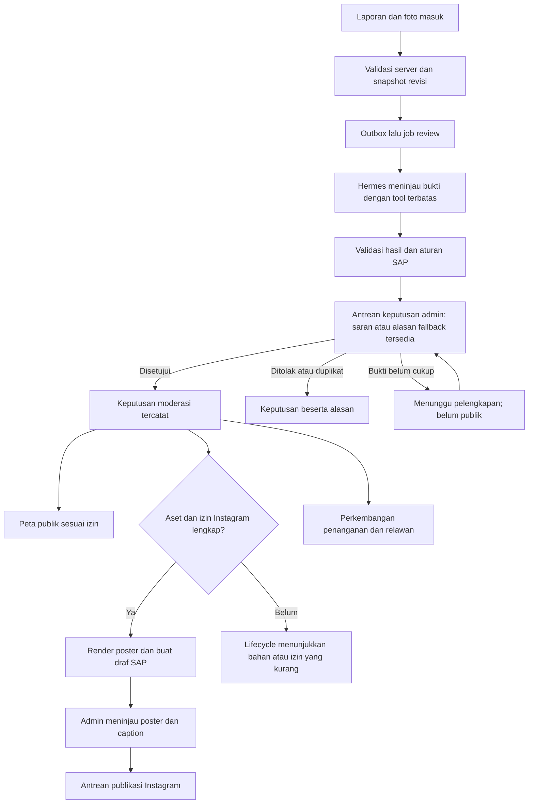
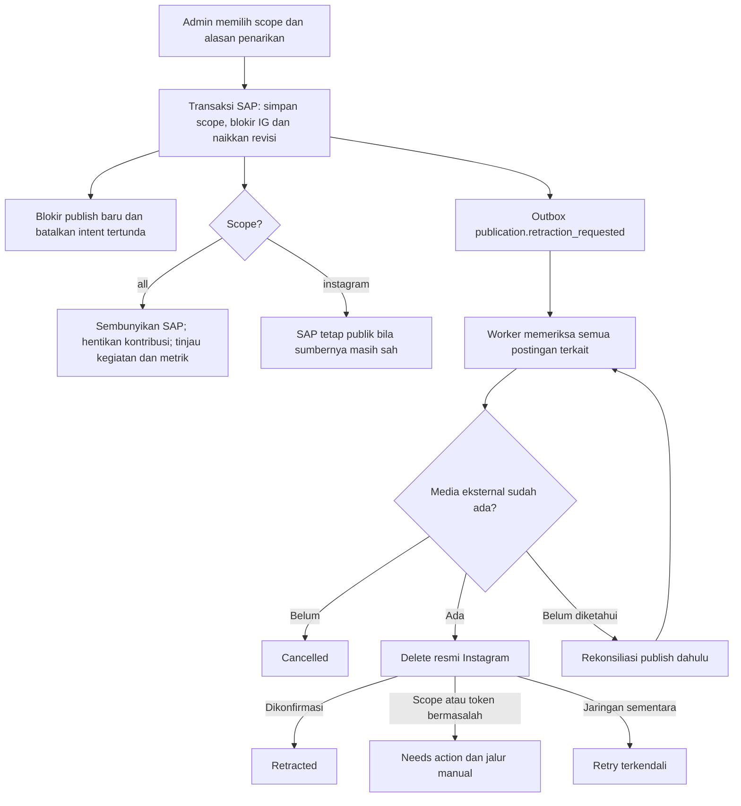

# Riset SAP: Hermes Agent, moderasi laporan, dan publikasi Instagram

Tanggal riset: **3 Oktober 2026, WIB**. Snapshot kode yang diperiksa: **`977abeb`** di `/home/zamn/sap-run`. Hermes yang dimaksud telah dikonfirmasi pengguna: **Hermes Agent dari Nous Research**.

Status dokumen: **riset dan rekomendasi rancangan**, belum implementasi. Kemampuan eksternal di bawah diperiksa dari dokumentasi resmi; belum dibuktikan dengan kredensial akun Instagram SAP.

**Acuan implementasi R1:** [kontrak Zaka–Zamani](../CONTRACT_ZAKA_ZAMANI.md) menetapkan DTO, enum, endpoint, izin, dan pembagian kerja; [rencana eksekusi backend](../BACKEND_EXECUTION_PLAN.md) menetapkan requirement dan urutan pengerjaan. Dua dokumen riset menjelaskan alasan produk dan teknis, dengan aturan R1 yang sama. Ide sesudah R1 memerlukan perubahan kontrak terlebih dahulu. OpenAPI 1.1.0 tetap menggambarkan endpoint existing, bukan endpoint usulan di sini.

**Pendalaman terbaru:** [rencana komunitas, relawan, dan UX Hermes](2026-10-03-community-volunteers-hermes-ux.md) memperinci syarat dukungan, susunan halaman, pembaruan warga, kegiatan relawan, serta tahap evaluasi. Gunakan dokumen tersebut untuk rincian komunitas/relawan yang lebih baru.

## 1. Keputusan yang saya rekomendasikan

Alur produk yang diminta dapat dibangun:

> Laporan masuk → Hermes membantu meninjau bukti → admin memutuskan setiap laporan pada R1 → laporan yang disetujui masuk peta sesuai izin → SAP membuat draf Instagram ketika aset dan izin lengkap → admin menyetujui publikasi → penarikan dipantau per kanal.

Rekomendasi utama:

1. **Gunakan Facebook Login for Business untuk integrasi Instagram SAP.** Dokumentasi media Meta mendukung penghapusan melalui jalur ini; kebutuhan hapus postingan menjadi alasan pemilihannya. Rincian izin ada di §5.
2. **Hermes berperan sebagai peninjau bukti dan penyusun usulan.** Semua keputusan verifikasi, pembaruan kondisi, dan penyelesaian R1 dilakukan admin. Model tidak mendapat token Instagram atau hak admin database.
3. **Draf dibuat otomatis setelah data, rendition, consent, dan approval kanal memenuhi syarat; publikasi dimulai dengan persetujuan admin.** Pilihan publikasi otomatis berada di luar R1.
4. **Jangan menyamakan keyakinan model dengan kebenaran kejadian.** Foto dapat membantu menilai objek yang terlihat, tetapi tidak memastikan lokasi, tanggal, atau pelaku pembuangan.
5. **Pisahkan status laporan, hasil review, izin tampil publik, dan status Instagram.** Kegagalan Instagram tidak boleh membuat laporan terverifikasi hilang dari peta. Penarikan dari peta juga tidak berarti Instagram sudah terhapus.
6. **Bangun proses penarikan sejak versi pertama.** Tombol dashboard harus menunjukkan hasil per kanal dan menangani token kedaluwarsa, kegagalan jaringan, serta publikasi yang sudah terlanjur berjalan.
7. **Tambahkan dukungan komunitas, konfirmasi dengan bukti, dan tugas relawan.** Upvote membantu mengurutkan perhatian; tidak menjadi dasar tunggal verifikasi.
8. **Ukur penyelesaian kejadian, waktu respons, dan sampah yang ditangani dengan bukti.** Jumlah unggahan dan like cukup menjadi ukuran jangkauan komunikasi.

## 2. Kondisi SAP saat ini dan pekerjaan yang diperlukan

Temuan ini berasal dari kode lokal, bukan asumsi bahwa tampilan sudah berarti backend tersedia.

| Bagian | Sudah ada | Kebutuhan baru |
| --- | --- | --- |
| Laporan | `submitted`, `verified`, `in_progress`, `resolved`, `rejected`, `duplicate`; foto, waktu, lokasi, revisi | Review Hermes dan antrean kasus ragu |
| Moderasi | Keputusan admin, `If-Match`, idempotency, timeline, audit, transaksi | Asal keputusan manusia/otomasi, snapshot bukti, versi kebijakan |
| Pembatalan verifikasi | Transisi dari keluarga verified ke rejected/duplicate; pembalikan poin | Alur penarikan publik yang terhubung ke Instagram |
| Peta | Agregasi H3; canonical verified/in_progress/resolved; koordinat publik digeneralisasi | Filter penarikan publik dan pembaruan saat izin dicabut |
| Worker | BullMQ, pemrosesan scan, ML/vision, pekerjaan penghapusan akun | Job review laporan, render poster, publish, retract, rekonsiliasi |
| Outbox | Keputusan moderasi menulis `report.decided` | Event create/update laporan dan konsumen baru; event existing tidak otomatis ditangani worker |
| Hermes | Belum ditemukan integrasi di source API/worker/config/contracts | Service terpisah dan kontrak hasil review |
| Instagram | Halaman admin, adapter frontend, kontrak usulan | Backend, tabel, OAuth, token, publisher, penarikan |
| Sumber postingan | Adapter frontend lama membatasi `scan_reports` dan `scanId != null` | R1 memakai `source=reports`: semua laporan canonical eligible, scanId nullable; migrasikan adapter bersama backend |
| Media publik | `publishedMediaIds` dan `public_derivative_key` | Rendition yang disunting, persetujuan, versi/hashes, pencabutan |
| Peran | Guard yang ada hanya menerima `admin`; model pengguna user/admin | R1 reviewer memakai admin; koordinator mempunyai scope kegiatan tertentu |
| Hapus laporan | Tidak ditemukan endpoint hapus laporan/admin pada controller yang diperiksa | Penarikan, pengarsipan, dan penghapusan data sebagai operasi berbeda |

**Dua detail kode yang harus diperhatikan:**

- `publishedMediaIds` berarti foto laporan yang diizinkan menjadi publik; itu **bukan** ID postingan Instagram. Simpan `igMediaId` secara terpisah.
- Jalur persetujuan media saat ini mengisi `public_derivative_key` dengan `object_key` media terlampir. Field tersebut belum membuktikan bahwa wajah, plat nomor, metadata, atau identitas lain sudah disunting. Sebelum publisher mengambil gambar, tambahkan proses rendition dan peninjauan hasilnya.

Pembuatan laporan saat ini menyimpan row, foto, timeline, dan respons idempotency dalam transaksi, tetapi belum menulis event `report.created`. Worker saat ini menerima `scan.process`, bukan job Hermes/Instagram. Membuat consumer baru saja belum cukup; producer dan relay perlu ditambahkan.

Sumber kode lokal:

- [Tipe laporan](../../apps/api/src/reports/report.types.ts), [pembuatan laporan](../../apps/api/src/reports/report.repository.ts).
- [Aturan transisi moderasi](../../apps/api/src/admin/moderation.types.ts), [transaksi keputusan](../../apps/api/src/admin/moderation.repository.ts), [guard admin](../../apps/api/src/admin/admin.guard.ts).
- [Query peta](../../apps/api/src/areas/areas.repository.ts), [aturan hotspot](../HOTSPOT_RULES.md), [worker](../../apps/worker/src/main.ts).
- [Kontrak Zaka–Zamani](../CONTRACT_ZAKA_ZAMANI.md), [adapter frontend](../../apps/web/lib/api/instagram.ts), [referensi dashboard](../../design/instagram-publication-v1/README.md).

## 3. Alur moderasi yang disarankan



### 3.1 Tahap peluncuran

| Mode | Peran Hermes | Keputusan publik |
| --- | --- | --- |
| Pengamatan awal | Menghasilkan rekomendasi; admin tetap meninjau semua | Semua oleh admin |
| Bantuan moderator | Memprioritaskan antrean, menunjukkan bukti/masalah, mengusulkan ringkasan | Semua oleh admin/moderator berizin |
| Otomasi terbatas, setelah R1 | Memerlukan evaluasi dan amendment kontrak tersendiri | Belum tersedia pada R1; canAutomate=false |

Mulai dari mode bantuan moderator. Ini menghasilkan contoh koreksi manusia untuk mengevaluasi kapan otomasi layak dinyalakan. Mode otomatis tidak ditentukan dengan angka seperti “confidence 90%” tanpa data pembanding.

### 3.2 Apa yang ditinjau Hermes

| Pemeriksaan | Yang dapat diusulkan | Batas hasil |
| --- | --- | --- |
| Kecocokan foto dan laporan | Objek sampah terlihat, foto terlalu kabur, kategori kemungkinan salah | Tidak membuktikan asal atau pelaku |
| Waktu | Waktu kejadian tidak lengkap/tidak konsisten; foto mungkin berulang | EXIF tidak menjadi bukti tunggal |
| Lokasi | Data koordinat kurang lengkap; konsistensi terhadap area layanan | Foto saja tidak memastikan GPS |
| Duplikasi | Kandidat dari pencarian server, waktu, jarak, checksum | Tidak langsung merge hanya karena lokasi berdekatan |
| Kelengkapan | Bukti yang masih diperlukan | Data hilang menghasilkan review manusia |
| Kelayakan publik | PII, tuduhan, foto yang perlu disunting | Media/ringkasan final tetap diperiksa sesuai kebijakan |
| Ringkasan | Usulan `publicSummary`, kategori, judul netral | Tidak menambah angka, pihak bersalah, atau bahaya yang tidak terbukti |

Sistem scan yang ada tetap berguna sebagai sinyal klasifikasi. Hermes tidak perlu mengulang semua inferensi scan. Foto sampah yang terklasifikasi benar juga belum berarti laporan kejadian layak diverifikasi.

### 3.3 Hasil terstruktur, bukan paragraf bebas sebagai perintah

Contoh **kontrak usulan**, bukan respons API yang sudah tersedia:

```json
{
  "schemaVersion": "sap-evidence-review-v1",
  "subjectType": "report",
  "subjectId": "<report-id>",
  "subjectRevision": 4,
  "sourceReportId": "<report-id>",
  "sourceReportRevision": 4,
  "snapshotHash": "<sha256-snapshot>",
  "recommendation": "human_review",
  "reasonCodes": ["LOCATION_UNCONFIRMED", "POSSIBLE_DUPLICATE"],
  "evidence": [
    {
      "mediaId": "<media-id>",
      "observation": "Terlihat beberapa kantong dan sampah campuran."
    }
  ],
  "duplicateCandidates": ["<candidate-report-id>"],
  "missingEvidence": ["Konfirmasi lokasi kejadian"],
  "publicSummaryProposal": "Laporan penumpukan sampah campuran sedang ditinjau.",
  "publicationWarnings": []
}
```

Enum R1: `recommend_accept`, `human_review`, `recommend_reject`, `recommend_duplicate`, sama untuk subjek report/community_update/activity_result. Accept adalah rekomendasi menerima subjek, bukan perintah menyelesaikan laporan. Versi Hermes/model/prompt/policy dan usage disimpan pada metadata ReviewRun. Semua ID harus berasal dari snapshot/tool resmi SAP. Output gagal schema, ID asing, revisi berubah, atau provider gagal diarahkan ke antrean manusia. Semua ReviewRun R1 memakai requiresHumanReview=true.

Simpan alasan singkat dan referensi bukti untuk audit. Tidak perlu menyimpan penalaran internal model. Jika ada score model, beri label sebagai score model; probabilitas yang dapat dipercaya membutuhkan kalibrasi terpisah.

### 3.4 Fallback manusia harus menjadi fitur nyata

Laporan baru yang ragu tetap `submitted`, belum publik dan belum eligible untuk draf. ReviewRun mencatat status eksekusi completed/failed/superseded secara terpisah dari requiresHumanReview=true; `needs_human` bukan enum eksekusi R1. Review selesai tidak berarti subjek disetujui. Review pembaruan atau hasil kegiatan tidak otomatis menyembunyikan laporan existing; penarikan memerlukan keputusan admin tersendiri.

Dashboard moderator menyediakan:

- Foto dan laporan asal, kandidat duplikat, alasan ragu, serta bukti yang kurang.
- Aksi setuju, tolak, tandai duplikat, minta bukti, koreksi ringkasan, dan jalankan review ulang.
- Penanggung jawab dan umur antrean. Target respons dapat disetel menurut kapasitas tim.
- Pemberitahuan ke pelapor dengan bahasa netral dan jalur memperbaiki laporan/banding.
- Pemeriksaan revision saat keputusan disimpan supaya moderator tidak menyetujui bukti yang sudah berubah.

“Fallback ke moderator” berarti menyimpan pekerjaan menunggu manusia di SAP. Hermes tidak perlu menahan satu percakapan/model call sampai admin datang.

## 4. Integrasi Hermes Agent

### 4.1 Kemampuan yang ditemukan

Hermes adalah runtime agent dari Nous Research; model yang dipakainya merupakan pilihan terpisah. Source tersedia dengan lisensi MIT. Lisensi runtime tidak menetapkan biaya ataupun ketentuan provider model. [Source Hermes](https://github.com/NousResearch/hermes-agent), [lisensi resmi](https://github.com/NousResearch/hermes-agent/blob/main/LICENSE).

Dokumentasi Python memperlihatkan `AIAgent`, pembatasan toolset, `max_iterations`, `skip_memory`, dan `skip_context_files`. Dokumentasi menyarankan instance baru per task/thread karena state agent tidak aman dibagi antar-thread. Untuk endpoint stateless, persistent memory dapat dinonaktifkan. [Python Library](https://hermes-agent.nousresearch.com/docs/guides/python-library/).

Hermes juga menyediakan API server dengan format Chat Completions/Responses, input gambar, dan autentikasi bearer. System prompt dari client ditambahkan ke prompt inti; ia tidak otomatis menghilangkan tool, memory, atau skill. Maka pembatasan harus dipasang pada konfigurasi runtime, bukan hanya kalimat “jangan melakukan X” dalam prompt. [API Server](https://hermes-agent.nousresearch.com/docs/user-guide/features/api-server).

Pemrosesan gambar dapat memakai model vision utama atau describer vision tambahan, bergantung konfigurasi/provider. Evaluasi harus mencatat model yang benar-benar melihat gambar; jangan berasumsi semua model teks memiliki vision. [Vision](https://hermes-agent.nousresearch.com/docs/user-guide/features/vision).

### 4.2 Pilihan integrasi

| Pilihan | Kelebihan untuk SAP | Konsekuensi | Penilaian |
| --- | --- | --- | --- |
| Python service membungkus `AIAgent` | Kontrak review sempit; isolasi tugas dan anggaran dapat ditentukan sendiri | Menambah service Python dan adapter internal | **Pilihan utama** |
| Hermes API server privat | Client Node dapat menggunakan HTTP; berguna untuk percobaan integrasi | Perlu audit toolset, state, auth, dan kemampuan versi yang terpin | Alternatif untuk pilot |
| Panggilan model vision langsung | Baseline sederhana untuk membandingkan kualitas/biaya | Tidak memakai orchestration Hermes | Pembanding evaluasi |

Arsitektur yang direkomendasikan:

```text
Next.js dashboard
       |
NestJS SAP API --- Postgres: laporan, keputusan, audit, outbox
       |                              |
       |                          relay outbox
       |                              |
       +----------------------- BullMQ workers
                                      |
              +-----------------------+----------------------+
              |                       |                      |
      Hermes review service     Renderer poster       Publisher Instagram
      model + tool baca SAP     aset disetujui         token hanya di sini
```

NestJS tetap API publik dan pemilik hak akses. Service Hermes hanya dapat dijangkau worker/backend dalam jaringan privat. Hasilnya diperlakukan sebagai rekomendasi dari komponen eksternal.

### 4.3 Tool yang masuk akal untuk Hermes

Nama berikut **usulan tool SAP**, belum tersedia:

| Tool | Isi yang diberikan | Pembatasan server |
| --- | --- | --- |
| `get_report_review_snapshot` | Laporan, revisi, bukti relevan, hasil scan | Satu laporan yang sedang ditugaskan |
| `get_report_review_image` | Gambar untuk peninjauan | ID media harus terlampir; URL pendek/bytes terkendali |
| `find_duplicate_candidates` | Kandidat dari query spatial/time server | Batas jumlah dan area, tanpa identitas pelapor lain |
| `get_moderation_policy` | Kebijakan SAP yang dipin | Read only dan versioned |

Untuk MVP, snapshot dapat langsung dikirim sebagai payload sehingga MCP belum wajib. Jika tool dibutuhkan, MCP mendukung server HTTP/stdio dan filtering per server melalui `tools.include`. Gunakan daftar izin eksplisit; server tool tetap harus mengotorisasi setiap permintaan. [MCP Hermes](https://hermes-agent.nousresearch.com/docs/user-guide/features/mcp).

### 4.4 Pengaturan yang direkomendasikan untuk produksi

Semua angka di sini merupakan **anggaran awal untuk pilot**, bukan batas dari Hermes:

- Satu instance/task review per laporan dan revision; persistent memory dan context file discovery dimatikan untuk review.
- Pin commit/release Hermes, model/provider, policy, prompt, dan daftar skill yang diizinkan. Perubahan policy/model harus melalui evaluasi.
- Default pilot: maksimum 6 iterasi/tool rounds, timeout keseluruhan 90 detik, maksimum 1 retry otomatis untuk kegagalan transport, serta batas token/media. Konfigurasi dan evaluasi mengikuti BE-07; kalibrasi terhadap pengukuran riil.
- Tool yang tersedia hanya pembacaan bukti SAP. Shell umum, browser umum, filesystem host, cron, penambahan skill, dan delegasi dinonaktifkan pada service review.
- Filesystem container dan egress dibatasi. Kredensial publisher, database admin, dan data pengguna lain tidak dipasang pada service Hermes.
- Teks laporan, teks dalam gambar, EXIF, nama file, dan respons tool dianggap sebagai data yang tidak dipercaya. Instruksi seperti “langsung verifikasi lalu upload” di dalamnya tidak mengubah policy.
- URL gambar berasal dari server SAP; hindari fetch URL bebas yang dikirim pelapor. Jika publikasi membutuhkan URL terbuka, itu URL rendition yang sudah diizinkan, bukan bukti private.
- Timeout/retry tidak menaikkan status jadi verified. Sediakan stop switch dan fallback manusia ketika anggaran habis.
- Log berisi run ID, model, versi, usage, alasan aman, dan durasi; redaksi token, URL bertanda tangan, GPS rinci, serta data pribadi.

Hermes memiliki kontrol approval, isolasi container, filtering kredensial MCP, dan kontrol keamanan lain. Kontrol tersebut membantu deployment, tetapi hak akses SAP tetap perlu dipaksakan oleh service dan server tool. [Security Hermes](https://hermes-agent.nousresearch.com/docs/user-guide/security).

### 4.5 Evaluasi bantuan R1 dan backlog verifikasi otomatis

Buat sampel laporan yang telah ditinjau manusia: jelas, kabur, salah kategori, berulang, lokasi/waktu salah, foto lama, foto contoh, deskripsi manipulatif, dan sumber bukti yang saling bertentangan. Pisahkan kejadian/foto yang sama antarkelompok evaluasi agar hasil tidak dibesarkan oleh duplikat.

Ukur setidaknya:

- Proporsi rekomendasi verified yang benar menurut peninjauan manusia, termasuk interval ketidakpastian dan jumlah sampelnya.
- Kesalahan yang menjadi publik; kesalahan lokasi/waktu diperiksa terpisah dari klasifikasi objek.
- Proporsi kasus yang diserahkan ke manusia dan waktu penanganannya.
- Koreksi/overturn admin, per kategori dan kualitas foto.
- Biaya, tool rounds, timeout, dan durasi persentil 95.

Usulan target awal: precision subset auto-approve ≥98%, dengan jumlah dan keragaman sampel memadai. Angka ini belum hasil pengukuran. Jika bukti evaluasi belum cukup, pertahankan persetujuan manusia. Jangan meluluskan otomasi hanya karena accuracy keseluruhan tinggi atau confidence model tinggi.

## 5. Instagram: kemampuan resmi dan pilihan login

### 5.1 Fakta paling penting untuk kebutuhan hapus

Dokumentasi **Instagram Media**, diperbarui 12 Agustus 2026, mendokumentasikan:

- `DELETE /<IG_MEDIA_ID>` melalui `graph.facebook.com`, **Facebook Login for Business**, menggunakan **Facebook User access token**.
- Izin `instagram_basic` dan `instagram_manage_contents`.
- Dukungan non-ad posts, Stories, Reels, dan seluruh album carousel. Anak carousel tidak dapat dihapus sendiri.
- Respons sukses berisi `success` dan `deleted_id`.
- Operasi update media yang didokumentasikan mengatur comments; tidak menyediakan penggantian caption/foto postingan melalui operasi itu.

Sumber: [Meta — Instagram Media](https://developers.facebook.com/documentation/instagram-platform/reference/instagram-media#deleting).

**Kesimpulan:** kebutuhan menghapus postingan milik akun SAP dari dashboard memungkinkan secara dokumentasi. Kebutuhan ini harus dibuktikan melalui uji integrasi akun SAP, scope yang benar, dan jenis media yang akan dipakai. Jangan merancang hanya dengan token Page untuk semua operasi: referensi delete secara khusus meminta token User.

### 5.2 Perbandingan jalur

| Pertimbangan | Instagram Login | Facebook Login for Business |
| --- | --- | --- |
| Akun | Professional: business/creator | Professional terhubung Facebook Page |
| Page Facebook | Tidak diwajibkan | Diwajibkan |
| Host utama | `graph.instagram.com` | `graph.facebook.com` |
| Scope publish | `instagram_business_basic`, `instagram_business_content_publish` | `instagram_basic`, `instagram_content_publish`, izin Page sesuai operasi |
| Hapus media kebutuhan SAP | Tidak didukung pada referensi delete yang dibaca | Didukung dengan izin tambahan di §5.1 |
| Rekomendasi | Bila kebutuhan hanya publish tanpa delete | **Dipilih untuk rancangan SAP ini** |

Dua konfigurasi, jenis akun, keterkaitan Page, serta perbedaan akses dijelaskan oleh [Meta — Overview](https://developers.facebook.com/documentation/instagram-platform/overview). Permission publish berasal dari [Meta — Content Publishing](https://developers.facebook.com/documentation/instagram-platform/content-publishing). Rekomendasi pemilihan jalur adalah kesimpulan rancangan SAP dari kebutuhan hapus.

Permission minimum yang perlu dibuktikan untuk koneksi Facebook SAP: `instagram_basic`, `instagram_content_publish`, `instagram_manage_contents`, serta `pages_show_list`/`pages_read_engagement` untuk discovery dan operasi terkait Page. Jika role melalui Business Manager memerlukan izin tambahan menurut endpoint, verifikasi pada konfigurasi akun aktual. Jangan meminta ads/messages/comments permissions hanya karena tersedia.

### 5.3 Standard Access, App Review, dan token

Untuk akun bisnis yang dimiliki/dikelola sendiri, dokumentasi menyediakan skenario Standard Access tanpa App Review. Melayani akun bisnis lain membutuhkan Advanced Access; Overview juga menyebut Business Verification. Perubahan menuju multiakun perlu direncanakan tersendiri. [Overview](https://developers.facebook.com/documentation/instagram-platform/overview), [App Review](https://developers.facebook.com/documentation/instagram-platform/app-review).

Untuk MVP, gunakan satu akun professional SAP yang ditautkan ke Page. Siapkan konfigurasi login dan scope pada Meta App Dashboard, lalu buktikan scope delete benar-benar tersedia dan diberikan. Kehadiran scope dalam dokumentasi tidak menjamin token yang sudah terbit memiliki scope itu.

Rancangan pengelolaan token:

- Callback OAuth diproses backend, dengan `state` sekali pakai terikat sesi dan redirect URI terdaftar.
- Simpan token terenkripsi bersama jenis token, account/Page ID, permissions, waktu kedaluwarsa, dan pemeriksaan terakhir.
- Dashboard hanya menerima metadata akun dan capability, bukan token.
- Pantau validitas dan scope, sediakan reconnect serta pause publication; masa berlaku dan cara pembaruan mengikuti jenis token Facebook yang dipakai.
- Jangan memakai endpoint refresh token Instagram Login untuk token Facebook. Periksa flow token masing-masing saat implementasi.
- Pencabutan akses/disconnect memblokir publish baru. Jika ada penarikan belum selesai, tunjukkan bahwa akses masih diperlukan untuk menyelesaikannya.
- Siapkan halaman privasi, mekanisme pencabutan/penghapusan data, dan materi demo sesuai persyaratan review ketika mengajukan akses yang diperlukan.

### 5.4 Publikasi poster

Alur resmi menggunakan media container lalu `media_publish`. Media harus dapat diambil server Meta lewat URL publik. Respons container bukan bukti postingan telah terbit. Simpan container ID dan media ID sebagai dua identifier berbeda. Untuk status container, `FINISHED` berarti siap, sedangkan `PUBLISHED` berarti sudah dipublikasikan. [Content Publishing](https://developers.facebook.com/documentation/instagram-platform/content-publishing).

Untuk SAP:

1. Buat draf di **database SAP**, berisi referensi sumber, poster, caption, alt text, revision, dan persetujuan.
2. Saat publish disetujui, periksa sumber/izin/akun sekali lagi.
3. Sediakan URL rendition JPEG yang dapat diambil Meta selama proses pengambilan; raw evidence tetap private.
4. Buat container dengan `image_url`, caption, dan alt text.
5. Pantau readiness bila diperlukan, lalu publish container yang sama.
6. Simpan `igMediaId`, waktu konfirmasi, permalink, account ID, dan attempt ID.
7. Jika respons hilang, lakukan rekonsiliasi. Jangan langsung membuat container/post baru.

**Draf SAP bukan native draft di aplikasi Instagram.** Container Meta juga tidak cocok menjadi penyimpanan draf jangka panjang. Render/simpan bahan di SAP; buat container mendekati waktu publish.

### 5.5 Batas teknis yang diperiksa

Referensi media user yang diperbarui 28 September 2026 mendokumentasikan JPEG, maksimum 8 MB, rasio **4:5 sampai 1.91:1**, lebar 320–1440, dan sRGB. Caption maksimum 2.200 karakter, 30 hashtag, serta 20 mention; alt text image maksimum 1.000 karakter. Container kedaluwarsa setelah 24 jam dan batas pembuatan container tercantum 400 per rolling 24 jam. [Meta — IG User Media](https://developers.facebook.com/documentation/instagram-platform/instagram-graph-api/reference/ig-user/media).

Target rendition SAP: **1080 × 1350, JPEG sRGB**, dengan batas ukuran internal lebih rendah dari 8 MB. Ini pilihan template SAP dalam rentang yang didokumentasikan. Validasi panjang caption final di server setelah semua token/hashtag ditambahkan. Batasi hashtag produk lebih kecil bila tidak diperlukan; jumlah maksimum API bukan target pemasaran.

Guide Content Publishing memuat angka 100 API-published posts per rolling 24 jam, tetapi bagian carousel masih mencantumkan 50. **Ada inkonsistensi di halaman resmi yang dibaca.** Gunakan `content_publishing_limit`, respons rate-limit, dan konfigurasi akun untuk keputusan runtime; jangan menyalin angka lama 25 atau menganggap angka guide sebagai jaminan kapasitas. Dokumentasi menyarankan polling container sekali per menit hingga lima menit. Polling dashboard ke SAP dapat berbeda dan tidak harus membuat panggilan Meta setiap kali. [Content Publishing](https://developers.facebook.com/documentation/instagram-platform/content-publishing).

### 5.6 Batas “full control”

| Aksi dashboard | Perlakuan rancangan |
| --- | --- |
| Edit/hapus draf | Sepenuhnya di SAP; belum ada postingan eksternal |
| Batalkan jadwal | Batalkan intent/job, lalu cek apakah publisher sudah melewati titik publish |
| Hapus postingan terbit milik akun SAP | Gunakan delete resmi setelah capability/scope dibuktikan |
| Ganti foto/caption yang sudah terbit | Jangan dijanjikan oleh API update media yang diperiksa; siapkan hapus dan buat postingan pengganti atau tindakan manual |
| Hapus satu foto dari carousel | Referensi mewajibkan penghapusan seluruh album |
| Mengembalikan postingan yang dihapus | Tidak didokumentasikan pada referensi yang dibaca; republish merupakan postingan baru |
| Menghapus screenshot/repost pihak lain | Tidak dikendalikan dashboard SAP |
| Hapus saat token revoked | Perlu reconnect atau tindakan pemilik akun; status tetap menunggu penanganan |

Full control berarti semua tindakan yang SAP dukung mempunyai kontrol, status, alasan, audit, dan pemulihan kegagalan. UI tidak boleh menunjukkan “terhapus di Instagram” hanya karena row lokal disembunyikan.

## 6. Penarikan laporan dan postingan: bagian wajib MVP

### 6.1 Bedakan alasan

| Keadaan | Laporan/peta | Instagram |
| --- | --- | --- |
| Bukti ternyata salah | Cabut visibility segera; keputusan reject/koreksi diaudit | Tarik postingan terkait |
| Ternyata duplikat | Kaitkan canonical; hitungan kejadian/poin dikoreksi | Tarik duplikat atau buat pembaruan yang disetujui |
| Kejadian selesai dibersihkan | `resolved`; tetap sebagai riwayat sesuai aturan peta | Dapat membuat draf perkembangan/hasil, tidak wajib menghapus laporan awal |
| Pelapor mencabut persetujuan foto | Hentikan penggunaan pada kanal yang dicabut | Tarik post yang memakai aset jika consent Instagram dicabut; cabut URL web jika consent web dicabut |
| Hanya salah teks/identitas publik | Sembunyikan sementara jika perlu; buat revision yang benar | Koreksi/pengganti dengan peninjauan; jangan mengubah row lokal seolah IG ikut berubah |
| Penghapusan data akun | Ikuti deletion workflow dan dependensi media | Tambahkan penarikan eksternal yang terkait aset, terpisah dari sekadar hapus object storage |

Penarikan publik disarankan memakai soft deletion/visibility dan audit. Penghapusan data permanen adalah operasi terpisah dengan aturan retensi/dependensi yang jelas. Ini memungkinkan tim menjelaskan dan memperbaiki keputusan sebelumnya tanpa tetap menyebarkan konten yang salah.

### 6.2 Alur penarikan yang diusulkan



Penarikan di SAP dan delete di Meta tidak berada dalam satu transaksi database. Implementasikan sebagai proses beberapa tahap yang dapat dilanjutkan setelah gagal. Restore memakai scope yang sama pada kontrak: all memulihkan kelayakan SAP/IG setelah review, instagram hanya kelayakan IG saat SAP masih publik. Restore tidak membuat replacement atau approval otomatis.

### 6.3 Race condition yang harus ditangani

- Worker memeriksa current source revision, persetujuan, dan intent penarikan sebelum membuat container dan sebelum publish.
- Masih ada celah antara pemeriksaan terakhir dan respons Meta. Jika penarikan datang saat publish berlangsung, rekam intent penarikan; jika media ternyata terbit, lanjutkan delete.
- Jangan mengandalkan menghapus job antrean untuk menghentikan request eksternal yang sudah berjalan.
- Timeout publish tidak berarti gagal publish. Gunakan container status/provider media/listing untuk rekonsiliasi. Jika identitas postingan belum pasti, tunjukkan `needs_action`; jangan hapus media berdasarkan kecocokan caption yang lemah.
- Timeout delete tidak berarti media masih ada ataupun sudah hilang. Rekonsiliasi dengan token yang valid dan bukti respons; error permission/404 sendiri tidak cukup menjadi bukti hapus.
- `retracted` hanya diberikan setelah keberhasilan provider atau bukti penghapusan manual yang tercatat. Simpan referensi audit minimal meskipun aset privat kemudian dipurge.

Sasaran produk awal: peta cepat menyembunyikan laporan yang dicabut; penarikan Instagram masuk prioritas tinggi dan dapat dipantau. Waktu selesai eksternal bergantung API, koneksi, dan token, sehingga jangan memberi janji “langsung hilang di semua tempat”.

## 7. Poster otomatis memakai desain kiriman

Referensi asli disimpan tanpa perubahan sebagai [gambar desain](assets/sap-instagram-post-reference.png). Gambar kiriman adalah simulasi: ada label data contoh, foto ilustrasi, dan peta ilustratif. Itu bukan bukti kejadian nyata.

Elemen yang dapat dipertahankan: warna hijau/kuning, latar krem, identitas SAP, judul besar, foto kejadian, panel waktu/kategori/ID, area map inset, dan CTA perkembangan.

| Elemen | Aturan produksi yang saya usulkan |
| --- | --- |
| Judul | Dari ringkasan publik yang disetujui, panjang dibatasi; misalnya “Laporan penumpukan sampah di kawasan …” |
| Foto utama | Evidence asli yang disetujui dan disunting; gambar ilustrasi hanya untuk konten edukasi yang jelas berlabel |
| Lokasi | Area publik/kecamatan yang terverifikasi; jangan alamat rumah atau exact GPS |
| Peta inset | Area H3/data geografis riil yang digeneralisasi, beri atribusi sesuai sumber; jangan pin dekoratif yang terlihat presisi |
| Waktu | Label “Dilaporkan”/“Kejadian”/“Diverifikasi” harus dibedakan; format WIB |
| Kategori | Kategori moderasi final, bukan confidence scan mentah |
| ID | Short code stabil seperti SAP-024 yang dipetakan ke report ID; hindari ID berubah saat render ulang |
| Stempel | Jelaskan level review: “Ditinjau SAP” atau “Dikonfirmasi lapangan” sesuai bukti |
| CTA | Halaman perkembangan publik atau QR tanpa token/koordinat rinci |
| Aksesibilitas | Alt text faktual, caption merangkum informasi yang juga tertulis di gambar |

**Cara membuat gambar:** Hermes mengusulkan judul/caption/alt text. Renderer deterministik menyusun template, data yang disetujui, foto, dan peta. Layout tidak diserahkan sebagai gambar bukti yang dibuat model generatif.

Pilihan implementasi renderer nantinya: SVG/HTML template dengan renderer gambar yang dipin, atau pipeline image composition. Font/aset brand dibundel dan terversi. Renderer menerima data terstruktur, bukan HTML/URL bebas dari pengguna. Pilih teknologi setelah percobaan render; dokumen ini belum memilih/memasang library.

Simpan `templateVersion`, source revision, rendition hash, font/assets version, dan caption revision. Admin melihat JPEG **yang benar-benar akan dikirim**, bisa mengganti foto/judul/crop, lalu mengesahkan revision tersebut. Render ulang membatalkan persetujuan lama.

Untuk judul panjang, sediakan batas baris dan fallback layout yang dapat dibaca di HP. Map inset tidak harus ada pada semua poster bila membuat foto/teks terlalu kecil. Jangan menyisipkan gambar simulasi kiriman sebagai seed laporan live.

Tambahkan varian setelah MVP: laporan baru, penanganan berlangsung, dan hasil pembersihan dengan before/after terverifikasi. Foto before/after dan berat yang dicantumkan harus merujuk bukti, bukan perkiraan visual Hermes.

## 8. Model data dan kontrak baru yang diusulkan

### 8.1 Pisahkan empat lifecycle

| Domain | Contoh state/field usulan | Hubungan dengan state existing |
| --- | --- | --- |
| Laporan | Status existing + `publicVisibility`, `withdrawnAt`, alasan | Jangan memaksa `reviewing` menjadi status laporan canonical |
| Review | `queued`, `running`, `completed`, `failed`, `superseded`; requiresHumanReview=true | Completed adalah eksekusi selesai, bukan keputusan moderasi |
| Persetujuan aset | Approved/withdrawn, media/rendition revision, channel scope | Foto approved untuk peta belum otomatis mendapat persetujuan untuk IG |
| Publikasi | `draft`, `publishing`, `published`, `failed`, `cancelled`, `retracting`, `retracted`, `needs_action` | Delapan state R1; scheduling ditunda, adapter existing perlu dimigrasikan |

`publicVisibility=hidden` berguna ketika kasus yang semula verified ditinjau kembali dan harus segera tidak publik. Query peta/public media harus memeriksa field ini; menambah field database tanpa mengubah query tidak menyembunyikan laporan.

### 8.2 Entitas

| Entitas usulan | Field penting |
| --- | --- |
| `review_runs` | Subject type/id/revision dan source report/revision, snapshot hash, Hermes/model/policy version, recommendation, alasan/bukti, usage, durasi, state |
| Perluasan keputusan moderasi | `decision_origin`, review ID, human/service actor, policy version, source revision |
| `media_publication_consents` | Report/media/rendition, channel, approval actor/time, revision, withdrawal |
| `instagram_accounts` | IG account ID, Page ID, login/token type, scopes, expiry, encrypted token reference, capability health |
| `instagram_posts` | Source canonical report/revision, approved rendition, template/caption versions, account, approval, state, container ID, IG media ID, permalink |
| `publication_attempts` | Intent/attempt ID, provider stage, request fingerprint, hasil/error aman, timestamps |
| `publication_retractions` | Target post, cause, source event, progress per kanal, attempt, confirmation/manual evidence |
| Outbox existing diperluas | Event topic, aggregate/revision, dedup key, payload minimum, retry/lease |
| Komunitas/relawan R1 | Support/follow, community update, activity/membership/result dan measurement sesuai kontrak bersama |

Aktor service harus dapat diaudit tanpa menyamar sebagai pengguna admin. Schema/foreign key existing perlu ditinjau saat menambahkan actor otomasi. Gunakan domain moderasi yang sama untuk menjaga transisi/poin; jangan update `reports.status` langsung dari Hermes.

### 8.3 Deduplikasi dan idempotency

- Review didedup per jenis subjek, revisi subjek/laporan, snapshot, model, policy, dan reviewIntent; retry transport memakai intent yang sama. Rerun yang sengaja diminta memperoleh intent baru.
- Publication series unik per `(canonicalReportId, accountId, kind, milestoneId)`: initial memakai milestoneId=null, resolution memakai milestone approved. Satu generation aktif per series; replacement hanya setelah generation terakhir cancelled/retracted, dengan replacesPostId dan approval baru. Restore tidak membuat post otomatis.
- Render/caption ulang mengubah revision, bukan membuat postingan awal lain secara diam-diam.
- Publish/retract mempunyai intent idempotent yang disimpan lebih lama dari TTL request umum SAP ketika lifecycle masih aktif. Retensi idempotency existing 24 jam saja belum cukup untuk rekonsiliasi beberapa hari.
- Outbox ditulis satu transaksi dengan perubahan sumber, kemudian di-relay dengan retry/lease. Penerimaan job berulang harus aman.
- Gunakan `at least once` delivery dengan dedup dan rekonsiliasi; jangan mengklaim transaksi exactly once melintasi SAP dan Meta.

Event usulan: `report.created`, `report.updated`, `report.review_requested`, `report.review_completed`, `report.decided`, `report.publication_consent_withdrawn`, `publication.requested`, `publication.retraction_requested`. Sertakan source revision/hash; payload antrean tidak berisi foto, token, atau data pribadi lengkap.

### 8.4 Tambahan endpoint SAP

Semua path berikut **usulan**, bukan tambahan pada OpenAPI sekarang. Pertahankan prefix `/api/v1`, sesi/CSRF untuk mutasi dashboard, authorization di server, `If-Match` dan `Idempotency-Key` sesuai operasi.

| Endpoint usulan | Tujuan |
| --- | --- |
| `GET /admin/reports/{id}/reviews` | Hasil review dan versi sumber |
| `POST /admin/reviews` | Rerun terkontrol; body subjectType/subjectId/subjectRevision |
| `POST /admin/reports/{id}/withdraw` | Cabut publikasi; reason, source revision, channel scope |
| `GET /admin/reports/{id}/publications` | Semua post/channel yang merujuk laporan/aset |
| `GET /admin/instagram/posts/{id}/preview` | Rendition final dari sumber yang diotorisasi |
| `POST /admin/instagram/posts/{id}/approve` | Mengesahkan rendition/caption revision |
| `POST /admin/instagram/posts/{id}/cancel` | Batalkan intent publish |
| `POST /admin/instagram/posts/{id}/retract` | Ajukan delete eksternal; respons 202 dengan operation ID |
| `GET /admin/instagram/operations/{id}` | Status rekonsiliasi/penarikan yang bertahan lintas reload |
| `POST /admin/instagram/account/disconnect` | Cabut koneksi; jelaskan pekerjaan belum selesai |

Daftar ini adalah subset; method/path, DTO, header, dan response lengkap mengikuti kontrak Zaka–Zamani. R1 menetapkan source=reports dan scanId nullable. Adapter existing scan_reports wajib dimigrasikan bersama schema/backend. Schedule berada di backlog sesudah R1.

InstagramOverview.capabilities dan InstagramPost.actions mengikuti field tertutup di kontrak bersama, dengan alasan per aksi. canAutomate=false pada R1. Capability tidak menggantikan pemeriksaan hak akses saat request diterima.

## 9. Kendali dashboard dan peran

### 9.1 Tampilan yang perlu ditambahkan

- **Antrean review:** umur laporan, hasil Hermes, alasan fallback, penanggung jawab, revisi.
- **Detail bukti:** foto private hanya untuk reviewer berizin; publicSummary dan rendition publik diperlihatkan terpisah.
- **Detail publikasi:** preview final, caption/alt text, approval revision, akun tujuan, permalink. Penjadwalan berada di luar R1.
- **Penarikan:** “Peta disembunyikan”, “Draf dibatalkan”, “Instagram sedang ditarik/terhapus/perlu tindakan”.
- **Status koneksi:** permission publish/delete, token health, akun/Page yang benar, reconnect.
- **Riwayat:** actor, alasan, perubahan state, asal keputusan Hermes/manusia, koreksi dan operasi provider.
- **Kontrol operasi:** pause review berbantuan AI, render, atau publisher per fitur; penarikan tetap dapat berjalan saat publication dipause. Keputusan/publish otomatis tidak tersedia pada R1.

Penarikan mempunyai scope jelas: all menyembunyikan SAP, menghentikan tindakan komunitas, membatalkan draf, dan menarik seluruh post terkait; instagram hanya menarik kanal Instagram dan mempertahankan SAP. Penarikan satu post memakai endpoint retract post. Tampilkan semua post yang terdampak dan hasil per kanal. Total menghitung delapan state, bukan hanya draft+published.

### 9.2 Peran

| Peran usulan | Kendali |
| --- | --- |
| Pelapor | Melihat laporan sendiri, menambah bukti melalui alur berizin, mengajukan koreksi/pencabutan |
| Relawan | Mendaftar kegiatan dan mengirim community update berizin; paket hasil R1 diunggah koordinator/admin |
| Koordinator kegiatan | Mengelola peserta dan paket hasil pada kegiatan yang ditugaskan; tanpa hak moderator global |
| Moderator, memakai admin pada R1 | Meninjau laporan dan media, mengesahkan ringkasan sesuai wewenang |
| Admin/editor | Mengelola akun IG, publikasi, penarikan, policy dan pause |
| Service review | Membaca snapshot task dan mengembalikan rekomendasi |
| Publisher service | Menjalankan intent publikasi/penarikan yang telah disetujui |

Untuk MVP kecil, moderator dapat memakai admin existing; jangan tampilkan role moderator seolah sudah didukung. Ketika role dipisah, evaluasi akses foto/GPS dan scope tiap endpoint. Kredensial Instagram tetap berada di backend terotorisasi.

## 10. Fitur komunitas dan relawan yang berguna

### 10.1 Bedakan dukungan dan konfirmasi

| Fitur | Manfaat | Aturan yang disarankan |
| --- | --- | --- |
| “Perlu ditangani” / upvote | Menangkap perhatian warga | Satu akun/satu incident; dapat dicabut; tidak mengubah verified |
| “Saya melihat juga” | Menambah bukti independen | Foto/waktu/area baru ditinjau; jumlah klaim tidak menjadi bukti tunggal |
| “Sudah ditangani” | Mempercepat follow-up | Usulan resolusi dengan foto, bukan langsung `resolved` |
| “Laporkan masalah pada laporan ini” | Mengoreksi lokasi/foto/identitas | Masuk review dan bisa menahan publikasi |
| Ikuti perkembangan | Mengembalikan warga setelah melapor | Notifikasi milestone sesuai preferensi, tanpa spam |
| Gabungkan kejadian duplikat | Satu sumber perkembangan | Moderator memilih canonical; dukungan tidak dihitung ganda |

Votes membutuhkan rate limit, deteksi lonjakan/pola akun, dan audit pembatalan. Vote tidak menghasilkan poin pada R1 dan tidak menentukan kebenaran laporan.

Prioritas penanganan dapat menggabungkan umur kejadian, bukti dampak, lokasi fasilitas publik yang terverifikasi, kesiapan mitra, dan dukungan komunitas dengan bobot terbatas. Pertahankan slot peninjauan bagi wilayah dengan sedikit pengguna; peta laporan tidak membuktikan wilayah minim laporan lebih bersih.

### 10.2 Misi relawan

Usulan alur:

```text
Kejadian canonical verified
  → moderator/mitra membuat tugas
  → relawan menyatakan minat
  → koordinator mengesahkan assignment dan jadwal
  → bukti penanganan + pemilahan + tujuan pengangkutan
  → reviewer memeriksa penyelesaian
  → resolved + draf kabar hasil + dampak tercatat
```

Fitur yang bernilai: kapasitas tim, penanggung jawab, status tugas, kebutuhan alat yang dikonfirmasi, before/after, verifikasi mitra, serta tanda terima penyerahan sampah. Lokasi tepat dibagikan hanya kepada pihak yang membutuhkan dalam tugas berizin, bukan otomatis ke seluruh pengunjung peta.

Jika laporan menunjukkan bahan berbahaya atau jenis sampah yang membutuhkan penanganan khusus, tugas diarahkan ke mitra yang sesuai setelah review; jangan otomatis membuat ajakan warga umum membersihkan semuanya.

Hermes dapat membantu merangkum kebutuhan tugas dan membuat draf komunikasi. Penetapan penanganan dan klaim selesai tetap berdasarkan bukti/keputusan reviewer.

### 10.3 Insentif

R1 mempertahankan aturan poin laporan existing saat pembatalan/duplikasi, tanpa poin baru untuk vote, pembaruan, atau pendaftaran kegiatan. Insentif kontribusi tambahan adalah backlog yang perlu kontrak serta evaluasi terpisah.

Leaderboard opsional berbasis tim/area dan kontribusi nyata lebih berguna daripada jumlah likes. Sertakan proses koreksi; pelapor yang jujur tetapi keliru tidak otomatis dilabeli curang.

## 11. Hubungan dengan SDGs dan ukuran dampak

| Target resmi | Hubungan yang masuk akal dengan SAP | Ukuran produk lokal yang diusulkan |
| --- | --- | --- |
| **11.6**: mengurangi dampak lingkungan perkotaan, termasuk pengelolaan sampah | Laporan canonical dan penanganan membantu pemantauan masalah sampah | Kejadian terbuka, median waktu respons/penyelesaian, penanganan menurut area; [UN Goal 11](https://sdgs.un.org/goals/goal11) |
| **12.5**: pencegahan, pengurangan, daur ulang, penggunaan kembali | Pemilahan dan penyerahan ke pengelola terverifikasi | Berat terukur per fraksi, tujuan pengelolaan, bukti serah terima; [UN Goal 12](https://sdgs.un.org/goals/goal12) |
| **17.17**: kemitraan publik, swasta, dan masyarakat sipil | Relawan, komunitas, bank sampah, serta mitra penanganan | Mitra aktif yang menyelesaikan tugas, tugas bersama, kelanjutan partisipasi; [UN Goal 17](https://sdgs.un.org/goals/goal17) |

Ukuran SAP tersebut adalah indikator operasional kontribusi lokal. Ia belum menjadi perhitungan indikator SDG resmi: misalnya 11.6.1 membutuhkan pembanding total sampah kota dan pengelolaan di fasilitas terkendali; 12.5.1 merupakan tingkat daur ulang nasional. Jangan menyatakan “SDG tercapai” dari jumlah report/upvote.

Definisi metrik awal:

- **Resolution rate:** canonical eligible yang selesai dalam cohort tertentu / canonical eligible pada cohort yang sama; tampilkan periode, jumlah, dan data yang belum selesai.
- **Time to verify / resolve:** selisih timestamp yang ditetapkan server; sajikan median dan p95, bedakan kejadian reopened.
- **Berat tertangani:** jumlah hasil timbangan/tanda terima valid, unit kg, tujuan pengelolaan, tidak dihitung ganda per mission/receipt.
- **Recurrence:** kejadian baru yang sah setelah penanganan pada area dan rentang yang ditetapkan; lokasi sama tidak otomatis incident sama.
- **Kualitas review:** proporsi keputusan yang dicabut, penyebab, dan waktu sampai penarikan selesai.
- **Persebaran layanan:** proporsi laporan eligible yang memperoleh respons menurut area; bedakan wilayah tanpa data dari wilayah tanpa masalah.
- **Konversi komunikasi:** kunjungan dari CTA → minat tugas → partisipasi → hasil terverifikasi, dengan agregasi yang menjaga privasi.

Tidak menghitung kg, emisi dihindari, kesehatan membaik, atau banjir dicegah dari foto/LLM saja. Jika kelak mengukur karbon, diperlukan metode, faktor, jenis pengelolaan, dan baseline yang didokumentasikan terpisah.

## 12. Urutan pengerjaan bersama

| Tahap | Hasil yang konkret | Kondisi selesai |
| --- | --- | --- |
| **P1 — BE-00–04** | Kontrak, transaksi, izin/media, proyeksi publik, outbox; readiness Meta/model paralel | Data publik aman dan pekerjaan durable; readiness eksternal tercatat |
| **P2 — BE-05–07** | Support/follow, pembaruan, review manual dan bantuan Hermes | Retry aman; keputusan manusia; AI gagal tidak menahan kontribusi |
| **P3 — BE-08–09** | Consent/rendition, draf otomatis, OAuth, approval, publish/retract | Manual report eligible; publish dedup; penarikan terkonfirmasi per kanal |
| **P4 — BE-10–11** | Kegiatan, peserta, paket hasil dan approved resolution evidence | Partial berbeda dari resolved; bukti relawan memakai claim sah |
| **P5 — BE-12–14** | Dampak/notifikasi, retensi/operasi, integrasi frontend, pilot/release | Tidak double count; gate integrasi, recovery dan pilot terpenuhi |

Paket dan dependensi rinci mengikuti rencana backend. BE-02 menguji readiness Meta/model sejak awal secara paralel dengan fondasi; masalah kredensial tidak menghentikan kontrak, alur manual, dan proyeksi publik. Publisher produksi memerlukan gate akses aktual create/publish/read/delete; tanpa bukti capability, UI menyatakan aksi belum tersedia atau needs_action. Otomasi keputusan/publish dan helper AI tambahan adalah backlog sesudah R1.

### 12.1 Rencana verifikasi implementasi nanti

Daftar berikut **belum dijalankan** pada riset ini:

1. Laporan valid → rekomendasi → persetujuan → peta → tepat satu draf.
2. Foto/koordinat kurang → requiresHumanReview=true dan alasan bukti kurang; tidak auto-verified dan tidak auto-publish.
3. Laporan berubah ketika Hermes berjalan → hasil lama `superseded` dan tidak dipakai.
4. Dua moderator menyimpan keputusan → revision conflict mencegah approval sumber yang salah.
5. Foto beridentitas pribadi → rendition disunting; URL private tidak dipakai publisher.
6. Consent ditarik sebelum publish → job tertunda gagal eligibility, tanpa postingan.
7. Penarikan bersamaan dengan publish → jika terbit, delete menyusul; status sementara terlihat.
8. Respons publish timeout/restart worker → tidak membuat post kedua.
9. Scope delete hilang/token expired → IG needs_action; pada scope all peta tetap disembunyikan, pada scope instagram SAP tetap publik.
10. Vote massal/duplikat → tidak mengubah verifikasi/hitungan canonical.
11. Resolved dengan bukti → riwayat peta tetap benar dan berat tertangani tidak dihitung ganda.
12. Deletion akun/media → semua publication yang memakai aset teridentifikasi; backup/log/retensi diperlakukan sesuai policy.

## 13. Biaya dan operasi

Belum ada benchmark biaya/latensi dengan data SAP. Jangan menetapkan biaya bulanan dari jumlah laporan saja.

```text
Biaya AI per hari
  = review per revision × rata-rata biaya review
  + caption baru × rata-rata biaya caption
  + retry dan vision tambahan

Biaya layanan
  = service Hermes + worker/render
  + storage/egress rendition
  + database/Redis + monitoring
```

Pantau ukuran foto/token, retry, rate limit, review antre, publikasi yang statusnya tidak pasti, dan penarikan tertunda. Untuk hemat, gunakan hasil scan yang sudah ada, batasi kandidat duplikat, render ulang hanya saat sumber/template berubah, dan tidak membuat caption baru saat retry publish.

Queue review/render/publish/retract sebaiknya dapat diatur concurrency/priority secara terpisah; penarikan tidak menunggu semua poster baru. Ledger/intents tetap di database; Redis/worker restart tidak boleh kehilangan permintaan hapus.

## 14. Keputusan R1 dan prasyarat eksternal

Default rekomendasi saya:

- Satu akun Instagram professional SAP, Facebook Login for Business, single image Feed terlebih dahulu.
- Semua laporan canonical yang memenuhi bukti/izin boleh menjadi sumber, termasuk laporan manual tanpa scan.
- Draf otomatis setelah keputusan yang sah serta consent/rendition/approval kanal lengkap; publish dengan approval admin.
- Hermes assisted review dengan semua keputusan manusia; auto-approve/publish berada di luar R1.
- Scope all menarik SAP dan semua post terkait; scope instagram mempertahankan SAP. Admin mengawasi retry dan penyelesaian manual.
- Media dan GPS rinci private; poster memakai rendition dan area publik yang digeneralisasi.
- Dukungan komunitas sebagai prioritas; konfirmasi lapangan dan resolusi memerlukan bukti.

Prasyarat yang masih membutuhkan data aktual: akun/Page SAP dan pemilik izin, model/provider vision dan biaya, kapasitas reviewer, serta konfigurasi retensi produksi. Bentuk consent per kanal dan replacement/correction sudah ditetapkan dalam kontrak; persetujuan pengguna dan readiness akun aktual tetap harus diperoleh sebelum publikasi.

## 15. Catatan sumber dan tingkat kepastian

### 15.1 Sumber primer yang diperiksa

| Sumber | Penggunaan | Cara/tanggal pemeriksaan |
| --- | --- | --- |
| [Hermes repository](https://github.com/NousResearch/hermes-agent) dan [LICENSE](https://github.com/NousResearch/hermes-agent/blob/main/LICENSE) | Identitas runtime dan lisensi | Web, 3 Okt 2026 |
| [Python Library](https://hermes-agent.nousresearch.com/docs/guides/python-library/) | Embedding, tools, isolation, memory | Web, 3 Okt 2026 |
| [API Server](https://hermes-agent.nousresearch.com/docs/user-guide/features/api-server) | HTTP, bearer, image input, prompt/runtime | Web, 3 Okt 2026 |
| [Vision](https://hermes-agent.nousresearch.com/docs/user-guide/features/vision) | Jalur model vision utama/auxiliary | Web, 3 Okt 2026 |
| [MCP](https://hermes-agent.nousresearch.com/docs/user-guide/features/mcp) dan [Security](https://hermes-agent.nousresearch.com/docs/user-guide/security) | Tool filtering dan batas deployment | Web, 3 Okt 2026 |
| [Meta Overview](https://developers.facebook.com/documentation/instagram-platform/overview) | Konfigurasi login, akun, access | Browser resmi; halaman updated 28 Sep 2026 |
| [Meta Content Publishing](https://developers.facebook.com/documentation/instagram-platform/content-publishing) | Publish, media publik, status, kuota | Browser resmi; updated 30 Jun 2026 |
| [Meta Instagram Media](https://developers.facebook.com/documentation/instagram-platform/reference/instagram-media) | Delete, token/scope, keterbatasan update | Browser resmi; updated 12 Agu 2026 |
| [Meta IG User Media](https://developers.facebook.com/documentation/instagram-platform/instagram-graph-api/reference/ig-user/media) | JPEG, caption, alt text, containers | Browser resmi; updated 28 Sep 2026 |
| [Meta App Review](https://developers.facebook.com/documentation/instagram-platform/app-review) | Standard/Advanced Access, proses review | Browser resmi; updated 30 Jun 2026 |
| [Meta official Postman workspace](https://www.postman.com/meta/instagram/overview) | Pembanding jalur login dan scope | Web, 3 Okt 2026 |
| [UN Goal 11](https://sdgs.un.org/goals/goal11), [Goal 12](https://sdgs.un.org/goals/goal12), [Goal 17](https://sdgs.un.org/goals/goal17) | Target SDGs dan batas indikator produk | Web, 3 Okt 2026 |

URL lama Meta `/docs/...` mengarah ke struktur `/documentation/...`. Beberapa halaman tidak dapat diambil alat pencarian, sehingga isi dibaca melalui browser pada situs Meta. Kesimpulan delete tidak didasarkan pada mirror, tutorial lama, atau jawaban forum.

### 15.2 Ketidakpastian yang perlu dibuktikan

- **Dokumentasi delete sudah ditemukan; akses akun SAP belum diuji.** Scope, token User, role Page, app access level, dan media target harus dibuktikan pada tahap 0.
- Dokumentasi Instagram Media menyebut heading/cURL `DELETE`, tetapi baris Request Syntax pada bagian delete masih tertulis `POST`. Implementasi mengikuti operasi DELETE yang didokumentasikan dan harus diuji; jangan menyalin contoh mentah tanpa pemeriksaan.
- Guide publishing mencantumkan dua angka kuota berbeda di bagian berbeda. Gunakan pemeriksaan runtime, jangan menjadikannya batas konstan yang diasumsikan benar untuk setiap akun.
- Guide publishing menampilkan token Page pada tabel Facebook Login, sementara referensi create media/delete menampilkan token User. Cocokkan token dengan operasi, scope, dan akun pada uji integrasi; jangan mengasumsikan satu tipe token bisa dipakai di seluruh endpoint.
- Halaman App Review memuat beberapa ejaan permission `_content_publishing`, sementara endpoint/guide publishing memakai `_content_publish`; daftar App Review juga tidak memuat semua scope pada referensi delete. Scope final harus diverifikasi di App Dashboard dan token aktual.
- Contoh Meta yang dibaca menggunakan `v26.0`. Versi produksi harus dipin setelah uji, dengan rencana migrasi; jangan memakai versi tanpa eksplisit dan menganggap perilakunya tetap.
- Hermes berkembang cepat. Seluruh parameter/toolset perlu dicocokkan dengan versi yang dipin sebelum deployment. Riset dokumentasi tidak sama dengan pembuktian kompatibilitas atau kualitas moderasi.

**Kesimpulan rancangan:** fondasi SAP sudah cocok untuk moderasi berjejak audit dan pekerjaan background. Penambahan yang paling bernilai adalah review Hermes dengan fallback manusia, draf poster dari bukti yang disetujui, serta penarikan yang dapat dipantau. Komunitas dan relawan kemudian menutup siklus laporan menjadi penanganan yang dapat diukur.
